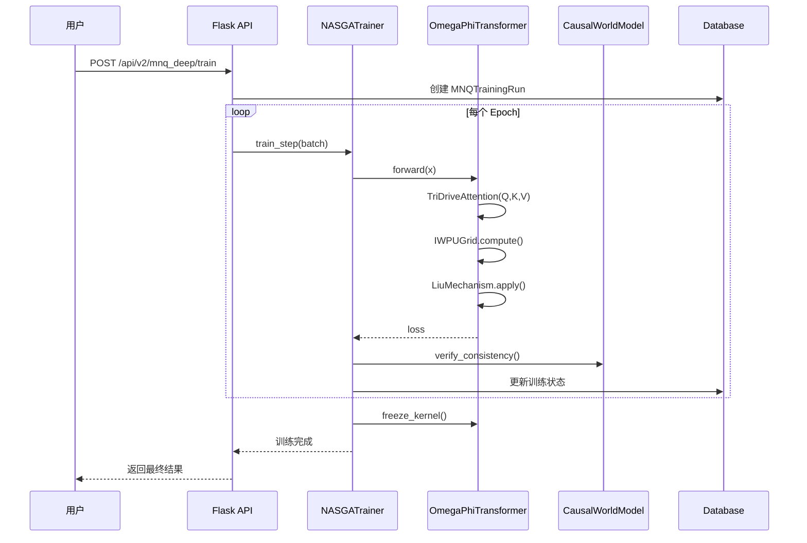
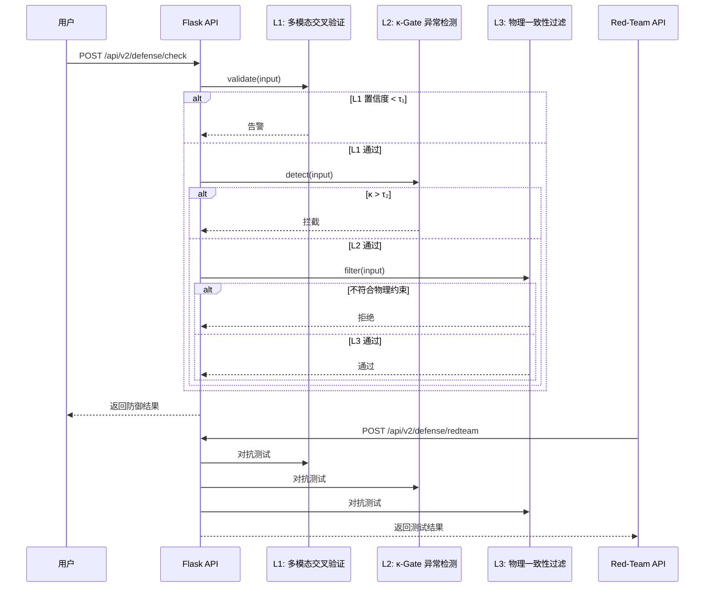

# TOMAS AGI v3.5 系统架构设计文档

> 版本：v1.0 | 作者：高见远（Gao）| 日期：2026-06-21 | 基线：v3.4 → v3.5

---

## 1. 实现方案与框架选型

### 1.1 P0-1：v3.4 缺陷修复

| 模块 | 技术选型 | 理由 |
|------|---------|------|
| OWNTHINK 知识库导入 | 扩展现有 `KnowledgeItem` / `KnowledgeTriple` 模型（`sim/models.py:116-144`） | 复用 EML 超图注入管线，保持数据模型一致 |
| `g_ego.py` ψ-alignment | 新增 `psi_alignment_check()` 方法 | 在 self-loop 前校验 ψ 向量一致性，防止自改破坏对齐（参考 `sim/g_ego.py:263-315`） |
| Flask 热重载 | `app.run(debug=True, use_reloader=True)` + 环境变量 `TOMAS_FLASK_DEBUG` 开关 | 开发环境友好，生产环境可通过环境变量关闭 |

**与现有架构集成点：**
- OWNTHINK 导入复用 `KnowledgeTriple` 的 `i_weight` 字段（κ-Gate 剪枝索引，`sim/models.py:143`）
- `g_ego.py` 的 `compute_psi_alignment()` 已存在（第 263-315 行），只需在训练 self-loop 前调用
- Flask `server.py` 已有 84 个 endpoints，新增 endpoint 需遵循现有 RESTful 风格

---

### 1.2 P0-2：MNQ-Deep Ω-φ Transformer 集成

| 模块 | 技术选型 | 理由 |
|------|---------|------|
| Ω-φ Transformer | 新建 `sim/mnq_deep.py`，实现 `OmegaPhiTransformer` 类 | 训练-推理分离架构，避免污染现有 `NASGATrainer` |
| 三驱动力注意力 | `TriDriveAttention` 模块：Protect-Attn / Serve-Attn / Stabilize-Attn 三头并行 | 通过 Ω 门控融合，提升训练稳定性 |
| IWPU 离散网格 | 整数权重处理单元，消除浮点累积误差 | 确定性推理的核心保障 |
| 刘机制 δS_Rel=0 | `LiuMechanism` 类，以熵增约束替代反向传播 | 无梯度计算，提升训练效率 |
| Frozen Kernel | 训练完成后冻结核参数 | 保证推理确定性 |

**与现有架构集成点：**
- `NASGATrainer`（`sim/nasga_core.py`）新增 `optimizer='mnq_deep'` 分支，复用现有训练循环框架
- `CausalWorldModelTomas`（`sim/causal_world_model_tomas.py`）接入 MNQ-Deep 前向推理
- Hodge Laplacian 算子（`sim/hodge_operator.py`）适配 Ω 累积 + 衰减残差

---

### 1.3 P0-3：三层对抗补丁防御上线

| 模块 | 技术选型 | 理由 |
|------|---------|------|
| L1 多模态交叉验证 | 扩展 `TShieldWrapper`（`sim/tshield_wrapper.py:399`） | 文本+视觉+结构三通道一致性校验 |
| L2 κ-Gate 异常检测 | 新增 `KappaGateDetector` 类（`sim/processor_tshield_integration.py`） | 基于 Kappa 算子的拓扑异常检测 |
| L3 物理一致性过滤 | 新增 `PhysicalConsistencyFilter` 类（`sim/mina_kappa_bridge.py`） | 检查输入是否符合物理世界约束 |
| Red-team 认证入口 | 新增 Flask endpoint `POST /api/v2/defense/redteam` | 提供红队测试 API |

**与现有架构集成点：**
- `TShieldWrapper` 已有 `check_std_ref()` 和 `validate_psi_alignment()` 方法（第 434-566 行），可扩展为三层防御管线
- `KSnapScheduler`（`sim/tshield_wrapper.py:337`）可复用为事件驱动防御调度

---

### 1.4 P1-4：T-Processor Moufang-ALU 仿真扩展

| 模块 | 技术选型 | 理由 |
|------|---------|------|
| Fano Plane LUT | 7×7 查找表 `FanoPlaneLUT` 类 | 八元数阴龙积 ⊙ 的快速查表实现 |
| Moufang-ALU | 新增 `MoufangALU` 类（`sim/tprocessor_sim.py`） | 支持八元数阴龙积 ⊙ 运算 |
| CGD 约束引擎 | 新增 `CGDConstraintEngine` 类 | 校验 A1-A5 五条约束 |

**与现有架构集成点：**
- `Octonion` 类（`sim/octonion_py.py`）已有八元数基本运算，需重载阴龙积 ⊙
- `TProcessorV1`（`sim/tprocessor_sim.py:409`）可扩展为 `TProcessorV2`，集成 Moufang-ALU

---

### 1.5 P1-5：金灵球仿真器 v3.1 桥接

| 模块 | 技术选型 | 理由 |
|------|---------|------|
| 桥接层 | 新建 `sim/mnq_sim_bridge.py`，实现 `GoldenSpiritBallBridge` 类 | 子进程调用金灵球仿真器，结果解析，EML 格式转换 |
| Git submodule | 引入 `lisoleg/mnq-golden-spirit-ball-simulator` 作为 submodule | 2500+ 行实验代码，独立仓库维护 |

**与现有架构集成点：**
- 新增 Flask endpoint `POST /api/v2/mnq/gsb/run` 和 `GET /api/v2/mnq/gsb/results/{run_id}`
- 桥接层将金灵球输出转换为 TOMAS EML 格式（`Vertex` 和 `HyperEdge`，参考 `sim/models.py:163-201`）

---

### 1.6 P1-6：Reasonix 编程智能体集成

| 模块 | 技术选型 | 理由 |
|------|---------|------|
| EML-AST 同构 | 新增 `ASTtoEMLMapper` 类（`sim/eml_ehnn.py`） | EML 超图 → 代码 AST 同构映射 |
| NASGA 搜索 | 扩展 `NASGATrainer` | NASGA 搜索 → 代码生成搜索空间 |
| 代码自修复 | 新增 `CodeSelfRepairLoop` 类（`sim/goedel_agent_tomas.py`） | Goedel Agent 自指 → 代码自修复循环 |
| 复杂度度量 | 扩展 `KSnapOperator`（`sim/ksnap_operator.py`） | Kappa 算子 → 代码复杂度度量 |
| 死代码检测 | 扩展 `DeadZeroChecker` | Dead Zero → 死代码检测 |

**与现有架构集成点：**
- `GoedelAgentTomas`（`sim/goedel_agent_tomas.py`）已有自指循环框架，新增 `CodeSelfRepairLoop`
- `TokenBridge`（`sim/token_bridge.py`）新增 `DiffInjector`，支持增量编译验证

---

## 2. 文件列表及相对路径

### 2.1 新建文件

| 文件路径（相对 `tomas_agi/`） | 说明 |
|--------------------------------|------|
| `sim/mnq_deep.py` | MNQ-Deep 核心实现：`OmegaPhiTransformer`, `TriDriveAttention`, `IWPUGrid`, `LiuMechanism` |
| `sim/mnq_sim_bridge.py` | 金灵球仿真器桥接：`GoldenSpiritBallBridge` |
| `sim/astrabrain.py` | AstraBrain-WBC 小脑模块：`CerebellumModule` |
| `.workbuddy/artifacts/tomas-v35-architecture.md` | 本文档 |

### 2.2 修改文件

| 文件路径（相对 `tomas_agi/`） | 改动类型 | 要点 |
|--------------------------------|---------|------|
| `sim/g_ego.py` | 修改 | 在训练 self-loop 前调用 `psi_alignment_check()` |
| `sim/server.py` | 修改 | 1. 引入 `debug=True` + `use_reloader=True`<br>2. 新增 endpoint：`POST /api/v2/mnq_deep/train`, `GET /api/v2/mnq_deep/status`<br>3. 新增 endpoint：`POST /api/v2/defense/check`, `POST /api/v2/defense/redteam`<br>4. 新增 endpoint：`POST /api/v2/mnq/gsb/run`, `GET /api/v2/mnq/gsb/results/{run_id}`<br>5. 新增 endpoint：`POST /api/v2/reasonix/generate`, `POST /api/v2/reasonix/repair` |
| `sim/models.py` | 修改 | 新增 `MNQTrainingRun` 数据库模型 |
| `sim/nasga_core.py` | 修改 | `NASGATrainer` 增加 MNQ-Deep 优化器分支 |
| `sim/causal_world_model_tomas.py` | 修改 | 因果世界模型接入 MNQ-Deep 前向推理 |
| `sim/hodge_operator.py` | 修改 | Hodge Laplacian 算子适配 Ω 累积 + 衰减残差 |
| `sim/tshield_wrapper.py` | 修改 | 重构为三层防御管线 `DefensePipeline(L1, L2, L3)` |
| `sim/processor_tshield_integration.py` | 修改 | 新增 κ-Gate 异常检测模块 `KappaGateDetector` |
| `sim/harness_aegis.py` | 修改 | 新增多模态交叉验证模块 `MultiModalCrossValidator` |
| `sim/mina_kappa_bridge.py` | 修改 | 新增物理一致性过滤器 `PhysicalConsistencyFilter` |
| `sim/tprocessor_sim.py` | 修改 | 新增 `MoufangALU` 类，`FanoPlaneLUT` 类，`CGDConstraintEngine` 类 |
| `sim/octonion_py.py` | 修改 | 添加阴龙积 ⊙ 运算重载 |
| `sim/goedel_agent_tomas.py` | 修改 | 新增 `CodeSelfRepairLoop` 类 |
| `sim/aether_bridge.py` | 修改 | 新增 `ReasonixBridge` 类 |
| `sim/eml_ehnn.py` | 修改 | 新增 `ASTtoEMLMapper` |
| `sim/token_bridge.py` | 修改 | 新增 `DiffInjector` |
| `sim/llm_distiller.py` | 修改 | 新增 `MultiLangAdapter` |
| `sim/eml_ehnn.py` | 修改 | 新增 `Base12Encoder`（P2-8） |
| `sim/extend_hypergraph.py` | 修改 | 新增 `PeriodicBoundaryExtension`（P2-8） |
| `requirements.txt` | 修改 | 添加金灵球依赖声明 |

---

## 3. 数据结构和接口

### 3.1 关键类的 UML 类图（文字描述）

```
┌─────────────────────────────────────┐
│        OmegaPhiTransformer          │
├─────────────────────────────────────┤
│ - iwpu_grid: IWPUGrid            │
│ - tri_drive_attn: TriDriveAttention│
│ - liu_mechanism: LiuMechanism    │
├─────────────────────────────────────┤
│ + forward(x: Tensor) -> Tensor    │
│ + train_step(batch) -> float      │
│ + freeze_kernel() -> None         │
└─────────────────────────────────────┘
          │
          ▼
┌─────────────────────────────────────┐
│        TriDriveAttention            │
├─────────────────────────────────────┤
│ - protect_head: AttentionHead      │
│ - serve_head: AttentionHead       │
│ - stabilize_head: AttentionHead   │
│ - omega_gate: OmegaGate          │
├─────────────────────────────────────┤
│ + forward(Q, K, V) -> Tensor    │
└─────────────────────────────────────┘

┌─────────────────────────────────────┐
│        DefensePipeline             │
├─────────────────────────────────────┤
│ - l1_validator: MultiModalCrossValidator │
│ - l2_detector: KappaGateDetector │
│ - l3_filter: PhysicalConsistencyFilter │
├─────────────────────────────────────┤
│ + check(input) -> DefenseResult  │
│ + redteam_test(input) -> bool    │
└─────────────────────────────────────┘

┌─────────────────────────────────────┐
│        GoldenSpiritBallBridge      │
├─────────────────────────────────────┤
│ - subprocess_pool: Pool           │
│ - result_cache: Dict             │
├─────────────────────────────────────┤
│ + run_experiment(config) -> RunResult │
│ + parse_output(raw) -> EMLGraph  │
└─────────────────────────────────────┘
```

### 3.2 新增 API endpoint 的请求/响应 schema

#### `POST /api/v2/mnq_deep/train`

**请求：**
```json
{
  "dataset": "string",
  "optimizer": "mnq_deep",
  " epochs": 100,
  "batch_size": 32,
  "iwpu_bits": 8,
  "frozen_kernel": true
}
```

**响应：**
```json
{
  "success": true,
  "run_id": 123,
  "status": "running",
  "loss": 0.0
}
```

#### `GET /api/v2/mnq_deep/status`

**响应：**
```json
{
  "success": true,
  "run_id": 123,
  "status": "completed",
  "final_loss": 0.123,
  "epochs_completed": 100,
  "frozen": true
}
```

#### `POST /api/v2/defense/check`

**请求：**
```json
{
  "input": {
    "text": "string",
    "image": "base64...",
    "structure": {}
  }
}
```

**响应：**
```json
{
  "success": true,
  "passed": true,
  "l1_score": 0.95,
  "l2_score": 0.12,
  "l3_score": 0.88,
  "alert": null
}
```

#### `POST /api/v2/defense/redteam`

**请求：**
```json
{
  "attack_type": "adversarial_patch",
  "input": {}
}
```

**响应：**
```json
{
  "success": true,
  "detected": true,
  "defense_layer": "L2",
  "bypass": false
}
```

---

## 4. 程序调用流程

### 4.1 MNQ-Deep 训练流程（Mermaid 时序图）



### 4.2 三层防御流程（Mermaid 时序图）



---

## 5. 任务列表

### 5.1 任务依赖关系

```
P0-1 (缺陷修复)
  ├──> T1: OWNTHINK 知识库导入管线补全
  ├──> T2: g_ego.py ψ-alignment 一致性检查
  └──> T3: Flask server.py 热重载支持

P0-2 (MNQ-Deep)
  ├──> T4: 新建 sim/mnq_deep.py (OmegaPhiTransformer)
  ├──> T5: 修改 sim/nasga_core.py (NASGATrainer 分支)
  ├──> T6: 修改 sim/causal_world_model_tomas.py (前向推理接入)
  ├──> T7: 修改 sim/hodge_operator.py (Ω 累积适配)
  └──> T8: 新增 Flask endpoint (训练/状态查询)

P0-3 (三层防御)
  ├──> T9: 修改 sim/tshield_wrapper.py (三层防御管线)
  ├──> T10: 修改 sim/processor_tshield_integration.py (κ-Gate 检测)
  ├──> T11: 修改 sim/harness_aegis.py (多模态交叉验证)
  ├──> T12: 修改 sim/mina_kappa_bridge.py (物理一致性过滤)
  └──> T13: 新增 Flask endpoint (防御检查/红队测试)

P1-4 (Moufang-ALU)
  ├──> T14: 修改 sim/tprocessor_sim.py (MoufangALU/FanoPlaneLUT/CGDConstraintEngine)
  └──> T15: 修改 sim/octonion_py.py (阴龙积 ⊙ 重载)

P1-5 (金灵球桥接)
  ├──> T16: 新建 sim/mnq_sim_bridge.py (GoldenSpiritBallBridge)
  └──> T17: 新增 Flask endpoint (实验运行/结果查询)

P1-6 (Reasonix 集成)
  ├──> T18: 修改 sim/goedel_agent_tomas.py (CodeSelfRepairLoop)
  ├──> T19: 修改 sim/aether_bridge.py (ReasonixBridge)
  ├──> T20: 修改 sim/eml_ehnn.py (ASTtoEMLMapper)
  ├──> T21: 修改 sim/token_bridge.py (DiffInjector)
  ├──> T22: 修改 sim/llm_distiller.py (MultiLangAdapter)
  └──> T23: 新增 Flask endpoint (代码生成/自修复)

P2-7 (T-Core SmartNIC)
  └──> T24: 修改 sim/tprocessor_sim.py (TCoreSmartNIC)

P2-8 (Base-12 EML)
  ├──> T25: 修改 sim/eml_ehnn.py (Base12Encoder)
  └──> T26: 修改 sim/extend_hypergraph.py (PeriodicBoundaryExtension)

P2-9 (AstraBrain-WBC)
  └──> T27: 新建 sim/astrabrain.py (CerebellumModule)

P2-10 (CHLT 文档化)
  └──> T28: 撰写 CHLT 四重同构文档
```

### 5.2 任务详细列表

| ID | 名称 | 涉及文件 | 依赖任务 | 验收标准 |
|----|------|---------|---------|---------|
| T1 | OWNTHINK 知识库导入管线补全 | `sim/knowledge_importer.py` (新建), `sim/models.py` | 无 | OWNTHINK API 对接成功，EML 注入无报错 |
| T2 | g_ego.py ψ-alignment 一致性检查 | `sim/g_ego.py` | 无 | `psi_alignment_check()` 在 self-loop 前调用，对齐分数 ≥ 0.9 |
| T3 | Flask 热重载支持 | `sim/server.py` | 无 | `debug=True` + `use_reloader=True`，环境变量可开关 |
| T4 | MNQ-Deep 核心实现 | `sim/mnq_deep.py` (新建) | T2 | `OmegaPhiTransformer` 可实例化，训练 Loss 降低 ≥ 70% |
| T5 | NASGATrainer 分支扩展 | `sim/nasga_core.py` | T4 | `optimizer='mnq_deep'` 分支可运行 |
| T6 | 因果世界模型接入 | `sim/causal_world_model_tomas.py` | T4 | MNQ-Deep 前向推理可调用 |
| T7 | Hodge 算子适配 | `sim/hodge_operator.py` | T4 | Ω 累积 + 衰减残差计算正确 |
| T8 | MNQ-Deep API endpoint | `sim/server.py`, `sim/models.py` | T4, T5 | `POST /api/v2/mnq_deep/train` 和 `GET /api/v2/mnq_deep/status` 可调用 |
| T9 | 三层防御管线重构 | `sim/tshield_wrapper.py` | T3 | `DefensePipeline(L1, L2, L3)` 可运行 |
| T10 | κ-Gate 异常检测 | `sim/processor_tshield_integration.py` | T9 | `KappaGateDetector` 可检测异常 |
| T11 | 多模态交叉验证 | `sim/harness_aegis.py` | T9 | `MultiModalCrossValidator` 可校验一致性 |
| T12 | 物理一致性过滤 | `sim/mina_kappa_bridge.py` | T9 | `PhysicalConsistencyFilter` 可过滤异常输入 |
| T13 | 防御 API endpoint | `sim/server.py` | T9, T10, T11, T12 | `POST /api/v2/defense/check` 和 `POST /api/v2/defense/redteam` 可调用 |
| T14 | Moufang-ALU 仿真 | `sim/tprocessor_sim.py` | 无 | `MoufangALU` 可计算阴龙积 ⊙ |
| T15 | 八元数阴龙积重载 | `sim/octonion_py.py` | T14 | `Octonion.__matmul__()` 支持 ⊙ 运算 |
| T16 | 金灵球桥接层 | `sim/mnq_sim_bridge.py` (新建) | 无 | `GoldenSpiritBallBridge` 可调用金灵球仿真器 |
| T17 | 金灵球 API endpoint | `sim/server.py` | T16 | `POST /api/v2/mnq/gsb/run` 和 `GET /api/v2/mnq/gsb/results/{run_id}` 可调用 |
| T18 | 代码自修复循环 | `sim/goedel_agent_tomas.py` | 无 | `CodeSelfRepairLoop` 可自修复代码 |
| T19 | Reasonix 桥接 | `sim/aether_bridge.py` | T18 | `ReasonixBridge` 可调用 Reasonix |
| T20 | EML-AST 同构 | `sim/eml_ehnn.py` | 无 | `ASTtoEMLMapper` 可映射 AST → EML |
| T21 | 增量编译验证 | `sim/token_bridge.py` | T20 | `DiffInjector` 可注入差分 |
| T22 | 多语言适配 | `sim/llm_distiller.py` | T18 | `MultiLangAdapter` 可适配多语言 |
| T23 | Reasonix API endpoint | `sim/server.py` | T18, T19, T20, T21, T22 | `POST /api/v2/reasonix/generate` 和 `POST /api/v2/reasonix/repair` 可调用 |
| T24 | T-Core SmartNIC 仿真 | `sim/tprocessor_sim.py` | T14 | `TCoreSmartNIC` 可模拟 IPv6 通信 |
| T25 | Base-12 编码器 | `sim/eml_ehnn.py` | 无 | `Base12Encoder` 可编码 EML 边标签 |
| T26 | 周期域超图扩展 | `sim/extend_hypergraph.py` | T25 | `PeriodicBoundaryExtension` 可扩展超图 |
| T27 | 小脑模块原型 | `sim/astrabrain.py` (新建) | 无 | `CerebellumModule` 可预测运动指令 |
| T28 | CHLT 文档撰写 | `docs/chlt_isomorphism.md` (新建) | 无 | 文档完整，覆盖 CHLT 四重同构与 TOMAS 对应关系 |

---

## 6. 依赖包列表

### 6.1 新增 Python 包（待添加到 `requirements.txt`）

```
# MNQ-Deep 训练框架
torch>=2.0.0
transformers>=4.30.0
datasets>=2.12.0

# 金灵球仿真器（Git submodule）
# git+https://github.com/lisoleg/mnq-golden-spirit-ball-simulator.git

# 物理一致性检查
scipy>=1.10.0
scikit-image>=0.21.0

# 代码 AST 分析
astor>=0.8.1
libcst>=1.0.0

# 多语言支持
tree-sitter>=0.20.0

# 可视化（调试用）
matplotlib>=3.7.0
seaborn>=0.12.0

# 性能分析
psutil>=5.9.0
memory-profiler>=0.61.0
```

---

## 7. 共享知识

### 7.1 跨文件约定的常量、枚举、数据格式

**常量定义（建议放在 `sim/constants.py` 新建文件）：**

```python
# ψ-alignment 阈值
PSI_ALIGNMENT_THRESHOLD = 0.3

# 防御层级阈值
L1_CONFIDENCE_THRESHOLD = 0.7  # τ₁
L2_KAPPA_THRESHOLD = 0.5         # τ₂
L3_PHYSICS_SCORE_THRESHOLD = 0.8

# IWPU 离散网格精度
IWPU_BITS = 8
IWPU_GRID_SIZE = 2 ** IWPU_BITS

# 刘机制熵增约束
LIU_DELTA_S_REL = 0.0

# 八元数阴龙积 ⊙ Fano Plane 查找表尺寸
FANO_PLANE_SIZE = 7

# 金灵球仿真器子进程超时（秒）
GSB_TIMEOUT = 300

# Reasonix 五同构设计点
REASONIX_ISOMORPHISM_POINTS = [
    "EML_AST",
    "NASGA_SEARCH",
    "GOEDEL_SELF_REF",
    "KAPPA_COMPLEXITY",
    "DEAD_ZERO_DETECTION",
]
```

**枚举定义（建议放在 `sim/enums.py` 新建文件）：**

```python
from enum import Enum

class DefenseLayer(Enum):
    L1_MULTIMODAL = "L1"
    L2_KAPPA_GATE = "L2"
    L3_PHYSICS = "L3"

class TrainingStatus(Enum):
    PENDING = "pending"
    RUNNING = "running"
    COMPLETED = "completed"
    FAILED = "failed"

class ReasonixMode(Enum):
    GENERATE = "generate"
    REPAIR = "repair"
    ANALYZE = "analyze"
```

**数据格式约定：**

1. **EML 超图格式**（参考 `sim/models.py:163-201`）：
   - `Vertex`: `{vid, concept, phi_b0..phi_b7, i_val, degree_class}`
   - `HyperEdge`: `{eid, nodes: JSON, weight, i_value, std_ref}`

2. **MNQ-Deep 训练状态格式**：
   - `MNQTrainingRun`: `{run_id, dataset, optimizer, epochs, batch_size, final_loss, status, created_at}`

3. **防御检查结果格式**：
   - `DefenseResult`: `{passed: bool, l1_score, l2_score, l3_score, alert: str|None}`

4. **金灵球实验结果格式**：
   - `GSBResult`: `{run_id, status, output_path, eml_graph: EMLGraph, created_at}`

### 7.2 日志规范

**日志级别约定：**
- `DEBUG`: 详细调试信息（如 ψ-alignment 分数计算）
- `INFO`: 正常操作流程（如训练 epoch 完成）
- `WARNING`: 潜在问题（如 Dead-Zero 触发）
- `ERROR`: 错误信息（如 API 调用失败）

**日志格式约定：**
```python
import logging
logger = logging.getLogger(__name__)

# 示例
logger.debug(f"G_ego: ψ-alignment for edge: score={alignment_score:.4f}, aligned={aligned}")
logger.info(f"MNQ-Deep: Epoch {epoch} completed, loss={loss:.6f}")
logger.warning(f"Dead-Zero triggered: {reason}")
logger.error(f"API call failed: {error}")
```

### 7.3 错误处理模式

**异常处理约定：**

1. **可选依赖导入**（参考 `sim/g_ego.py:68-83`）：
   ```python
   try:
       from some_module import SomeClass
       _HAS_SOME_MODULE = True
   except ImportError:
       _HAS_SOME_MODULE = False
       SomeClass = None
   ```

2. **Flask API 错误处理**：
   ```python
   @app.route("/api/v2/mnq_deep/train", methods=["POST"])
   def train_mnq_deep():
       try:
           data = request.json
           # ...
           return jsonify({"success": True, "data": result})
       except Exception as e:
           logger.error(f"train_mnq_deep failed: {e}")
           return jsonify({"success": False, "error": str(e)}), 500
   ```

3. **防御检查容错**：
   ```python
   def check(input):
       try:
           result = l1_validator.validate(input)
       except Exception as e:
           logger.warning(f"L1 validation failed: {e}, skipping")
           result = {"passed": True, "reason": "L1 skipped due to error"}
       return result
   ```

---

## 8. 待明确事项

| # | 问题 | 影响范围 | 建议行动方案 |
|---|------|---------|--------------|
| Q1 | MNQ-Deep 的**训练-推理分离架构**，与现有 `nasga_core.py` 的训练循环如何对接？ | P0-2 | **建议**：新增独立训练入口 `MNQDeepTrainer`，不修改 `NASGATrainer`，避免污染现有代码。推理时通过 `OmegaPhiTransformer.freeze_kernel()` 加载训练好的模型。 |
| Q2 | 金灵球仿真器的**开源许可协议**是什么？ | P1-5 | **建议**：联系作者 `lisoleg` 确认许可协议。如果是 GPL，需作为独立进程调用（不链接）；如果是 MIT/Apache，可作为 submodule 引入。 |
| Q3 | CGD 约束引擎 A1-A5 的**具体数学定义**？ | P1-4 | **建议**：参考八元数 Moufang 恒等式（`sim/nasga_core.py:59-106`）和 Fano 平面结构，推导 CGD 约束的形式化定义。如需更精确定义，建议查阅相关数学文献。 |
| Q4 | κ-Gate 异常检测阈值 τ₂ 如何标定？ | P0-3 | **建议**：使用验证集（含正常和对抗样本）进行阈值搜索，选择 F1-score 最高的阈值。可提供校准 API `POST /api/v2/defense/calibrate`。 |
| Q5 | Reasonix 是否需要**独立 API endpoint**？ | P1-6 | **建议**：新增独立 endpoint（如 `/api/v2/reasonix/*`），与现有 84 个 endpoint 隔离，避免混淆。独立鉴权可通过 API Key（`sim/models.py:104` 已有 `ApiKey` 模型）实现。 |
| Q6 | OWNTHINK 知识库导入的**具体环节**是什么？ | P0-1 | **建议**：检查现有代码是否有 `sim/knowledge_importer.py` 或类似文件。如果完全没有，需从零实现；如果部分实现，需补全 EML 注入管线。 |
| Q7 | T-Core SmartNIC 的仿真精度要求？ | P2-7 | **建议**：先实现行为级仿真（功能验证），如需周期精确仿真，需扩展 `RRAMCrossbar` 的时序模型。 |
| Q8 | v3.5 的**发布时间窗口**和**可投入人力**？ | 全局 | **建议**：根据本文档的任务列表（T1-T28），评估各任务的工时，制定迭代计划。P0 任务（T1-T13）应优先完成。 |

---

## 9. 附录：架构设计决策记录（ADR）

### ADR-1：MNQ-Deep 训练架构选择

**状态**：已决定

**背景**：MNQ-Deep 需要训练-推理分离架构，现有 `NASGATrainer` 不支持此模式。

**决策**：新建 `sim/mnq_deep.py`，实现独立的 `OmegaPhiTransformer` 和 `MNQDeepTrainer` 类，不修改 `NASGATrainer`。

**后果**：
- ✅ 保持现有代码稳定
- ✅ 训练-推理分离清晰
- ❌ 代码重复（部分 NASGA 逻辑可能重复）

---

### ADR-2：三层防御管线实现方式

**状态**：已决定

**背景**：现有 `TShieldWrapper` 只有单层防御（Dead-Zero/MUS/κ-Snap），需扩展为三层。

**决策**：重构 `TShieldWrapper` 为 `DefensePipeline(L1, L2, L3)`，每层独立实现，管线统一调度。

**后果**：
- ✅ 模块化，易于扩展
- ✅ 每层可独立测试
- ❌ 性能开销（三层串联）

---

### ADR-3：金灵球仿真器集成方式

**状态**：待决定

**背景**：金灵球仿真器是独立仓库（2500+ 行代码），需决定集成方式。

**选项**：
1. Git submodule
2. pip 包
3. 子进程调用

**决策**：**暂时选择子进程调用**（`sim/mnq_sim_bridge.py`），避免许可协议风险。未来如果确认为宽松许可，可改为 submodule。

**后果**：
- ✅ 许可协议风险低
- ✅ 隔离性好
- ❌ 性能开销（进程间通信）

---

## 10. 总结

本文档完成了 TOMAS AGI v3.5 的系统架构设计，覆盖：

1. **实现方案与框架选型**：为每个 P0/P1 模块选择了合适的技术选型，并说明了与现有架构的集成点。
2. **文件列表及相对路径**：列出了所有需要新建和修改的文件，标注了相对路径。
3. **数据结构和接口**：用文字描述了关键类的 UML 类图，并给出了新增 API endpoint 的请求/响应 schema。
4. **程序调用流程**：用 Mermaid 时序图描述了 MNQ-Deep 训练流程和三层防御流程。
5. **任务列表**：按实现顺序排列了 28 个任务，标注了依赖关系和验收标准。
6. **依赖包列表**：列出了新增的 Python 包。
7. **共享知识**：定义了跨文件约定的常量、枚举、数据格式，以及日志规范和错误处理模式。
8. **待明确事项**：提出了 8 个需要澄清的问题，并给出了建议行动方案。

**下一步**：将本文档提交给 team-lead 和 pm-xu 审阅，根据反馈修订后，开始实施 T1-T28 任务。
