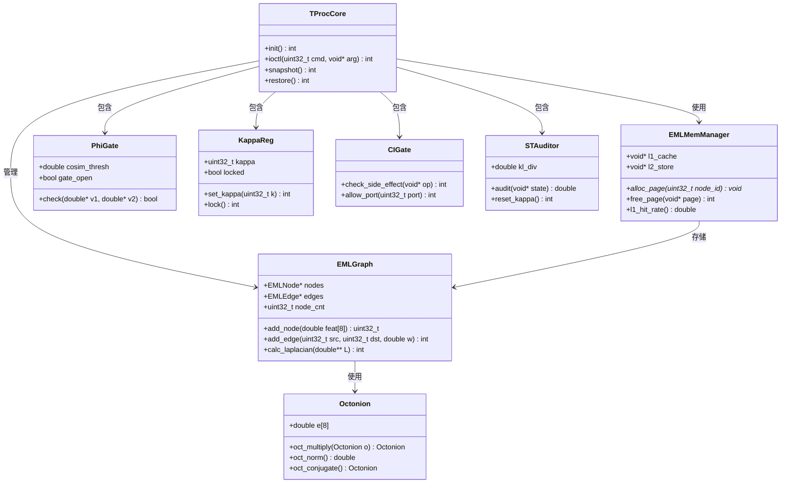
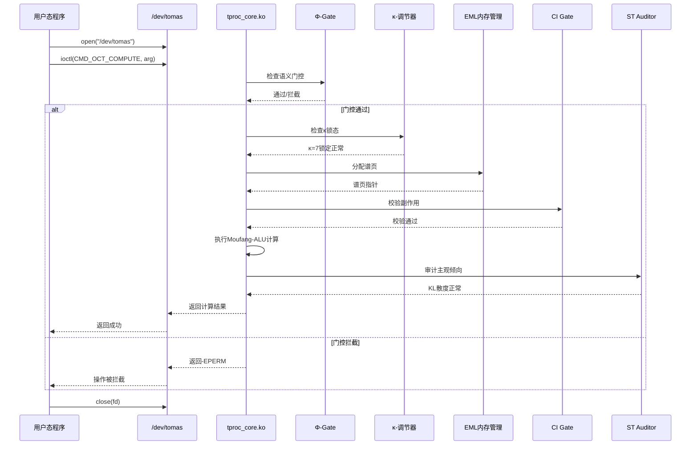
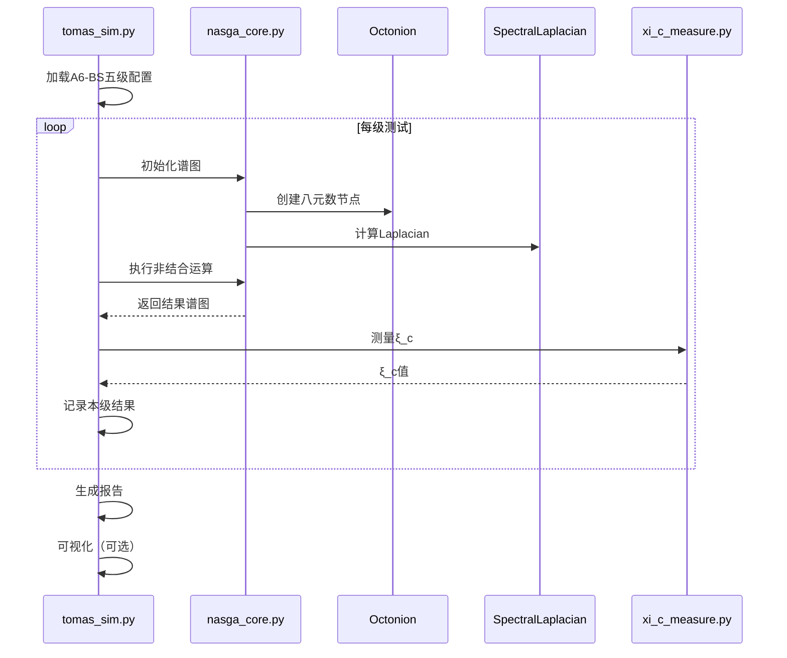
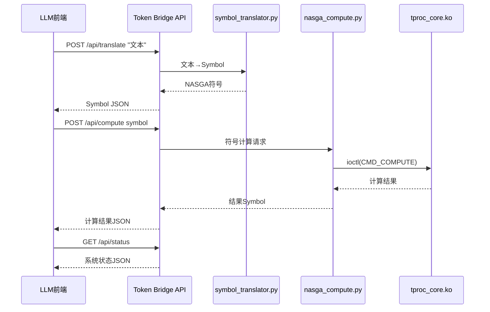

# TOMAS-AGI 系统架构设计文档

> 版本：v2.0 | 日期：2026-06-14 | 架构师：高见远（Gao）

---

## 1. 实现方案 + 框架选型

### 1.1 技术栈总览

| 层级 | 语言/框架 | 选型理由 |
|------|----------|---------|
| **软件仿真** | Python 3.11 + NumPy + SciPy | 快速验证NASGA数学正确性，NumPy向量化加速谱图计算 |
| **内核模块** | C（Linux Kernel 5.15+） | 直接访问硬件资源，ioctl接口与用户态通信 |
| **USCS文件系统** | C（VFS接口） | 实现自定义文件系统必须基于内核VFS |
| **忆阻器驱动** | C（Linux内核SPI/I2C子系统） | 硬件寄存器级访问 |
| **GPU加速** | CUDA 12.x（sm_70+） | 八元数乘法大规模并行化 |
| **FPGA原型** | Verilog（Xilinx Vivado / Intel Quartus） | 可综合RTL，时序约束明确 |
| **形式化校验** | Lean 4 + Coq 8.17 | Lean 4用于MNQ认知校验，Coq用于双重验证 |
| **Blueprint生成** | Rust 1.75+ | 类型安全，适合DAG依赖分析 |
| **Token Bridge API** | Python + FastAPI + Uvicorn | 异步高性能，自动生成OpenAPI文档 |
| **视觉互搏引擎** | C + OpenCV | 实时视频处理，C库高效 |
| **构建系统** | Makefile + Kbuild（内核） + Cargo（Rust） | 各语言标准构建工具 |

### 1.2 整体架构分层

```
┌─────────────────────────────────────────────────────┐
│               应用层                                  │
│  Token Bridge REST API / LLM前端 / Web可视化         │
├─────────────────────────────────────────────────────┤
│               运行时层                                │
│  tomas_sim.py (仿真) / server.py (API)              │
├─────────────────────────────────────────────────────┤
│              内核层                                  │
│  tproc_core.ko / uscsfs.ko / mr_array.ko           │
│  Φ-Gate / κ-调节器 / δ-mem / CI Gate / ST Auditor  │
├─────────────────────────────────────────────────────┤
│              硬件抽象层                              │
│  CUDA Kernel / FPGA RTL / 忆阻器物理层              │
├─────────────────────────────────────────────────────┤
│              形式化校验层                            │
│  Lean MNQ / Coq证明 / Blueprint DAG                 │
└─────────────────────────────────────────────────────┘
```

---

## 2. 完整文件树

```
tomas_agi/
├── docs/
│   ├── PRD.md                          # 产品需求文档
│   └── ARCHITECTURE.md                 # 本文档
├── include/
│   └── tomas/
│       ├── common.h                    # 公共宏、类型定义
│       ├── octonion.h                  # 八元数接口
│       ├── spectral_graph.h             # 谱图数据结构
│       ├── eml_map.h                   # EML内存映射接口
│       ├── phi_gate.h                  # Φ-Gate接口
│       ├── kappa_reg.h                 # κ-调节器接口
│       ├── ci_gate.h                   # CI Gate接口
│       ├── st_auditor.h                # ST审计器接口
│       └── constants.h                 # 物理常数（I(X)守恒等）
├── sim/
│   ├── tomas_sim.py                    # 主仿真器入口
│   ├── nasga_core.py                   # NASGA核心代数运算（Python）
│   ├── octonion_py.py                  # 八元数Python实现
│   ├── spectral_laplacian_py.py        # 谱图Laplacian Python实现
│   ├── a6_bs_benchmark.py              # A6-BS五级基准测试
│   ├── xi_c_measure.py                 # ξ_c效能指标测量
│   └── visualizer.py                   # 仿真结果可视化
├── kernel/
│   ├── tproc_core.c                    # T-Processor主模块
│   ├── tproc_core.h                    # 主模块头文件
│   ├── octonion.c                      # 八元数C实现（Fano查表）
│   ├── spectral_laplacian.c            # 谱图Laplacian计算
│   ├── asym_residue.c                  # 结合子残差计算
│   ├── kappa_reg.c                     # κ=7稳态调节器
│   ├── eml_map.c                       # EML谱图内存管理
│   ├── phi_gate.c                      # Φ-Gate语义门控
│   ├── tomas_entry.S                   # Continuation快照汇编
│   ├── delta_mem.c                     # δ-mem L1-L2融合
│   ├── ci_gate.c                       # CI Gate副作用校验
│   ├── st_auditor.c                    # ST主观倾向审计
│   ├── port_ctrl.c                     # TXN Port管控
│   ├── Makefile                        # 内核模块构建
│   └── Kconfig                         # 内核配置选项
├── uscsfs/
│   ├── super.c                         # 超级块操作
│   ├── inode.c                         # inode操作
│   ├── file.c                          # 文件读写操作
│   ├── dir.c                           # 目录操作
│   ├── symlink.c                       # 符号链接支持
│   ├── Makefile                        # 文件系统构建
│   └── Kconfig                         # 文件系统配置
├── memristor/
│   ├── mr_array.c                      # 忆阻器阵列驱动
│   ├── mr_array.h                      # 阵列驱动头文件
│   ├── mr_calib.c                      # 电导校准
│   ├── mr_thermal.c                    # 温控防漂移
│   └── Makefile                        # 驱动构建
├── cuda/
│   ├── moufang_kernel.cu               # Moufang-ALU CUDA核
│   ├── octonion_gpu.cuh                # GPU八元数头文件
│   ├── spectral_kernel.cu              # 谱图GPU加速
│   └── Makefile                        # CUDA构建
├── fpga/
│   ├── moufang_alu.v                   # Moufang-ALU RTL
│   ├── i_cell.v                        # I-细胞RTL
│   ├── eml_graph_ctrl.v                # EML图控制器RTL
│   ├── kappa_reg.v                     # κ-调节器RTL
│   ├── tomas_top.v                     # 顶层封装RTL
│   ├── xi_c_counter.v                  # ξ_c效能计数器RTL
│   ├── tb_moufang_alu.v                # Moufang-ALU测试平台
│   ├── tb_tomas_top.v                  # 顶层测试平台
│   └── constraints.xdc                 # 时序约束（Xilinx）
├── token_bridge/
│   ├── server.py                       # FastAPI服务器主入口
│   ├── api.py                          # REST API路由
│   ├── symbol_translator.py             # 文本→NASGA符号转换
│   ├── nasga_compute.py                # 符号计算接口
│   ├── auth.py                         # Token认证
│   ├── requirements.txt                 # Python依赖
│   ├── Dockerfile                      # 容器化配置
│   └── docker-compose.yml              # 多服务编排
├── tvde/
│   ├── compressor.c                    # 视频→EML谱图压缩
│   ├── compressor.h                    # 压缩器头文件
│   ├── physics_probe.c                 # 物理残影检测
│   └── physics_probe.h                 # 探针头文件
├── formal/
│   ├── mnq_checker.py                  # MNQ校验器Python封装
│   ├── mnq_lean.lean                   # MNQ Lean 4形式化证明
│   ├── cognitive_functor.lean          # 认知函子Lean证明
│   ├── i_conservation.lean             # I(X)守恒Lean证明
│   ├── mnq_coq.v                      # MNQ Coq形式化证明
│   ├── blueprint_gen.rs                # Blueprint DAG生成器
│   └── proof_scripts/                  # 辅助证明脚本
│       └── tangent_functor.lean
├── asic/
│   ├── spec_28nm.md                    # 28nm流片规格
│   ├── spec_12nm.md                    # 12nm流片规格
│   ├── area_est.py                     # 面积估算脚本
│   ├── power_est.py                    # 功耗估算脚本
│   └── eda_scripts/
│       ├── synth.tcl                   # 综合脚本
│       ├── pnr.tcl                     # 布局布线脚本
│       └── drc_check.tcl               # DRC检查脚本
├── tests/
│   ├── test_octonion.c                # 八元数单元测试
│   ├── test_spectral.py                # 谱图测试
│   ├── test_tproc.sh                   # 内核模块集成测试
│   ├── test_token_bridge.py            # API测试
│   ├── test_mnq.py                     # MNQ校验测试
│   └── test_fpga.py                    # FPGA仿真测试
├── scripts/
│   ├── build_all.sh                    # 全量构建脚本
│   ├── run_sim.sh                      # 运行仿真
│   ├── load_tproc.sh                   # 加载内核模块
│   ├── unload_tproc.sh                 # 卸载内核模块
│   ├── audit_view.py                   # 审计日志查看工具
│   └── ci_gate_check.sh                # CI Gate手动检查
├── Makefile                            # 顶层构建
├── README.md                           # 项目说明
└── LICENSE                             # 许可证
```

---

## 3. 数据结构和接口

### 3.1 核心数据结构（C）

```c
/* include/tomas/octonion.h */
typedef struct {
    double e[8];  /* e0..e7: 1, e1..e7 (Fano平面基底) */
} Octonion;

/* include/tomas/spectral_graph.h */
typedef struct {
    uint32_t id;
    double   feat[8];   /* 8维特征（对应八元数） */
} EMLNode;

typedef struct {
    uint32_t src;
    uint32_t dst;
    double   weight;     /* 边权重，映射忆阻器电导 */
    double   I_conserv;  /* I(X)守恒标记 */
} EMLEdge;

typedef struct {
    EMLNode *nodes;
    EMLEdge *edges;
    uint32_t node_cnt;
    uint32_t edge_cnt;
    uint32_t cap_nodes;  /* 容量 */
    uint32_t cap_edges;
} EMLGraph;

/* include/tomas/eml_map.h */
typedef struct {
    void   *l1_cache;    /* L1 热数据缓存 */
    void   *l2_store;    /* L2 冷数据存储 */
    uint32_t page_size;   /* 4KB谱页 */
    uint32_t l1_hit;     /* L1命中次数 */
    uint32_t l1_miss;    /* L1未命中次数 */
} EMLMemManager;

/* include/tomas/phi_gate.h */
typedef struct {
    double  cosim_thresh;  /* 余弦相似度阈值 */
    bool    gate_open;      /* 门控状态 */
    uint64_t pass_count;    /* 通过计数 */
    uint64_t block_count;   /* 拦截计数 */
} PhiGate;

/* include/tomas/kappa_reg.h */
typedef struct {
    uint32_t kappa;       /* 当前κ值，锁定为7 */
    bool     locked;      /* 是否锁定 */
    uint64_t switch_ns;    /* 切换时间戳(ns) */
} KappaReg;

/* include/tomas/ci_gate.h */
typedef struct {
    uint32_t port_id;
    bool     allowed;      /* 是否允许操作 */
    double   side_effect;  /* 副作用计量 */
} CIGateEntry;

/* include/tomas/st_auditor.h */
typedef struct {
    double   kl_div;      /* KL散度 */
    double   threshold;    /* 触发阈值 */
    bool     kappa_reset;  /* 是否触发κ重置 */
    char     log_path[256];/* 审计日志路径 */
} STAuditor;
```

### 3.2 Mermaid 类图



---

## 4. 程序调用流程

### 4.1 用户态程序通过ioctl调用T-Processor



### 4.2 A6-BS基准测试流程



### 4.3 Token Bridge API 调用流程



---

## 5. 任务列表（核心产出）

> 任务编号说明：T=通用，K=内核，S=仿真，C=CUDA，F=FPGA，V=形式化，A=API，H=硬件

### 5.1 里程碑 M1：软件仿真（P0-1, P0-2, P1-6, P1-7）

| 任务编号 | 任务名称 | 涉及文件 | 依赖任务 | 验收标准 |
|---------|---------|---------|---------|---------|
| T001 | 搭建项目目录结构 | 全部目录 + Makefile | — | 目录树完整，Makefile可运行 |
| T002 | 实现八元数Python类 | sim/octonion_py.py | T001 | Fano乘法表正确，与理论值误差<1e-10 |
| T003 | 实现谱图Laplacian Python | sim/spectral_laplacian_py.py | T002 | Laplacian矩阵与NetworkX结果一致 |
| T004 | 实现结合子残差Python | sim/nasga_core.py | T002, T003 | 残差可计算，数值稳定 |
| T005 | 实现A6-BS摆锤级测试 | sim/a6_bs_benchmark.py | T004 | 摆锤级可运行，输出ξ_c |
| T006 | 实现A6-BS Peano级测试 | sim/a6_bs_benchmark.py | T005 | Peano级通过 |
| T007 | 实现A6-BS牛顿级测试 | sim/a6_bs_benchmark.py | T006 | 牛顿级通过 |
| T008 | 实现A6-BS杨-米尔斯级测试 | sim/a6_bs_benchmark.py | T007 | 杨-米尔斯级通过，双精度 |
| T009 | 实现ξ_c测量模块 | sim/xi_c_measure.py | T005 | ξ_c可测量，输出CSV |
| T010 | 实现主仿真器入口 | sim/tomas_sim.py | T009 | 一键运行全部五级测试 |
| T011 | Lean MNQ校验器骨架 | formal/mnq_lean.lean | T001 | Lean编译通过，I-守恒命题定义 |
| T012 | 认知函子Lean证明 | formal/cognitive_functor.lean | T011 | 认知函子定理证明通过 |
| T013 | I(X)守恒Lean证明 | formal/i_conservation.lean | T011 | I守恒定理证明通过 |
| T014 | MNQ校验器Python封装 | formal/mnq_checker.py | T012, T013 | Python可调用Lean证明 |
| T015 | Coq MNQ证明 | formal/mnq_coq.v | T011 | Coq证明通过（双重验证） |
| T016 | Blueprint DAG生成器 | formal/blueprint_gen.rs | T001 | Cargo build通过，可生成DAG dot文件 |

### 5.2 里程碑 M2：内核模块（P0-3 ~ P0-9, P1-8）

| 任务编号 | 任务名称 | 涉及文件 | 依赖任务 | 验收标准 |
|---------|---------|---------|---------|---------|
| T017 | 实现公共头文件 | include/tomas/*.h | T001 | 头文件完整，各模块可include |
| T018 | 实现八元数C库（Fano查表） | kernel/octonion.c, include/tomas/octonion.h | T017 | Fano乘法正确，单元测试通过 |
| T019 | 实现谱图Laplacian C库 | kernel/spectral_laplacian.c | T018 | 与Python仿真结果一致（误差<1e-6） |
| T020 | 实现结合子残差C库 | kernel/asym_residue.c | T019 | 残差计算正确 |
| T021 | 实现κ=7调节器 | kernel/kappa_reg.c | T017 | κ锁定为7，切换响应<1ms |
| T022 | 实现EML谱图内存管理 | kernel/eml_map.c | T017 | CRUD操作正确，与4KB谱页对齐 |
| T023 | 实现Φ-Gate语义门控 | kernel/phi_gate.c | T017 | 余弦相似度阈值可配置，门控有效 |
| T024 | 实现Continuation快照汇编 | kernel/tomas_entry.S | T017 | 快照保存/恢复无数据丢失，<10ms |
| T025 | 实现δ-mem L1-L2融合 | kernel/delta_mem.c | T022 | L1命中率>80%，冷数据自动降级 |
| T026 | 实现T-Processor主模块 | kernel/tproc_core.c | T018~T025 | 可加载/卸载，ioctl接口正常 |
| T027 | 实现CI Gate副作用校验 | kernel/ci_gate.c | T026 | 越权操作拦截率100% |
| T028 | 实现ST主观倾向审计 | kernel/st_auditor.c | T026 | KL散度超阈值触发κ重置，日志可追溯 |
| T029 | 实现Port管控 | kernel/port_ctrl.c | T027 | TXN Port权限可配置 |
| T030 | 内核模块Makefile和Kconfig | kernel/Makefile, kernel/Kconfig | T026 | make编译通过，可insmod |

### 5.3 里程碑 M3：USCS文件系统 + 忆阻器集成（P0-5, P0-6, P1-1）

| 任务编号 | 任务名称 | 涉及文件 | 依赖任务 | 验收标准 |
|---------|---------|---------|---------|---------|
| T031 | 实现USCS超级块操作 | uscsfs/super.c | T030 | 可mount，超级块正确 |
| T032 | 实现USCS inode操作 | uscsfs/inode.c | T031 | inode分配/释放正确 |
| T033 | 实现USCS文件操作 | uscsfs/file.c | T032 | 读/写4KB谱页正常 |
| T034 | 实现USCS目录操作 | uscsfs/dir.c | T032 | 目录ls/创建/删除正常 |
| T035 | 实现USCS符号链接 | uscsfs/symlink.c | T032 | 符号链接可读写 |
| T036 | USCS文件系统Makefile | uscsfs/Makefile | T033 | 编译通过，可mount |
| T037 | 实现忆阻器阵列驱动 | memristor/mr_array.c | T030 | 阵列读写正确 |
| T038 | 实现电导校准 | memristor/mr_calib.c | T037 | I(X)映射误差<5% |
| T039 | 实现温控防漂移 | memristor/mr_thermal.c | T037 | 温度变化电导漂移<1% |
| T040 | 忆阻器驱动Makefile | memristor/Makefile | T038 | 编译通过，可insmod |

### 5.4 里程碑 M4：双环闭环（P0-10 ~ P0-12, P1-6, P1-8）

| 任务编号 | 任务名称 | 涉及文件 | 依赖任务 | 验收标准 |
|---------|---------|---------|---------|---------|
| T041 | 双环集成测试 | tests/test_tproc.sh | T028, T029, T040 | CI Gate + ST Auditor联动正确 |
| T042 | /proc/tomas/audit接口 | kernel/st_auditor.c | T028 | cat /proc/tomas/audit输出日志 |
| T043 | /proc/tomas/mnq接口 | kernel/tproc_core.c | T014 | cat /proc/tomas/mnq输出MNQ状态 |
| T044 | 审计日志查看工具 | scripts/audit_view.py | T042 | 可解析并显示审计日志 |
| T045 | MNQ校验集成测试 | tests/test_mnq.py | T014, T043 | Python调用Lean证明通过 |

### 5.5 里程碑 M5：物理加速（P1-2, P1-3, P1-5）

| 任务编号 | 任务名称 | 涉及文件 | 依赖任务 | 验收标准 |
|---------|---------|---------|---------|---------|
| T046 | CUDA八元数核函数 | cuda/moufang_kernel.cu | T018 | GPU八元数乘法延迟<10μs |
| T047 | CUDA谱图加速 | cuda/spectral_kernel.cu | T046 | Laplacian GPU加速有效 |
| T048 | CUDA构建脚本 | cuda/Makefile | T046 | nvcc编译通过 |
| T049 | Moufang-ALU RTL | fpga/moufang_alu.v | T018 | RTL仿真功能与C一致 |
| T050 | I-细胞RTL | fpga/i_cell.v | T049 | 仿真通过 |
| T051 | EML图控制器RTL | fpga/eml_graph_ctrl.v | T050 | 仿真通过 |
| T052 | κ-调节器RTL | fpga/kappa_reg.v | T021 | RTL仿真正确 |
| T053 | 顶层封装RTL | fpga/tomas_top.v | T049~T052 | 顶层仿真通过 |
| T054 | ξ_c计数器RTL | fpga/xi_c_counter.v | T053 | 计数器功能正确 |
| T055 | 测试平台（Moufang-ALU） | fpga/tb_moufang_alu.v | T049 | 仿真通过，覆盖率>90% |
| T056 | 测试平台（顶层） | fpga/tb_tomas_top.v | T053 | 仿真通过，时序收敛 |
| T057 | FPGA时序约束 | fpga/constraints.xdc | T053 | 时序报告无违规 |
| T058 | 视频压缩器 | tvde/compressor.c | T022 | 视频→EML谱图，压缩率可量化 |
| T059 | 物理残影检测 | tvde/physics_probe.c | T058 | 残影可检测 |

### 5.6 里程碑 M6：Token Bridge API（P1-4）

| 任务编号 | 任务名称 | 涉及文件 | 依赖任务 | 验收标准 |
|---------|---------|---------|---------|---------|
| T060 | FastAPI服务器骨架 | token_bridge/server.py | T010 | 启动成功，/docs可访问 |
| T061 | 符号转换API | token_bridge/symbol_translator.py | T060 | POST /api/translate正常 |
| T062 | 符号计算API | token_bridge/nasga_compute.py | T061 | POST /api/compute正常，延迟<100ms |
| T063 | 状态查询API | token_bridge/api.py | T060 | GET /api/status正常 |
| T064 | Token认证 | token_bridge/auth.py | T060 | API需认证，非法请求被拒 |
| T065 | Docker配置 | token_bridge/Dockerfile | T064 | docker build/run一键启动 |
| T066 | API集成测试 | tests/test_token_bridge.py | T065 | 全部API测试通过 |

### 5.7 里程碑 M7：ASIC规格（P2-1 ~ P2-4）

| 任务编号 | 任务名称 | 涉及文件 | 依赖任务 | 验收标准 |
|---------|---------|---------|---------|---------|
| T067 | 28nm流片规格文档 | asic/spec_28nm.md | T053 | 规格完整，含面积/功耗估算 |
| T068 | 12nm流片规格文档 | asic/spec_12nm.md | T067 | 规格完整 |
| T069 | 面积估算脚本 | asic/area_est.py | T067 | 可输出各模块面积 |
| T070 | 功耗估算脚本 | asic/power_est.py | T067 | 可输出各模块功耗 |
| T071 | EDA综合脚本 | asic/eda_scripts/synth.tcl | T067 | 可运行综合 |
| T072 | EDA布局布线脚本 | asic/eda_scripts/pnr.tcl | T071 | 可运行PNR |
| T073 | Web可视化仪表板 | sim/visualizer.py | T009 | ξ_c实时可视化 |

---

## 6. 依赖包列表

### 6.1 Python（sim/ + token_bridge/ + formal/）

```
# requirements.txt（sim/ 和 token_bridge/ 共用）
numpy>=1.24.0
scipy>=1.10.0
networkx>=3.0
matplotlib>=3.7.0
fastapi>=0.104.0
uvicorn[standard]>=0.24.0
pydantic>=2.0.0
python-lean>=4.0.0  # Lean 4 Python绑定（如可用）
requests>=2.31.0
pytest>=7.4.0
```

### 6.2 Rust（formal/blueprint_gen.rs）

```toml
# Cargo.toml
[package]
name = "tomas-blueprint"
version = "0.1.0"
edition = "2021"

[dependencies]
petgraph = "0.6"
dot = "0.1"
serde = { version = "1.0", features = ["derive"] }
serde_json = "1.0"
clap = { version = "4.0", features = ["derive"] }
```

### 6.3 CUDA

```
CUDA Toolkit >= 12.0
Compute Capability >= sm_70 (Volta+)
```

### 6.4 内核构建

```
Linux Kernel Headers >= 5.15
build-essential
gcc
make
```

### 6.5 FPGA

```
Xilinx Vivado 2023.1+  # 或 Intel Quartus 22.1+
Verilator >= 5.0        # 开源仿真
```

### 6.6 形式化

```
lean4 >= 4.0.0
coq >= 8.17
```

---

## 7. 共享知识（跨文件约定）

### 7.1 命名规范

| 类型 | 规范 | 示例 |
|------|------|------|
| 文件名 | 小写下划线 | `octonion.c`, `spectral_laplacian.c` |
| 函数名（C） | 小写+下划线，模块前缀 | `oct_multiply()`, `eml_add_node()` |
| 函数名（Python） | 小写+下划线 | `oct_multiply()`, `calc_laplacian()` |
| 结构体/类名 | PascalCase | `Octonion`, `EMLGraph`, `PhiGate` |
| 常量 | 大写+下划线 | `KAPPA_LOCKED`, `PAGE_SIZE_4KB` |
| 头文件宏保护 | 大写+下划线 | `TOMAS_OCTONION_H_` |

### 7.2 错误处理策略

- **C内核代码**：所有导出函数返回 `int`（0=成功，负数=errno），内部函数返回标准errno。
  ```c
  #define TOMAS_OK 0
  #define TOMAS_ERR_INVAL -EINVAL
  #define TOMAS_ERR_NOMEM -ENOMEM
  #define TOMAS_ERR_PERM  -EPERM
  ```
- **Python代码**：使用异常（`raise ValueError`, `raise RuntimeError`），顶层入口捕获全部异常并记录日志。
- **CUDA代码**：kernel调用后检查 `cudaGetLastError()`。
- **Verilog**：使用 `valid` / `ready` 握手信号，错误时 `err` 位置1。

### 7.3 日志规范

- **内核模块**：使用 `pr_info()`, `pr_warn()`, `pr_err()`，格式：
  ```
  [tomas] <module>: <message>
  ```
- **Python**：使用 `logging` 模块，格式：
  ```
  %(asctime)s [%(levelname)s] %(name)s: %(message)s
  ```
- **审计日志**：结构化JSON，含 `timestamp`, `event_type`, `kl_div`, `kappa_value`, `port_id`。

### 7.4 I(X)守恒约定

所有涉及EML边权重修改的操作必须调用 `ci_gate_check()`，确保：
```
ΔI_total = Σ(new_weight) - Σ(old_weight) ≈ 0  (误差 < 1e-6)
```

### 7.5 八元数乘法Fano平面查表

采用标准Fano平面表示，乘法规则编码为静态查找表（`oct_fano_table[8][8]`），位于 `octonion.c` 和 `octonion_py.py`。

### 7.6 4KB谱页对齐

EML内存管理中，每个谱页固定4096字节，内含：
- 页头（64字节）：元数据
- 节点区（差异化大小）
- 边区（差异化大小）

---

## 8. 待明确事项

| # | 问题 | 影响范围 | 建议跟进方 | 紧急程度 |
|---|------|---------|-----------|---------|
| Q1 | 忆阻器硬件选型：具体芯片型号和电导范围？ | P1-1驱动 | 硬件团队 | 高 |
| Q2 | FPGA目标平台：Xilinx还是Intel？具体型号？ | P1-3 RTL | 硬件团队 | 高 |
| Q3 | CUDA最低算力要求：sm_70/80/90？ | P1-2 CUDA | 系统工程师 | 中 |
| Q4 | Lean 4还是Lean 3？是否需要Coq双重验证？ | P0-12, P1-6 | 形式化团队 | 中 |
| Q5 | Token Bridge接入哪个LLM？API格式？ | P1-4 API | 应用团队 | 中 |
| Q6 | κ=7锁定值是否有严格理论推导？是否可配置？ | P0-4 | 理论团队 | 低 |
| Q7 | A6-BS ξ_c各等级通过阈值？杨-米尔斯级精度？ | P0-2 | 理论+工程团队 | 高 |
| Q8 | ASIC流片时间线与预算：28nm vs 12nm？ | P2-1 | 管理层 | 低 |
| Q9 | 多T-Processor集群调度策略：谱图如何分片？ | P2-3 | 架构团队 | 低 |
| Q10 | 忆阻器单元故障率预期？是否需要ECC？ | P1-1, P2-4 | 硬件团队 | 中 |

---

## 9. 核心设计决策说明

### 9.1 为什么内核模块用C而非Rust？

Linux内核官方尚未稳定支持Rust（截至5.15），且T-Processor需要与VFS、ioctl深度集成，C是最佳选择。

### 9.2 为什么仿真器用Python而非C？

NASGA数学验证需要快速迭代，Python + NumPy生态系统适合数值计算原型验证。性能关键路径后续用CUDA/FPGA加速。

### 9.3 为什么κ锁定为7而非可配置？

根据PRD，κ=7是理论推导的稳态锁定值。架构上保留 `set_kappa()` 接口但加锁，如需可配置可通过模块参数 `insmod tproc_core.ko kappa=7` 传入。

### 9.4 EML谱图为何用4KB谱页？

与Linux标准页面大小对齐，简化内存管理，同时匹配USCS文件系统的块大小。

### 9.5 双环正义为何分认知环和行为环？

- **认知环**（Lean MNQ）：编译期/离线校验，确保认知逻辑正确
- **行为环**（CI Gate + ST Auditor）：运行期实时审计，防止运行时漂移

两层防护确保系统在理论和执行两个层面均可审计。

---

*文档结束 — 架构师：高见远（Gao）· 2026-06-14*

---

## 10. DeepSeek Chat 前端架构（V3）

### 10.1 技术栈

| 层级 | 技术 | 用途 |
|------|------|------|
| 框架 | Vite + React 18 + TypeScript | 构建工具链 + UI 框架 |
| 样式 | Tailwind CSS | 原子化 CSS |
| 可视化 | D3.js (力导向图) | EML 知识图谱可视化 |
| API | DeepSeek API (v1) | LLM 推理（作家模式） |
| 状态 | React Hooks (useReducer + useRef) | 会话管理 + 流式响应 |

### 10.2 "翻译官 + 作家" V3 混合推理架构

```
用户输入
    │
    ▼
┌──────────────┐
│  EML 图检索   │  概念匹配 + BFS 子图提取
│  (翻译官)     │  ─ 事实性、有结构化知识的查询
└──────┬───────┘
       │ confidence = f(match_strength, graph_coverage)
       │
       ▼
  confidence ≥ 0.5 ?
   ┌─────┴─────┐
   │ YES       │ NO
   ▼           ▼
┌─────────┐  ┌─────────────┐
│ 翻译官   │  │ 作家         │
│ LLM 回复 │  │ DeepSeek LLM │
│ + EML 上 │  │ + EML 上下文 │
│ 下文注入 │  │ + φ-Gate 监管│
└─────────┘  └─────────────┘
       │           │
       └─────┬─────┘
             ▼
        最终回复
```

### 10.3 核心模块

| 模块 | 文件 | 职责 |
|------|------|------|
| TokenBridgeClient | `src/api/distiller.ts` | EML 加载/序列化/图谱查询/概念名注入 |
| useChat Hook | `src/hooks/useChat.ts` | 路由裁决（翻译官/作家/回退）+ LLM 流式 |
| DistillPanel | `src/components/DistillPanel.tsx` | 文本蒸馏 UI + Token Bridge 推理面板 |
| EMLGraphVisualization | `src/components/EMLGraphVisualization.tsx` | D3.js 力导向知识图谱 |
| MessageBubble | `src/components/MessageBubble.tsx` | 消息气泡：推理链路 + LLM Prompt + 直连重试 |
| App | `src/App.tsx` | 入口：自动加载合并多 EML 图谱 |

### 10.4 关键指标

| 指标 | 含义 | 显示位置 |
|------|------|---------|
| **V** (Vertex) | 概念（顶点）数 | Token Bridge 状态栏 |
| **E** (Edge) | 关系（边）数 | Token Bridge 状态栏 |
| **K** (Knowledge) | 知识条数 = V + E | Token Bridge 状态栏 |
| **𝕀̄** (avgDelta) | 平均信息存在度（谱折叠深度） | Token Bridge 状态栏 |
| **confidence** | EML 路由置信度（0-1），≥0.5→翻译官，<0.5→作家 | 搜索结果 + 消息气泡 |
| **κ** (Kappa) | 谱折叠深度——κ≥0.5 双分歧态共存 | 推理链路面板 |

### 10.5 蒸馏工作流

```
文本语料 → [概念提取] → [关系提取] → [EML 图谱构建] → [二进制序列化]
                                           │
                              ┌────────────┴────────────┐
                              ▼                         ▼
                     加载到 Token Bridge        下载 .eml + .concepts.json
                              │
                    ┌─────────┴─────────┐
                    ▼                   ▼
              检测重叠/冲突         确认合并图谱
              (detectMergeSummary)  (buildMergedEML)
```

**合并策略**：重叠概念保留高 𝕏 值方 · 冲突关系保留高强度方 · 无冲突知识全部保留 · 冗余关系自动去重。

### 10.6 太乙互博 (φ-Space) 推理链路

每个 EML 路由回复附带的 LEAN 推理链路（5 阶段）：
1. **φ-Gate 编码** — 查询语义 → 八元数特征向量
2. **概念匹配** — 余弦相似度搜索 EML 图谱
3. **BFS 子图提取** — 1-hop 邻域扩展
4. **太乙路由裁决** — confidence = f(match, coverage)，判决翻译官/作家
5. **执行模式** — 翻译官（EML 注入 LLM）或 作家（DeepSeek 直接创作）

### 10.7 文件结构

```
deepseek-chat/
├── public/
│   ├── physics_distilled.eml              # 物理知识图谱
│   ├── physics_distilled.concepts.json    # 物理概念名
│   ├── chemistry_distilled.eml            # 化学知识图谱
│   ├── chemistry_distilled.concepts.json  # 化学概念名
│   ├── medicine_distilled.eml             # 医学知识图谱
│   ├── medicine_distilled.concepts.json   # 医学概念名
│   ├── test_ai_distilled.eml             # AI 测试图谱
│   ├── test_ai_distilled.concepts.json   # AI 概念名
│   ├── general_knowledge_distilled.eml    # 通用知识图谱（~100条）
│   └── general_knowledge_distilled.concepts.json
├── src/
│   ├── api/
│   │   ├── distiller.ts                   # TokenBridge + EML 序列化 + 合并
│   │   └── deepseek.ts                    # DeepSeek API 流式调用
│   ├── components/
│   │   ├── ChatArea.tsx                    # 聊天主区域
│   │   ├── ChatInput.tsx                   # 输入框
│   │   ├── DistillPanel.tsx                # 蒸馏面板（含合并 UI）
│   │   ├── EMLGraphVisualization.tsx       # 知识图谱可视化
│   │   ├── MessageBubble.tsx               # 消息气泡（推理链路+Prompt+重试）
│   │   ├── MessageList.tsx                 # 消息列表
│   │   ├── Sidebar.tsx                     # 侧边栏
│   │   └── WelcomeScreen.tsx               # 欢迎页
│   ├── hooks/
│   │   └── useChat.ts                      # EML 路由 + LLM 流式 Hook
│   ├── App.tsx                             # 入口：自动加载合并 EML
│   ├── types.ts                            # 类型定义
│   └── index.css                           # 全局样式
├── scripts/
│   └── generate-general-knowledge.ts       # 通用知识 EML 生成脚本
└── package.json
```

---
