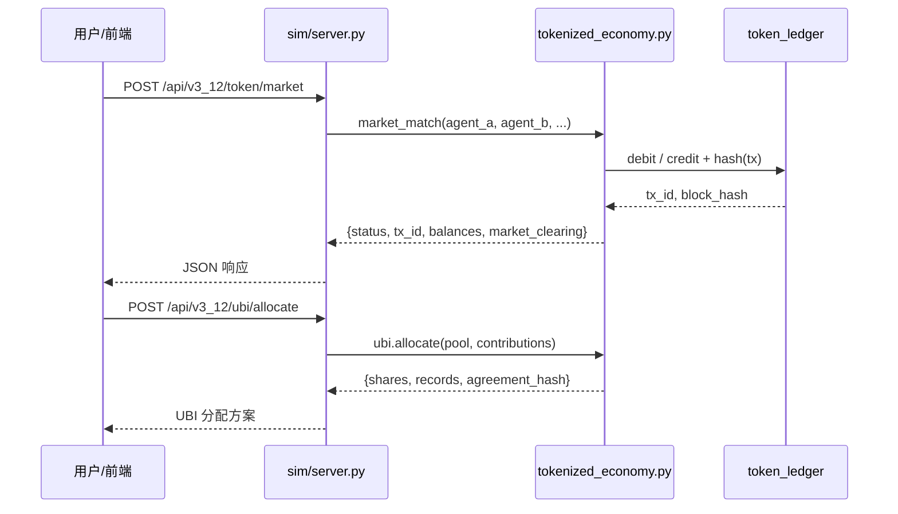
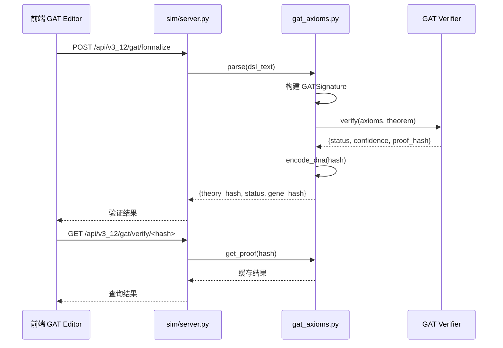
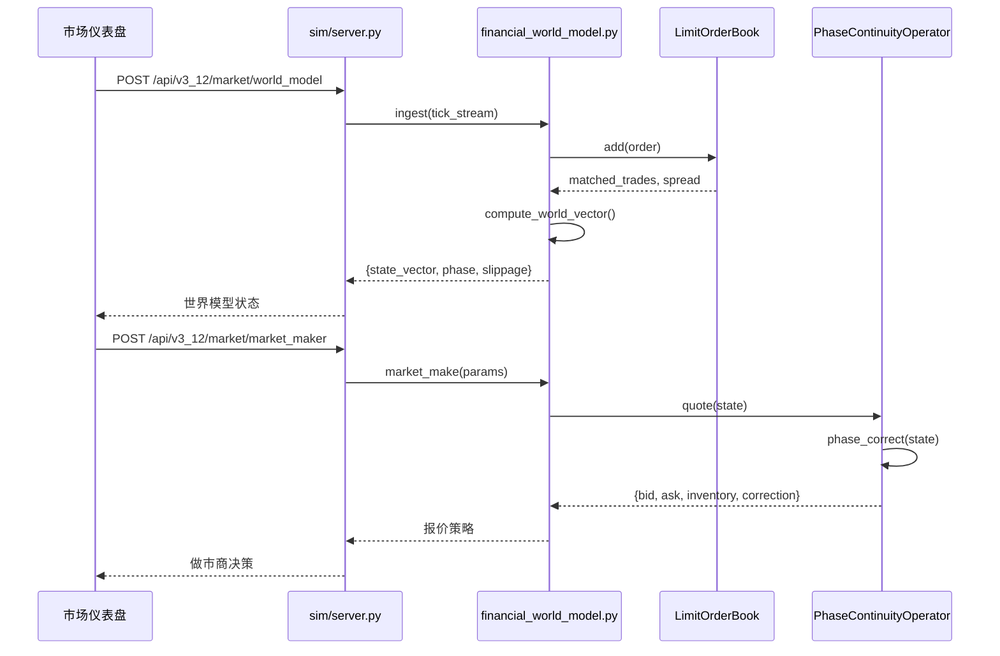
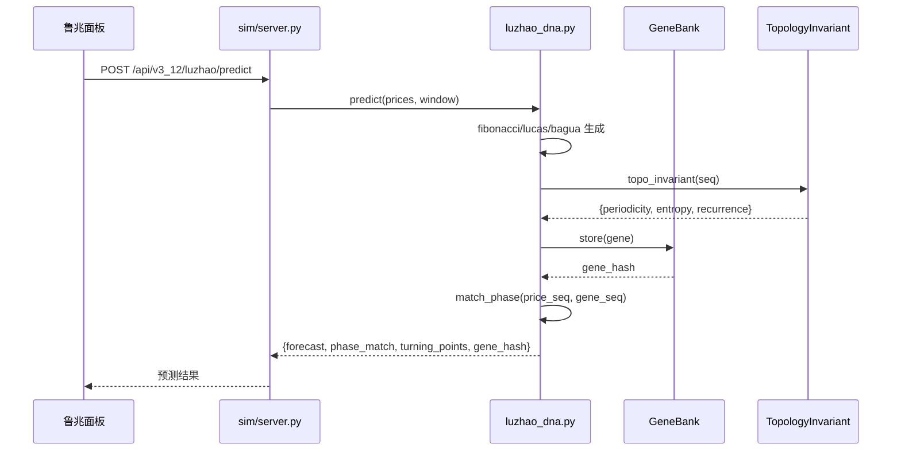

# TOMAS AGI v3.12 系统架构设计文档

**架构师**: 高见远 (Gao)  
**版本**: v3.12 Incremental  
**日期**: 2026-06-22  
**基于 PRD**: `sim/docs/prd_tomas_v3.12_incremental.md`  
**目标**: 在 v3.11（Flask 后端 + React/TS 前端）基础上，增量实现 P0 核心能力，保持 stdlib-only、零新增外部依赖，并与现有 140 个端点、~1,366 个 pytest 的代码风格一致。

---

## 1. 实现方案 + 框架选型

### 1.1 总体策略

v3.12 是“理论驱动、模拟实现、可验证”的增量版本。四个 P0 模块均采用**纯 Python 标准库**实现核心算法，不引入真实区块链、GATLab Julia 绑定或金融数据供应商，从而保证：

- 在 v3.11 的 Python 3.11+ 环境中无需 `pip install`；
- 每个模块可独立运行并自带 `_self_test()`；
- 与现有 κ-Snap、八元数超图、GaussEx 等模块保持同样的三层 `ImportError` 回退导入风格。

Flask 后端仅作为现有 HTTP 网关的延续，新增 `/api/v3_12/*` 端点；React 前端新增对应面板，通过已有 `apiClient.ts` 调用后端。

### 1.2 四大 P0 模块

| 模块 | 核心抽象 | 实现方式 | 与 v3.11 的关系 |
|------|---------|---------|----------------|
| **代币化资源账本** | `AgentWallet`、`TokenLedger`、`Market`、`UBIAllocator` | 内存链式账本 + SHA-256 交易哈希 + 余额检查 | 独立模块，可被 `goal_directed_agent` / `cognitive_health` 调用 |
| **GAT 宿主语言接口** | `GATSignature`、`GATTheory`、`GATTerm`、`Morphism`、`FreeModel` | 轻量 DSL 解析器（BNF 子集）+ 形式化验证框架 | 与 `semantic_math` 互补，为推理链提供可验证签名 |
| **相位连续算子（MM 模拟）** | `LimitOrderBook`、`MarketState`、`PhaseContinuityOperator`、`SlippageCost` | 模拟 LOB + 相位匹配度 + 滑点 = 相位失配代价 | 与 `wm_hyperedge` 世界模型接口对接 |
| **鲁兆 DNA 基因库** | `LuZhaoSequence`、`GeneBank`、`TopologyInvariant` | 纯 Python 数列生成 + 拓扑不变量检测 | 为 `taiyi_cycle_v2` 太乙预言机提供基因序列 |

### 1.3 前端选型

- 沿用 Vite + React + TypeScript；
- 新增 `AppMode` 与 `Sidebar` 导航项；
- 新增面板组件以 `Panel` 后缀命名，与现有 `CognitiveHealthPanel`、`GrillMePanel` 保持一致；
- 图表使用现有自定义 SVG + 简单 Canvas，避免引入图表库。

---

## 2. 文件列表及相对路径

### 2.1 新建后端文件

- `sim/tokenized_economy.py` — 代币、钱包、交易、市场、UBI。
- `sim/gat_axioms.py` — GAT 签名、DSL 解析、理论态射、自由模型与验证器。
- `sim/financial_world_model.py` — 限价订单簿、市场状态、相位连续算子、滑点。
- `sim/luzhao_dna.py` — 斐波那契/鲁加斯/八卦数生成、基因库、拓扑不变量。

### 2.2 修改后端文件

- `sim/server.py` — 新增 `/api/v3_12/*` 端点（约 12 个），并注册四个模块的 `_self_test()` 健康检查。
- `sim/models.py`（如需要）— 可选地新增 `TokenTransaction` / `GATProof` 的 SQLite 持久化表，本次优先内存实现，后续迭代再落地 ORM。

### 2.3 新建前端文件

- `deepseek-chat/src/components/TokenMarketPanel.tsx`
- `deepseek-chat/src/components/GATPanel.tsx`
- `deepseek-chat/src/components/FinancialWorldModelPanel.tsx`
- `deepseek-chat/src/components/LuZhaoPanel.tsx`
- `deepseek-chat/src/api/v3_12.ts` — 封装 v3.12 后端调用。

### 2.4 修改前端文件

- `deepseek-chat/src/types.ts` — 扩展 `AppMode`。
- `deepseek-chat/src/App.tsx` — 在 `renderPanel()` 中新增 `case` 分支。
- `deepseek-chat/src/components/Sidebar.tsx` — 在 `NAV_ITEMS` 中新增导航项。
- `deepseek-chat/src/api/apiClient.ts`（如需要）— 统一错误处理。

### 2.5 测试文件

- `tests/test_tokenized_economy.py`（≥15 用例）
- `tests/test_gat_axioms.py`（≥12 用例）
- `tests/test_financial_world_model.py`（≥18 用例）
- `tests/test_luzhao_dna.py`（≥16 用例）
- `tests/test_v3_12_integration.py` — 端点集成测试。

---

## 3. 数据结构与接口（类图）

```mermaid
classDiagram
    class TokenizedEconomy {
        +dict[str, AgentWallet] wallets
        +TokenLedger ledger
        +Market market
        +UBIAllocator ubi
        +create_agent(id, initial_balance, resources) AgentWallet
        +transfer(from_id, to_id, amount, resource) dict
        +settle_market() dict
        +allocate_ubi(pool, human_share) dict
        +_self_test() bool
    }
    class AgentWallet {
        +str agent_id
        +float token_balance
        +list resources
        +dict history
        +credit(amount) void
        +debit(amount) bool
        +to_dict() dict
    }
    class TokenLedger {
        +list blocks
        +append(tx) str
        +balance(agent_id) float
        +chain_hash() str
    }
    class Market {
        +list orders
        +match_orders() list
        +last_price() float
    }
    class UBIAllocator {
        +allocate(pool, contributions) dict
    }

    class GATAxioms {
        +GATSignature signature
        +list[GATAxiom] axioms
        +list[GATTerm] theorems
        +parse(dsl: str) GATTheory
        +verify(theory, theorem) dict
        +morphism_check(src, dst, term) bool
        +free_model(signature) dict
        +_self_test() bool
    }
    class GATSignature {
        +str name
        +list sorts
        +dict operations
        +to_dict() dict
    }
    class GATTheory {
        +GATSignature signature
        +list axioms
        +hash() str
        +prove(term) dict
    }
    class FreeModel {
        +dict carriers
        +interpret(term) dict
    }

    class FinancialWorldModel {
        +LimitOrderBook lob
        +MarketState state
        +PhaseContinuityOperator mm
        +ingest(ticks) dict
        +phase_match(symbol) float
        +slippage(order) float
        +market_make(params) dict
        +_self_test() bool
    }
    class LimitOrderBook {
        +list bids
        +list asks
        +add(order) void
        +cancel(order_id) bool
        +best_bid() float
        +best_ask() float
        +spread() float
    }
    class MarketState {
        +str symbol
        +float mid_price
        +float phase
        +dict world_vector
        +to_dict() dict
    }
    class PhaseContinuityOperator {
        +float inventory
        +float risk_aversion
        +quote(state) dict
        +phase_correct(state) dict
    }
    class SlippageCost {
        +compute(order, lob) float
    }

    class LuZhaoDNA {
        +GeneBank bank
        +generate(n, pattern) list
        +topo_invariant(seq) dict
        +match_phase(price_seq, gene_seq) float
        +predict(prices, window) dict
        +_self_test() bool
    }
    class GeneBank {
        +dict genes
        +store(gene) str
        +retrieve(hash) dict
    }
    class TopologyInvariant {
        +periodicity(seq) int
        +entropy(seq) float
        +recurrence(seq) list
    }

    TokenizedEconomy --> AgentWallet
    TokenizedEconomy --> TokenLedger
    TokenizedEconomy --> Market
    TokenizedEconomy --> UBIAllocator
    GATAxioms --> GATSignature
    GATAxioms --> GATTheory
    GATAxioms --> FreeModel
    FinancialWorldModel --> LimitOrderBook
    FinancialWorldModel --> MarketState
    FinancialWorldModel --> PhaseContinuityOperator
    FinancialWorldModel --> SlippageCost
    LuZhaoDNA --> GeneBank
    LuZhaoDNA --> TopologyInvariant
```



---

## 4. 程序调用流程（时序图）

### 4.1 代币市场交易 + UBI 分配



### 4.2 GAT 形式化验证



### 4.3 金融市场相位连续算子



### 4.4 鲁兆 DNA 预测



---

## 5. 任务列表（有序编号，含依赖）

| 编号 | 任务 | 描述 | 依赖 | 验收 |
|------|------|------|------|------|
| **T1** | 共享基础与接口约定 | 定义 `sim/v3_12_types.py`（或直接在四个模块内使用 `dataclass`），统一返回字典字段、异常类型、哈希工具 | 无 | 通过 `_self_test()` 基础用例 |
| **T2** | 实现 `sim/luzhao_dna.py` | 斐波那契、鲁加斯、八卦数生成；基因库；拓扑不变量；预测与相位匹配 | T1 | `_self_test()` ≥20 用例；pytest ≥16 |
| **T3** | 实现 `sim/gat_axioms.py` | GAT 签名、DSL 解析、理论态射、自由模型、验证器、DNA 编码哈希 | T1 | `_self_test()` ≥20 用例；pytest ≥12 |
| **T4** | 实现 `sim/tokenized_economy.py` | 钱包、链式账本、市场交易、UBI 分配 | T1 | `_self_test()` ≥20 用例；pytest ≥15 |
| **T5** | 实现 `sim/financial_world_model.py` | 模拟 LOB、市场状态、滑点、相位连续算子（做市商） | T1 | `_self_test()` ≥20 用例；pytest ≥18 |
| **T6** | 后端端点集成 | 在 `sim/server.py` 新增 `/api/v3_12/*` 端点；注册健康检查 | T2, T3, T4, T5 | 端点返回 JSON 200；无 500 |
| **T7** | 前端类型与导航 | 修改 `types.ts`、`Sidebar.tsx` | 无 | 新增 mode 可切换 |
| **T8** | 实现前端四个面板 | TokenMarketPanel、GATPanel、FinancialWorldModelPanel、LuZhaoPanel | T7, T6 | 面板可渲染、调用 API |
| **T9** | 集成测试与 CI | 编写 `tests/test_v3_12_integration.py`；确保 pytest 全部通过 | T6, T8 | ≥20 集成用例；CI 通过 |
| **T10** | 文档与示例 | 更新 `README.md`、补充 API 示例、完善本架构文档 | T9 | 文档完整 |

---

## 6. 依赖包列表

**v3.12 目标：stdlib only，零外部依赖。**

四个新模块仅使用 Python 标准库：

| 用途 | 标准库模块 |
|------|-----------|
| 数据结构/类型 | `dataclasses`, `typing`, `enum` |
| 哈希/加密 | `hashlib` |
| 数学/随机 | `math`, `random`, `statistics` |
| 序列/集合 | `collections`, `itertools` |
| JSON/时间 | `json`, `time`, `datetime` |
| 正则/解析 | `re` |
| UUID | `uuid` |
| 日志 | `logging` |
| 测试 | `doctest`（可选）、`unittest` / `pytest`（pytest 已存在） |

**已存在依赖（不新增）**：Flask、Flask-CORS、SQLAlchemy、React、TypeScript、Vite 等继续沿用；v3.12 不新增任何 `pip` 包。

---

## 7. 共享知识（跨文件约定）

### 7.1 文件头与风格

- 每个 `.py` 文件以 `UTF-8` 编码声明开头；
- 模块 docstring 包含：版本、核心概念、状态机（如有）、Author；
- 全部使用 `from __future__ import annotations` 保持前向兼容；
- 类型提示使用 `typing` 标准库，函数返回统一为 `dict` 或 `bool`。

### 7.2 三阶回退导入

与 `cognitive_health.py` / `ksnap_operator.py` 保持一致：

```python
try:
    from .existing_module import SomeClass
    _HAS_X = True
except ImportError:
    try:
        from existing_module import SomeClass
        _HAS_X = True
    except ImportError:
        _HAS_X = False
        SomeClass = None
```

若被依赖模块不存在，则功能降级但模块仍可导入和自检。

### 7.3 返回格式

所有 API 函数返回：

```python
{
    "success": bool,
    "data": Any | None,
    "error": str | None,
    "meta": {"timestamp": float, "version": str}
}
```

`server.py` 端点再统一包一层 `jsonify({"success": ..., "data": ...})`。

### 7.4 命名规范

- 模块/类：PascalCase；
- 函数/变量：snake_case；
- 常量：SCREAMING_SNAKE_CASE；
- 私有函数：前缀 `_`；
- 模块自检函数：`_self_test()`；
- 端点路由：`/api/v3_12/<domain>/<action>`；
- 前端 `AppMode`：kebab-case，如 `'token-market'`、`'gat'`、`'financial-world-model'`、`'luzhao'`。

### 7.5 测试与自检

- 每个新模块必须实现 `_self_test()`，且包含 **不少于 20 个断言/测试点**；
- 在文件末尾支持：`if __name__ == "__main__": _self_test()`；
- `pytest` 文件位于 `tests/` 目录，命名 `test_<module>.py`，覆盖正常、异常、边界三种场景。

---

## 8. 待明确事项

1. **代币经济参数**：总量、初始分配、UBI 人类/AGI 分配比例是否动态？建议由产品/经济模型提供默认值，代码中做成可配置常量。
2. **GAT DSL 语法范围**：是否仅支持“sort + term + axiom”子集？需要与理论团队确认可判定的语法边界，避免过度实现图灵完备证明器。
3. **金融市场数据源**：本次为模拟数据；若后续接入真实行情（Wind/同花顺/Bloomberg），需要新增数据适配层，可能引入外部依赖。
4. **鲁兆 DNA 的卦象参数**：八卦数循环是否需要与二十四节气/时间索引绑定？需要业务定义。
5. **持久化策略**：当前优先内存实现；是否需要将交易记录、GAT 证明、DNA 基因写入 SQLite？建议 v3.12.1 再落地 ORM 表。
6. **ARC-AGI-3 / 多模态甘极化 / 太乙增强版**：属于 P1/P2，本次架构预留接口，但不纳入 P0 实现排期。
7. **性能基线**：代币交易 <100 ms、GAT 验证 <5 s、鲁兆预测 <1 s 需要在 T9 集成测试中实际测量并写入 CI 阈值。

---

## 9. 结论

v3.12 通过四个 stdlib-only 模块（`tokenized_economy.py`、`gat_axioms.py`、`financial_world_model.py`、`luzhao_dna.py`）承载 P0 核心需求，保持与 v3.11 一致的三阶回退导入、`_self_test()` 自检和 dataclass 风格。后端通过 `sim/server.py` 新增 12 个 `/api/v3_12/*` 端点，前端通过 `App.tsx` / `Sidebar.tsx` / `types.ts` 扩展四个面板。所有新模块零外部依赖，确保在现有 CI 环境中可直接集成。
