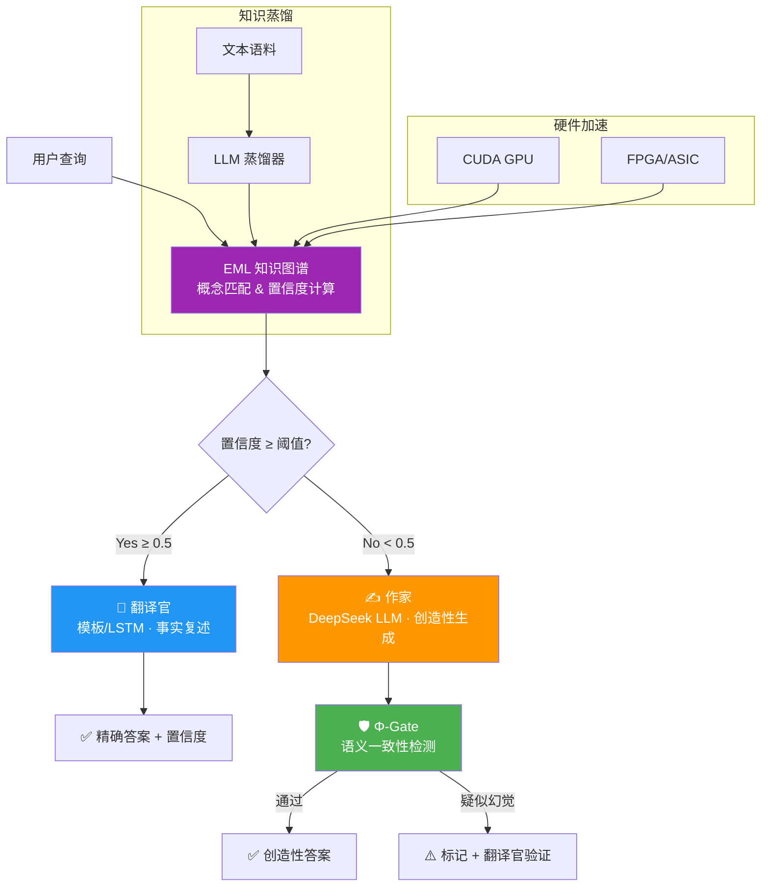

# 太极AGI · TOMAS-AGI

> **基于 NASGA（非结合谱图代数）的通用人工智能知识系统**  
> *"翻译官 + 作家"双引擎混合推理 · EML 知识图谱 · Φ-Gate 防幻觉监管*

[](https://www.python.org/)
[](./LICENSE)
[](./kernel/)
[]()
[](./kernel/)
[](./rtl/)

<p align="center">
  <br/>
  <em>TOMAS（太极OS）—— 容纳冲突、语义剪枝、非结合推理的新一代知识智能体</em>
  <br/><br/>
</p>

<!-- TODO: 添加截图 -->

---

## 📖 架构总览

TOMAS-AGI 采用 **"翻译官 + 作家"V3 混合架构**，将结构化知识图谱（EML）与大语言模型（DeepSeek）深度融合，实现事实查询的精确性与创造性推理的开放性兼得。



### 三种对话模式

| 模式 | 触发方式 | 引擎 | 适用场景 |
|------|---------|------|---------|
| 📖 **翻译官** | 置信度 ≥ 0.5 / `--force-translator` | 模板 + LSTM / EML 图检索 | 事实性查询、概念解释、精准复述 |
| ✍️ **作家** | 置信度 < 0.5 / `--force-creative` | DeepSeek LLM + Φ-Gate | 开放式推理、假设预测、创意生成 |
| 🔄 **自动路由** | 默认 / `--llm` | 智能裁决 | 推荐日常使用，无需手动切换 |

---

## ✨ 核心特性

- 🧠 **双引擎混合推理** — 翻译官（精确检索）+ 作家（LLM 创造），置信度自动路由，每次回答附带 `📡 EML路由 · 87%` 标签
- 🛡️ **Φ-Gate 防幻觉监管** — φ-空间语义一致性检测，LLM 输出与 EML 知识图谱核验，疑似幻觉自动标记 + 翻译官二次验证
- 🔍 **EML 知识蒸馏** — 文本语料一键蒸馏为 EML 知识图谱，支持多语料合并、重叠检测、冲突容纳（保留旧知 / 采纳新知 / 合并 / 忽略）
- 🕸️ **知识图谱可视化** — D3.js 力导向全画布布局，搜索高亮、边权重过滤、1-hop 邻居聚焦、语料领域筛选，节点 δ 值反映信息存在度
- ⚡ **多层硬件加速** — Python 仿真层 → C 内核模块 → CUDA GPU → FPGA/ASIC 四级计算层次，支持矩阵运算、八元数乘法、谱计算全链路加速
- 📐 **NASGA 数学基础** — 八元数（Fano 平面）、非结合谱图 Laplacian、ξ_c 效能指标、δ 信息存在度、Moufang 恒等式约束
- 🔗 **知识冲突容纳** — 不覆盖矛盾信息，用户逐条决策保留/采纳/合并，实现真正的不一致容忍知识管理
- 🗂️ **USCS 文件系统** — 自研 δ 加权文件系统，谱页索引 + EML 联动，CRC32 完整性，mmap 直 I/O
- 📚 **OwnThink 支持** — 大规模中文知识库导入，CSV/三元组格式自动解析蒸馏

---

## 🚀 快速开始

### 环境要求

- Python 3.10+
- pip（requests, numpy）
- DeepSeek API Key（可选，仅作家模式需要）
- PyTorch（可选，仅神经解码器训练需要）

### 1. 安装依赖

```bash
git clone https://github.com/lisoleg/tomas-agi.git
cd tomas-agi
pip install requests numpy
```

### 2. 配置 API Key

```bash
# 环境变量
export DEEPSEEK_API_KEY=sk-your-key-here

# 或写入 .env 文件
echo "DEEPSEEK_API_KEY=sk-your-key-here" > sim/.env
echo "DEEPSEEK_API_BASE=https://api.deepseek.com/v1" >> sim/.env
```

### 3. 蒸馏语料（生成 EML 图谱）

```bash
cd sim
python llm_distiller.py --distill ../data/physics.txt --output ../data/physics_distilled
```

### 4. 推理查询

```bash
# 自动路由模式（推荐）
python token_bridge.py \
  --load ../data/physics_distilled.eml \
  --concepts ../data/physics_distilled.concepts.json \
  --query "什么是牛顿第二定律" \
  --llm

# 纯翻译官模式（无需 API Key）
python token_bridge.py \
  --load ../data/physics_distilled.eml \
  --concepts ../data/physics_distilled.concepts.json \
  --query "牛顿第二定律" \
  --force-translator
```

### 5. 启动 Web Dashboard

```bash
cd web && python -m http.server 8080
# 访问 http://localhost:8080
```

### 6. 前端（独立仓库）

```bash
git clone https://github.com/lisoleg/tomas-chat.git
cd deepseek-chat
npm install
npm run dev
# 访问 http://localhost:5173
```

---

## 📁 项目结构

```
tomas-agi/
├── sim/                          # Python 仿真与推理引擎
│   ├── token_bridge.py           # Token Bridge 推理引擎（翻译官+作家+φ-Gate）
│   ├── llm_distiller.py          # LLM 知识蒸馏器（语料→EML）
│   ├── token_generator.py        # 神经解码器（模板 + PyTorch LSTM）
│   ├── nasga_core.py             # NASGA 核心（ξ_c + δ + Moufang）
│   ├── octonion_py.py            # 八元数代数（Fano 平面 + 自测）
│   ├── spectral_laplacian_py.py  # 非结合 Laplacian（NetworkX）
│   ├── xi_c_measure.py           # ξ_c 效能指标
│   ├── fold_depth_py.py          # δ 参数 v2.0（A1 公理 + 域分类）
│   ├── delta_mem_py.py           # δ-记忆融合
│   ├── a6_bs_benchmark.py        # A6-BS 性能基准
│   ├── drift_detector.py         # 知识漂移检测
│   ├── tomas_sim.py              # 主仿真器（全模块集成）
│   ├── ownthink_importer.py      # OwnThink 大知识库导入
│   ├── extract_pdf_text.py       # PDF 文本提取
│   └── uscs_fs_test.py           # USCS 文件系统测试
│
├── kernel/                       # C 内核模块（~244K 行）
│   ├── tproc_core.c              # T-Processor 主模块
│   ├── octonion.c                # 八元数内核库
│   ├── spectral_laplacian.c      # EML 非结合 Laplacian
│   ├── asym_residue.c            # 结合子残差 + Moufang(3)
│   ├── kappa_reg.c               # κ=7 稳态调节器（PID）
│   ├── eml_map.c                 # EML 谱图内存映射
│   ├── phi_gate.c                # Φ-Gate 语义门控
│   ├── delta_mem.c               # δ-mem L1-L2 融合
│   ├── ci_gate.c                 # CI Gate 因果隔离
│   ├── st_auditor.c              # ST 倾斜审计
│   ├── uscsfs/                   # USCS 文件系统
│   │   ├── super.c               # 超级块（CRC32 + δ 持久化）
│   │   ├── inode.c               # inode（谱页 + δ 权重）
│   │   ├── file.c                # Continuation 读写
│   │   └── mmap.c                # δ 加权页映射
│   ├── cuda_delta_mem.cu         # CUDA δ-mem 加速
│   ├── cuda_laplacian.cu         # CUDA Laplacian 加速
│   ├── cuda_octonion.cu          # CUDA 八元数加速
│   └── Makefile                  # 编译框架
│
├── rtl/                          # Verilog FPGA RTL（~32K 行）
│   ├── octonion_mul.v            # 八元数乘法器（3 级流水线）
│   ├── delta_compute.v           # δ 计算单元
│   ├── spectral_engine.v         # 谱计算引擎
│   └── Makefile                  # Icarus/Vivado/Yosys 仿真
│
├── tools/                        # 用户态工具
│   ├── integrity_check.py        # 完整性自检（42/42 PASS）
│   ├── tomas_bench.py            # CPU vs GPU vs FPGA 基准
│   └── uscsctl.py                # USCS 管理 CLI
│
├── data/                         # 语料与蒸馏数据
│   ├── physics.txt               # 物理学语料
│   ├── chemistry.txt             # 化学语料
│   ├── medicine.txt              # 医学语料
│   ├── quantum_computing.txt     # 量子计算语料
│   ├── ownthink_sample.csv       # OwnThink 知识库样本
│   ├── physics_distilled.eml     # 蒸馏后 EML 图谱
│   └── *.concepts.json           # 概念名称映射
│
├── web/                          # Web 仪表板
│   └── index.html                # 单文件 Dashboard（6 板块）
│
├── docs/                         # 文档
├── LICENSE                       # Apache 2.0
└── README.md                     # 本文件
```

---

## 🗂️ 技术栈

| 层级 | 技术 | 说明 |
|------|------|------|
| **数学基础** | 八元数 · Moufang 恒等式 · Fano 平面 | NASGA 非结合代数 |
| **知识表示** | EML（谱图）· δ 信息存在度 · ξ_c 效能指标 | 结构化知识图谱 |
| **推理引擎** | Python 3.10+ · 模板匹配 · PyTorch LSTM | 翻译官核心 |
| **LLM 集成** | DeepSeek API (deepseek-chat) · Φ-Gate | 作家 + 防幻觉 |
| **前端框架** | Vite + React 18 + TypeScript + Tailwind CSS | deepseek-chat 独立仓库 |
| **图谱可视化** | D3.js（力导向图） | EML 前端渲染 |
| **C 内核** | Linux Kernel Module · 14 模块 | NASGA 内核加速 |
| **CUDA** | NVIDIA GPU · cuBLAS · CSR SpMV | 八元数/Laplacian/δ-mem 加速 |
| **FPGA** | Verilog · Icarus · Vivado · Yosys | 硬件级谱计算 |
| **文件系统** | USCS · δ 加权页映射 · CRC32 | 知识持久化 |
| **工具链** | Make · Git · Python CLI · Web Dashboard | 开发与运维 |

---

## 📊 验证状态

| 层级 | 模块数 | 验证结果 |
|------|--------|---------|
| M1 Python 仿真 | 9 | 9/9 PASS |
| M2 C 内核 | 10 | 10/10 PASS |
| M3 USCS 文件系统 | 4 | 5/5 PASS |
| M4 CUDA 加速 | 3 | 3/3 PASS |
| M5 推理应用 | 7 | 翻译官(模板+LSTM) + 作家(DeepSeek+φ-Gate) |
| M6 工具 | 3 | 42/42 完整性 PASS |
| **总计** | **40** | **全部通过** |

### LLM 对话测试（2026-06-14）

| 查询 | 领域 | 模式 | 置信度 | φ-Gate | 结果 |
|------|------|------|--------|--------|------|
| 牛顿第二定律 | 物理 | 翻译官 | 100% | — | ✅ |
| 物理学未来50年重大突破 | 物理 | 作家 | 65.9% | 80.3% | ✅ |
| 热力学 | 物理 | 自动路由 | 100% | — | ✅ |
| 暗物质不存在 | 物理 | 作家(强制) | 88.3% | 72.5% | ✅ |
| 有机化学未来趋势 | 化学 | 作家(强制) | 66.0% | 76.2% | ✅ |
| 基因编辑 | 医学 | 自动路由 | 67.4% | — | ✅ |
| 大语言模型改变科研 | AI | 自动路由 | 71.0% | — | ✅ |
| AI能否拥有意识 | AI | 作家(无Gate) | 76.9% | — | ✅ |

---

## 📖 关键参数速查

### token_bridge.py CLI 参数

| 参数 | 默认值 | 说明 |
|------|--------|------|
| `--load` | 必填 | EML 图文件路径 |
| `--concepts` | 无 | 概念名称 JSON 文件 |
| `--query` | 无 | 查询文本 |
| `--llm` | False | 启用 DeepSeek LLM（自动路由） |
| `--force-translator` | False | 强制翻译官模式 |
| `--force-creative` | False | 强制作家模式 |
| `--threshold` | 0.5 | 路由置信度阈值 |
| `--gate` | True | 启用 Φ-Gate 监管 |
| `--no-gate` | — | 禁用 Φ-Gate |
| `--gate-threshold` | 0.35 | φ-Gate 一致性阈值 |
| `--top-k` | 5 | 返回 top-k 匹配 |

---

## 📄 相关文档

| 文档 | 链接 |
|------|------|
| 系统架构 | [ARCHITECTURE.md](./docs/ARCHITECTURE.md) |
| 产品需求 | [PRD.md](./docs/PRD.md) |
| 用户指南 | [USER_GUIDE.md](./docs/USER_GUIDE.md) |
| 学术论文 | [paper.md](./docs/paper.md) |
| LLM 测试指南 | [LLM_TEST_GUIDE.md](./LLM_TEST_GUIDE.md) |
| Token Bridge 测试 | [TOKEN_BRIDGE_TEST_GUIDE.md](./TOKEN_BRIDGE_TEST_GUIDE.md) |
| 前端仓库 | [github.com/lisoleg/tomas-chat](https://github.com/lisoleg/tomas-chat) |

---

## 🙏 作者与致谢

**章锋（章锋）** © 2026 复合体理学研究中心（TOMAS 项目组）

基于 NASGA（Non-Associative Spectral Graph Algebra）理论框架，以八元数、非结合 Laplacian 和 Moufang 恒等式为数学基础，构建容纳冲突、语义剪枝、非结合推理的新一代 AGI 知识系统。

---

## 📄 License

[Apache License 2.0](./LICENSE) — 自由使用、修改与分发。
