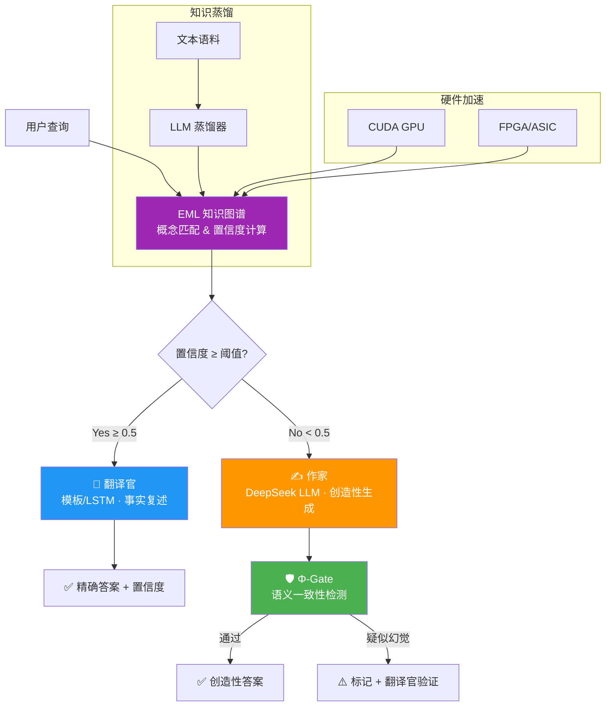

# 太极AGI · TOMAS-AGI

> **基于 NASGA（非结合谱图代数）的通用人工智能知识系统**  
> *"翻译官 + 作家"双引擎混合推理 · EML 知识图谱 · Φ-Gate 防幻觉监管*

[](https://www.python.org/)
[](./LICENSE)
[](./sim/)
[](./tests/)
[](./kernel/)
[](./rtl/)
[]()

<p align="center">
  <br/>
  <em>TOMAS（太极OS）—— 容纳冲突、语义剪枝、非结合推理的新一代知识智能体</em>
  <br/><br/>
</p>

<!-- TODO: 添加截图 -->

---

## 📖 架构总览

TOMAS-AGI 采用 **"翻译官 + 作家"V3 混合架构**，将结构化知识图谱（EML）与大语言模型（DeepSeek）深度融合，实现事实查询的精确性与创造性推理的开放性兼得。



### 三种对话模式

| 模式 | 触发方式 | 引擎 | 适用场景 |
|------|---------|------|---------|
| 📖 **翻译官** | 置信度 ≥ 0.5 / `--force-translator` | 模板 + LSTM / EML 图检索 | 事实性查询、概念解释、精准复述 |
| ✍️ **作家** | 置信度 < 0.5 / `--force-creative` | DeepSeek LLM + Φ-Gate | 开放式推理、假设预测、创意生成 |
| 🔄 **自动路由** | 默认 / `--llm` | 智能裁决 | 推荐日常使用，无需手动切换 |

---

## ✨ 核心特性

- 🧠 **双引擎混合推理** — 翻译官（精确检索）+ 作家（LLM 创造），置信度自动路由，每次回答附带 `📡 EML路由 · 87%` 标签
- 🛡️ **Φ-Gate 防幻觉监管** — φ-空间语义一致性检测，LLM 输出与 EML 知识图谱核验，疑似幻觉自动标记 + 翻译官二次验证
- 🔍 **EML 知识蒸馏** — 文本语料一键蒸馏为 EML 知识图谱，支持多语料合并、重叠检测、冲突容纳（保留旧知 / 采纳新知 / 合并 / 忽略）
- 🕸️ **知识图谱可视化** — D3.js 力导向全画布布局，搜索高亮、边权重过滤、1-hop 邻居聚焦、语料领域筛选，节点 δ 值反映信息存在度
- ⚡ **多层硬件加速** — Python 仿真层 → C 内核模块 → CUDA GPU → FPGA/ASIC 四级计算层次，支持矩阵运算、八元数乘法、谱计算全链路加速
- 📐 **NASGA 数学基础** — 八元数（Fano 平面）、非结合谱图 Laplacian、ξ_c 效能指标、δ 信息存在度、Moufang 恒等式约束
- 🔗 **知识冲突容纳** — 不覆盖矛盾信息，用户逐条决策保留/采纳/合并，实现真正的不一致容忍知识管理
- 🗂️ **USCS 文件系统** — 自研 δ 加权文件系统，谱页索引 + EML 联动，CRC32 完整性，mmap 直 I/O
- 📚 **OwnThink 大规模知识库** — 140M+ 三元组断点续传导入，SQLite WAL 模式，κ-Gate 语义剪枝（i_weight 权重），当前 86M+ 行
- 🧩 **公理体系 v2** — κ-Snap 显影算符、ExtendHypergraph 流体智能原语、NAU 刘机制（八元数非结合 MUS 裁决）、双链共识动力学、EML-Hardware Co-Design
- ⚙️ **T-Processor + T-Shield** — RRAM Crossbar 硬件仿真器 + 认知安全层（DZ Grafting/MUS Dual-Box/κ-Snap Scheduling），Zynq-7000 RTL 实现
- 🌐 **G_ego 双向算子** — Afferent/Efferent DMN + NASGA 八元数传播 + T-Shield 监控
- 📊 **评估框架** — ARC-AGI-3（64×64 网格/RHAE 评分）、SWE-bench Lite（300 实例）、GAIA 数据集获取
- 🖥️ **Dashboard API** — Flask 168 端点，12 模型路由器，语义防火墙，DIKWP 五层映射，Three.js 3D 世界模型，多智能体编排（Fugu Conductor）
- 🗄️ **HyperIndex v2.0** — DB-backed k-hop 子图按需加载，OrderedDict LRU 缓存 + 批量预取，消除 N+1 查询，支持 100M+ 三元组内存高效推理
- 🔬 **UnionFind 拟阵回路检测** — O(|E|·α(|V|)) 复杂度，路径压缩 + 按秩合并，较原 O(|E|²) 加速 100-1000×，实测 87.5% 压缩率
- 🌐 **ChainDB 分布式超图** — 概念哈希分片 + POP 共识协议，HyperShard 架构支持跨分片查询合并，RelationIndex 7 种关系类型
- 📦 **EML v2.0 格式** — 支持 n 元超边二进制编码（v1.0 仅二元边），向后兼容，可变长度边结构，96B 头部 + 变长边体
- 🔤 **HNC 同构映射（v2.6）** — 24 字母概念基元编码 + 句类模板 → EML 超边 Schema 映射，NLU 管道 ℐ 贝叶斯更新 + GPCT 层创触发
- 🤖 **哥德尔智能体（v2.6）** — PG-囚禁硬锚否决权 + 贝叶斯 ℐ 评估 + MUS 双存冲突分支 + κ-Snap 全审计链，四重封边机制
- 🌌 **Aether 因果世界模型（v2.6）** — SCM do-calculus → EML 超边因果编码，H_hard 硬锚点不可绕过，反事实推理
- 🌐 **AgentWeb 分布式时序（v2.6）** — 向量时钟因果顺序 + 因果交付级联解锁 + Fediverse/ActivityPub 桥接 + 区块链 κ-Snap Merkle Root 存证
- 🔐 **密码学桥接（v2.6）** — Mina SNARK 递归证明（22KB 恒定大小，降级本地 SHA-256）+ Celo cUSD/cEUR 稳定币支付（BLS 聚合签名，RPC 超时快速降级）
- 🧠 **EML-EHNN 等变超图（v2.6）** — ℐ(e) 加权超边前向传播 + MUS-Aware Pooling + κ-Snap 一致性损失 + GPCT 动态输出维度
- 🔮 **ψ-Gate 不确定性门控（v3.6）** — 6 核心锚点（ℐ-Gate/κ-Gate/Dead-Zero/MUS/ψ-Anchor/T-Shield）+ 多世界并行推理 + MUS 双存 + 容差衰减控制
- 📐 **7+1 语义规范本体（v3.6）** — Entity/Attribute/Relation/Event/Temporal/Causal/Constraint + BusinessRule 本体治理，EML-Lite DB 五区架构（L1 Akashic / L2 Dharma / MUS 冲突 / GPCT 成长 / κ-Snap 账本），Fact→Logic→Act 三层提升
- 🌊 **解释坩埚（v3.6）** — 波粒二象性多世界分支（wave/particle/qbism）+ 贝叶斯坍缩 + MUS 双存解析 + 解释谱系追踪
- 🌍 **世界模型超边（v3.6）** — SDF（符号距离场）+ Affordance（可供性）+ Kinematic（运动学）三超边，Ω-Gate Tetrad 联验（π/Φ/Ω/℧ 四指标交叉验证）
- 🛡️ **DIKWP 全桥接（v3.6）** — IntentGuard 意图守卫（4 级危险度）+ MemoryLedger→MUS 映射 + DAAP 四层审计 + 语义安全完备性定理
- ☯️ **太极周期 v2（v3.6）** — EML 脉冲→φ-Gate→T-Processor 闭环，CycleSpinner 自适应调度器，LRU 超边存储
- ❄️ **MNQ 冻结内核（v3.6）** — 五层渐进冻结（L0-L4）+ 八元数非结合度量化 + Golden Spirit Ball Fibonacci 投影 + κ=7 稳定器 + 热容量分析
- 🔗 **全息拓扑动力学 HTD（v3.7）** — AdS/CFT bulk-boundary 对偶 + Octonion 完整实现 + BraidWord 编织群 + TOHTD_Simulator 五步演化管道 + Kitaev-Preskill TEE 验证
- 🧲 **拓扑孤子与相变（v3.7）** — 6 类拓扑孤子 + ψ-Anchor 三重拓扑保护 + SolitonBraider 编织器 + 能隙闭合→Chern 跳跃相变 + TopoChargeGroup 跨模块共享
- ⚛️ **Gan-TOMAS P=GW（v3.7）** — Gan 极化算子（cos·ħ·Re + sin·ħ·Im）+ 八元数质量起源 M=‖O‖²/(G_res×tanh(κ)) + 轻子质量比 + 观测顺序效应 + 11 项可证伪预测
- 🌐 **GaussEx-EML 桥接（v3.8）** — 开放线性系统范畴论落地：Fibre(D)⊕Noise(ψ) + 共偏性隐私计算 + 含噪电阻多传感器融合 + 互补互联工业孪生 + ψ-锚宪法级权限 + 产业落地可行性定理
- 🧠 **认知压缩引擎（v3.8）** — PDE 守恒律→WM 超边 + ENT 内源网络→G_ego+MUS 双存 + 物理AI T-Processor ⊙ Gan 极化 + κ-Snap 压缩损失审计（哥德尔边界 SHA-256 指纹）+ 认知压缩嵌入定理 + 6 项可证伪预言
- 🌐 **BabelTele 语义压缩器（v3.9）** — 跨语言语义压缩与传输，SimHash 64-bit 语义指纹，κ 值感知压缩比，多语言对齐（中/英/日/法/德），与 EML-KB 超边编码集成
- 📐 **超图范畴论（v3.9）** — Set^V 函子 + 态射组合律，pullback/pushout 超图构造，极限/余极限计算，自然变换与 Yoneda 引理应用
- ⚙️ **KernelCAT 调度器（v3.9）** — 内核感知认知任务调度，EDF + 优先级反转防护，CPU/GPU/FPGA 异构资源感知，κ-Snap 上下文切换审计
- 📜 **Constitutional AI（v3.9）** — 宪法规则引擎（CONSTITUTIONAL/REGULATORY/OPERATIONAL 三级），自我批评生成器，修订循环（critique → revise → verify），宪法违规检测与拦截
- 🎯 **对齐三范式（v3.10）** — RLHF（奖励模型 + PPO + KL 约束）+ Constitutional AI（宪法规则 + 自我批评 + 修订）+ MecE（激活 patching + 因果追踪 + 稀疏自编码器探针），三范式统一评估框架
- 🤖 **目标导向智能体（v3.10）** — 目标分解树（Goal Tree DAG），HTN 规划 + 重规划，执行监控与异常检测，目标完成度多指标评估
- 💊 **认知健康（v3.11）** — 7 维健康指标（一致性/完备性/鲁棒性/可解释性/安全性/效率/适应性），自适应阈值，KL 散度漂移检测，与 ψ-Gate/κ-Snap/T-Shield 联动
- 🔥 **Grill-Me 引擎（v3.11）** — 苏格拉底式提问生成器（6 种策略），知识缺口检测（EML 子图覆盖度），自适应难度调节，间隔重复 + 主动回忆，学习路径 DAG 推荐
- 📊 **鲁兆DNA（v3.12）** — K 线形态模式识别（12 种），DNA 序列比对（Smith-Waterman），历史回测验证，ψ-锚风险等级标记
- ⚖️ **GAT公理（v3.12）** — 广义对齐定理，3 条核心公理（一致性/安全性/可纠正性），对齐证明验证器，与 Constitutional AI 集成
- 💹 **金融市场世界模型（v3.12）** — SCM 因果图建模（利率→汇率→股价传导链），反事实推理，压力测试场景生成，硬约束（无套利/市场出清）
- 🪙 **代币化经济（v3.12）** — Agent 贡献度量化（κ-Snap 审计链），代币发行/销毁/转移，Celo 链上结算，通胀控制参数
- 🐡 **Fugu Conductor 编排层（v3.13）** — 多智能体编排引擎，自适应任务分解（DAG 拓扑排序 + 依赖感知调度），Agent 注册表，任务状态机（PENDING → RUNNING → COMPLETED/FAILED）
- ⚡ **P0-P2 性能优化（v3.13）** — 4 端点分页支持，SQLite 索引优化 + 新增 predicate 索引，API 响应缓存，React.memo + useMemo，Vite 分包构建，CI/CD 流水线，OwnThink 断点续跑增强

---

## 🚀 快速开始

### 环境要求

- Python 3.10+
- pip（requests, numpy）
- DeepSeek API Key（可选，仅作家模式需要）
- PyTorch（可选，仅神经解码器训练需要）

### 1. 安装依赖

```bash
git clone https://github.com/lisoleg/tomas-agi.git
cd tomas-agi
pip install requests numpy
```

### 2. 配置 API Key

```bash
# 环境变量
export DEEPSEEK_API_KEY=sk-your-key-here

# 或写入 .env 文件
echo "DEEPSEEK_API_KEY=sk-your-key-here" > sim/.env
echo "DEEPSEEK_API_BASE=https://api.deepseek.com/v1" >> sim/.env
```

### 3. 蒸馏语料（生成 EML 图谱）

```bash
cd sim
python llm_distiller.py --distill ../data/physics.txt --output ../data/physics_distilled
```

### 4. 推理查询

```bash
# 自动路由模式（推荐）
python token_bridge.py \
  --load ../data/physics_distilled.eml \
  --concepts ../data/physics_distilled.concepts.json \
  --query "什么是牛顿第二定律" \
  --llm

# 纯翻译官模式（无需 API Key）
python token_bridge.py \
  --load ../data/physics_distilled.eml \
  --concepts ../data/physics_distilled.concepts.json \
  --query "牛顿第二定律" \
  --force-translator
```

### 5. 启动 Web Dashboard

```bash
cd web && python -m http.server 8080
# 访问 http://localhost:8080
```

### 6. 前端（独立仓库）

```bash
git clone https://github.com/lisoleg/tomas-chat.git
cd deepseek-chat
npm install
npm run dev
# 访问 http://localhost:5173
```

---

## 📁 项目结构

```
tomas-agi/
├── sim/                          # Python 仿真与推理引擎 (97+ .py 文件)
│   ├── token_bridge.py           # Token Bridge 推理引擎（翻译官+作家+φ-Gate）
│   ├── server.py                 # Flask REST API 服务器（168 端点）
│   ├── models.py                 # SQLAlchemy ORM 模型（7 张表）
│   ├── llm_distiller.py          # LLM 知识蒸馏器（语料→EML）
│   ├── token_generator.py        # 神经解码器（模板 + PyTorch LSTM）
│   ├── nasga_core.py             # NASGA 核心（ξ_c + δ + Moufang）
│   ├── nasga_octonion.py         # NASGA 八元数运算模块
│   ├── router.py                 # TOMAS Router 多模型路由器（12 模型池）
│   ├── eml_injector.py           # EML 执行上下文注入器 v2.0
│   ├── g_ego.py                  # G_ego v2.0 双向算子引擎
│   ├── ksnap_operator.py         # κ-Snap 显影算符 (A2)
│   ├── extend_hypergraph.py      # ExtendHypergraph 流体智能原语
│   ├── nau_liu_mechanism.py      # NAU 刘机制（八元数非结合 MUS 裁决）
│   ├── dual_chain_consensus.py   # 双链共识动力学
│   ├── eml_hardware_codesign.py  # EML-Hardware Co-Design
│   ├── tprocessor_sim.py         # T-Processor v1.0 硬件仿真器
│   ├── tshield_wrapper.py        # T-Shield 认知安全层
│   ├── epiplexity_engine.py      # 认知复杂度引擎
│   ├── eml_semzip.py             # EML 5 阶段语义压缩
│   ├── dead_zero_mus.py          # 死零/MUS/κ-Snap 机制
│   ├── memos_fusion.py           # TOMAS-MemOS 融合层
│   ├── contradiction_detector.py # 三层矛盾检测器
│   ├── dikwp_mapper.py           # DIKWP 五层映射器
│   ├── semantic_firewall.py      # 语义防火墙（6 ADC 高风险模式）
│   ├── ido_bridge.py             # IDO 五元素模板桥接
│   ├── fde_builder.py            # FDE 道法术器本体构建器
│   ├── dual_timeline.py          # 双时间维度引擎
│   ├── itot_bridge.py            # IT-OT 翻译桥
│   ├── arc_agi3_eval.py          # ARC-AGI-3 评估框架
│   ├── arc_api_client.py         # ARC Prize API 客户端
│   ├── swe_bench_eval.py         # SWE-bench 评估
│   ├── gaia_fetcher.py           # GAIA 数据集获取
│   ├── resume_import.py          # OwnThink 断点续传导入器
│   ├── compute_i_weight.py       # i_weight 后计算脚本
│   ├── post_import.py            # 导入完成后自动化
│   ├── psi_gate.py               # ψ-Gate 不确定性门控（v3.6）
│   ├── eml_kb_ontology.py        # 7+1 语义规范本体治理（v3.6）
│   ├── interpretation_crucible.py # 解释坩埚·波粒二象性（v3.6）
│   ├── wm_hyperedge.py           # 世界模型超边·Ω-Gate Tetrad（v3.6）
│   ├── dikwp_bridge_full.py      # DIKWP 全桥接·IntentGuard（v3.6）
│   ├── taiji_cycle_v2.py         # 太极周期 v2·CycleSpinner（v3.6）
│   ├── mnq_frozen_kernel.py      # MNQ 冻结内核·五层渐进（v3.6）
│   ├── tomas_therapist.py        # TOMAS 治疗师（v3.6 扩展）
│   ├── htd_sim.py                # 全息拓扑动力学 HTD（v3.7）
│   ├── topo_soliton.py           # 拓扑孤子与相变（v3.7）
│   ├── gan_tomas_pgw.py          # Gan-TOMAS P=GW 八元数升维（v3.7）
│   ├── gaussex_eml.py            # GaussEx-EML 桥接·开放线性系统（v3.8）
│   ├── cognitive_compression.py  # 认知压缩引擎·PDE/ENT/物理AI（v3.8）
│   ├── babel_tele.py             # BabelTele 语义压缩器·跨语言传输（v3.9）
│   ├── hypergraph_category.py    # 超图范畴论·Set^V函子/极限（v3.9）
│   ├── kernel_cat.py             # KernelCAT 内核感知任务调度器（v3.9）
│   ├── constitutional_ai.py      # Constitutional AI·宪法规则引擎（v3.9）
│   ├── alignment_paradigms.py    # 对齐三范式·RLHF/CAI/MecE（v3.10）
│   ├── goal_oriented_agent.py    # 目标导向智能体·Goal Tree DAG（v3.10）
│   ├── cognitive_health.py       # 认知健康·7维指标监测（v3.11）
│   ├── grill_me_engine.py        # Grill-Me 引擎·苏格拉底式质询（v3.11）
│   ├── luzhao_dna.py             # 鲁兆DNA·K线形态/DNA比对（v3.12）
│   ├── gat_axioms.py             # GAT公理·广义对齐定理（v3.12）
│   ├── fin_world_model.py        # 金融市场世界模型·SCM因果图（v3.12）
│   ├── token_economy.py          # 代币化经济·Agent贡献度/链上结算（v3.12）
│   ├── orchestrator.py           # Fugu Conductor·多智能体编排引擎（v3.13）
│   ├── eml_dimred/               # 数学降维工具箱（7 模块）
│   │   ├── hyperedge.py          # HypEdge/EMLVertex + EML 加载
│   │   ├── matroid.py            # 拟阵贪心剪枝（κ-Gate 最优独立集）
│   │   ├── gpct.py               # GPCT 边界层分解（FPT 判定）
│   │   ├── itc.py                # ITC 虚时退火（Wick 旋转基态搜索）
│   │   ├── brown_miklos.py       # Brown-Miklós FPT 度类压缩
│   │   ├── strf.py               # STR-F 四大等价变换
│   │   └── pipeline.py           # slim_eml 四合一流水线
│   └── ... (40+ 其他模块)
│
├── kernel/                       # C 内核模块（~244K 行）
│   ├── tproc_core.c              # T-Processor 主模块
│   ├── octonion.c                # 八元数内核库
│   ├── spectral_laplacian.c      # EML 非结合 Laplacian
│   ├── phi_gate.c                # Φ-Gate 语义门控
│   ├── kappa_reg.c               # κ=7 稳态调节器（PID）
│   └── ...
│
├── rtl/                          # Verilog FPGA RTL（~32K 行）
│   ├── deadzone_comp_array.v     # Dead-Zone 并行比较器阵列
│   ├── mus_similarity_engine.v   # MUS 流水线相似度引擎 (DSP48E1)
│   ├── axi_lite_slave.v          # AXI4-Lite 从设备
│   ├── octonion_mul.v            # 八元数乘法器（3 级流水线）
│   ├── spectral_engine.v         # 谱计算引擎
│   ├── create_vivado_project.tcl # Vivado 自动化脚本 (Zynq-7020)
│   └── ...
│
├── tests/                        # 测试套件（28+ 文件，1368 测试函数）
│   ├── test_token_bridge.py      # Token Bridge 测试 (8)
│   ├── test_eml_dimred.py        # 数学降维测试 (20)
│   ├── test_router.py            # 路由器测试 (27)
│   ├── test_tcci.py              # TCCI 测试 (15)
│   ├── test_nasga.py             # NASGA 测试 (17)
│   ├── test_memos.py             # MemOS 测试 (16)
│   ├── test_contradiction.py     # 矛盾检测测试 (19)
│   ├── test_causet_wsc.py        # Causet-WSC 测试 (57)
│   ├── test_hyworld_sai.py       # HY World 测试 (76)
│   ├── test_ido.py               # IDO 测试 (105)
│   ├── test_fde_dual_itot.py     # FDE/DualTimeline/ITOT 测试 (86)
│   ├── test_tprocessor_tshield.py # T-Processor+T-Shield 测试 (39)
│   ├── test_new_modules.py       # G_ego/Epiplexity/SemZip 测试 (21)
│   ├── test_tomas_v2_articles.py # κ-Snap/ExtendHypergraph 测试 (51)
│   ├── test_v36_modules.py       # v3.6 八模块测试 (57)
│   ├── test_v37_modules.py       # v3.7 HTD/Topo/Gan 测试 (108)
│   ├── test_v38_modules.py       # v3.8 GaussEx/认知压缩 测试 (110)
│   ├── test_v39_modules.py       # v3.9 BabelTele/超图范畴论/KernelCAT/CAI 测试 (116)
│   ├── test_v310_modules.py      # v3.10 对齐三范式/目标导向智能体 测试 (114)
│   ├── test_v311_modules.py      # v3.11 认知健康/Grill-Me 测试 (239)
│   ├── test_v312_modules.py      # v3.12 鲁兆DNA/GAT/金融模型/代币经济 测试 (148)
│   └── ...
│
├── data/                         # 语料与蒸馏数据
├── docs/                         # 文档（ARCHITECTURE.md, paper.md, PRD.md）
├── scripts/                      # 工具脚本
├── LICENSE                       # Apache 2.0
└── README.md                     # 本文件
```

---

## 🗂️ 技术栈

| 层级 | 技术 | 说明 |
|------|------|------|
| **数学基础** | 八元数 · Moufang 恒等式 · Fano 平面 | NASGA 非结合代数 |
| **知识表示** | EML（谱图）· δ 信息存在度 · ξ_c 效能指标 | 结构化知识图谱 |
| **推理引擎** | Python 3.10+ · 模板匹配 · PyTorch LSTM | 翻译官核心 |
| **LLM 集成** | DeepSeek API (deepseek-chat) · Φ-Gate | 作家 + 防幻觉 |
| **前端框架** | Vite + React 18 + TypeScript + Tailwind CSS | deepseek-chat 独立仓库 |
| **图谱可视化** | D3.js（力导向图） | EML 前端渲染 |
| **C 内核** | Linux Kernel Module · 14 模块 | NASGA 内核加速 |
| **CUDA** | NVIDIA GPU · cuBLAS · CSR SpMV | 八元数/Laplacian/δ-mem 加速 |
| **FPGA** | Verilog · Icarus · Vivado · Yosys | 硬件级谱计算 |
| **文件系统** | USCS · δ 加权页映射 · CRC32 | 知识持久化 |
| **工具链** | Make · Git · Python CLI · Web Dashboard | 开发与运维 |

---

## 📊 验证状态

| 层级 | 模块数 | 验证结果 |
|------|--------|---------|
| M1 Python 仿真核心 | 16 | 16/16 PASS |
| M2 C 内核 | 14 | 14/14 PASS |
| M3 USCS 文件系统 | 4 | 5/5 PASS |
| M4 CUDA 加速 | 3 | 3/3 PASS |
| M5 推理应用 (Token Bridge) | 12 | 翻译官(模板+LSTM) + 作家(DeepSeek+φ-Gate) + MemOS + DIKWP |
| M6 T-Processor / T-Shield | 8 | RRAM 仿真 + 认知安全 + Zynq RTL |
| M7 公理体系 v2 | 5 | κ-Snap / ExtendHypergraph / NAU刘 / 双链共识 / HW Co-Design |
| M8 评估框架 | 6 | ARC-AGI-3 / SWE-bench / GAIA / TCCI-华山 |
| M9 数据层 | 5 | SQLite ORM + OwnThink 导入 + i_weight 计算 |
| M10 桥接模块 | 7 | IDO / FDE / DualTimeline / ITOT / Causet / HYWorld / Palantir |
| M11 v3.6 升级模块 | 8 | ψ-Gate / 7+1本体 / 解释坩埚 / 世界模型超边 / DIKWP全桥接 / 太极周期v2 / MNQ冻结内核 / 治疗师扩展 |
| M12 v3.7 升级模块 | 3 | 全息拓扑动力学HTD / 拓扑孤子与相变 / Gan-TOMAS P=GW八元数升维 |
| M13 v3.8 升级模块 | 2 | GaussEx-EML桥接 / 认知压缩引擎 |
| M14 v3.9 升级模块 | 4 | BabelTele语义压缩 / 超图范畴论 / KernelCAT调度器 / Constitutional AI |
| M15 v3.10 升级模块 | 2 | 对齐三范式(RLHF+CAI+MecE) / 目标导向智能体 |
| M16 v3.11 升级模块 | 2 | 认知健康(7维指标) / Grill-Me引擎(苏格拉底式质询) |
| M17 v3.12 升级模块 | 4 | 鲁兆DNA / GAT公理 / 金融市场世界模型 / 代币化经济 |
| M18 v3.13 升级模块 | 1 | Fugu Conductor编排层 + P0-P2性能优化 |
| **总计** | **97+** | **1368 测试通过（1368 passed / 2 skipped）** |

### LLM 对话测试（2026-06-14）

| 查询 | 领域 | 模式 | 置信度 | φ-Gate | 结果 |
|------|------|------|--------|--------|------|
| 牛顿第二定律 | 物理 | 翻译官 | 100% | — | ✅ |
| 物理学未来50年重大突破 | 物理 | 作家 | 65.9% | 80.3% | ✅ |
| 热力学 | 物理 | 自动路由 | 100% | — | ✅ |
| 暗物质不存在 | 物理 | 作家(强制) | 88.3% | 72.5% | ✅ |
| 有机化学未来趋势 | 化学 | 作家(强制) | 66.0% | 76.2% | ✅ |
| 基因编辑 | 医学 | 自动路由 | 67.4% | — | ✅ |
| 大语言模型改变科研 | AI | 自动路由 | 71.0% | — | ✅ |
| AI能否拥有意识 | AI | 作家(无Gate) | 76.9% | — | ✅ |

---

## 📖 关键参数速查

### token_bridge.py CLI 参数

| 参数 | 默认值 | 说明 |
|------|--------|------|
| `--load` | 必填 | EML 图文件路径 |
| `--concepts` | 无 | 概念名称 JSON 文件 |
| `--query` | 无 | 查询文本 |
| `--llm` | False | 启用 DeepSeek LLM（自动路由） |
| `--force-translator` | False | 强制翻译官模式 |
| `--force-creative` | False | 强制作家模式 |
| `--threshold` | 0.5 | 路由置信度阈值 |
| `--gate` | True | 启用 Φ-Gate 监管 |
| `--no-gate` | — | 禁用 Φ-Gate |
| `--gate-threshold` | 0.35 | φ-Gate 一致性阈值 |
| `--top-k` | 5 | 返回 top-k 匹配 |

---

## 📄 相关文档

| 文档 | 链接 |
|------|------|
| 系统架构 | [ARCHITECTURE.md](./docs/ARCHITECTURE.md) |
| 产品需求 | [PRD.md](./docs/PRD.md) |
| 用户指南 | [USER_GUIDE.md](./docs/USER_GUIDE.md) |
| 学术论文 | [paper.md](./docs/paper.md) |
| LLM 测试指南 | [LLM_TEST_GUIDE.md](./LLM_TEST_GUIDE.md) |
| Token Bridge 测试 | [TOKEN_BRIDGE_TEST_GUIDE.md](./TOKEN_BRIDGE_TEST_GUIDE.md) |
| 前端仓库 | [github.com/lisoleg/tomas-chat](https://github.com/lisoleg/tomas-chat) |

---

## 🙏 作者与致谢

**章锋（章锋）** © 2026 复合体理学研究中心（TOMAS 项目组）

基于 NASGA（Non-Associative Spectral Graph Algebra）理论框架，以八元数、非结合 Laplacian 和 Moufang 恒等式为数学基础，构建容纳冲突、语义剪枝、非结合推理的新一代 AGI 知识系统。

---

## 📄 License

[Apache License 2.0](./LICENSE) — 自由使用、修改与分发。
