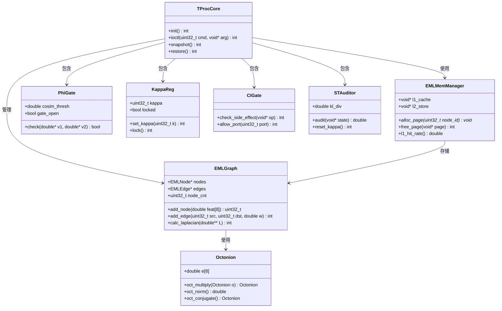
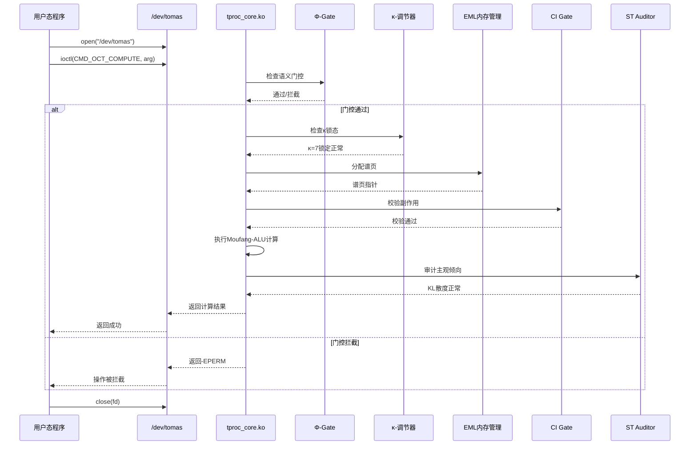
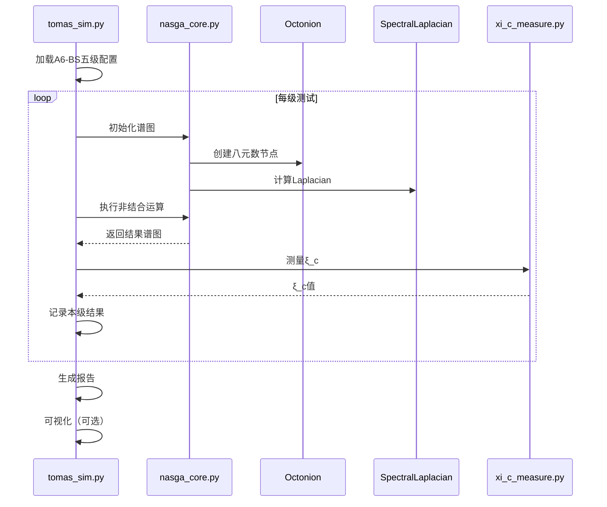
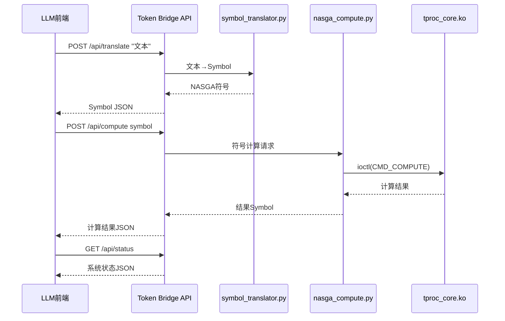

# TOMAS-AGI 系统架构设计文档

> 版本：v3.13 | 日期：2026-06-23 | 架构师：高见远（Gao）

---

## 1. 实现方案 + 框架选型

### 1.1 技术栈总览

| 层级 | 语言/框架 | 选型理由 |
|------|----------|---------|
| **软件仿真** | Python 3.11 + NumPy + SciPy | 快速验证NASGA数学正确性，NumPy向量化加速谱图计算 |
| **数据持久化** | SQLite + SQLAlchemy ORM | 7张表存储语料/知识/会话/配置，D:/tomas-data/tomas.db |
| **后端 API** | Flask + Flask-CORS | RESTful API 服务，知识图谱增删改查，κ-Gate 过滤 |
| **Token Bridge** | Python + FastAPI | 混合推理引擎（翻译官+作家），置信度路由 |
| **前端** | React 18 + TypeScript + Vite | 现代化Web界面，D3.js可视化 |
| **前端测试** | Vitest + React Testing Library | 单元测试，组件测试 |
| **内核模块** | C（Linux Kernel 5.15+） | 直接访问硬件资源，ioctl接口与用户态通信 |
| **GPU加速** | CUDA 12.x（sm_70+） | 八元数乘法大规模并行化 |
| **形式化校验** | Lean 4 + Coq 8.17 | Lean 4用于MNQ认知校验，Coq用于双重验证 |
| **构建系统** | Makefile + Kbuild（内核） + Vite（前端） | 各语言标准构建工具 |
| **前端样式** | Tailwind CSS 4 | 实用优先的CSS框架，快速UI开发 |
| **状态管理** | Zustand（4个store） | 轻量级状态管理，app/dashboard/chat/tshield |
| **3D渲染** | Three.js + @react-three/fiber | 3D场景可视化，WorldModelViewer组件 |

### 1.2 整体架构分层

```
┌─────────────────────────────────────────────────────┐
│               应用层                                  │
│  Token Bridge REST API / LLM前端 / Web可视化         │
├─────────────────────────────────────────────────────┤
│               数据层                                  │
│  SQLite + SQLAlchemy ORM / models.py (7张表)         │
│  κ-Gate 语义剪枝 / BFS 子图过滤                      │
├─────────────────────────────────────────────────────┤
│               运行时层                                │
│  tomas_sim.py (仿真) / server.py (API)              │
├─────────────────────────────────────────────────────┤
│              内核层                                  │
│  tproc_core.ko / uscsfs.ko / mr_array.ko           │
│  Φ-Gate / κ-调节器 / δ-mem / CI Gate / ST Auditor  │
├─────────────────────────────────────────────────────┤
│              硬件抽象层                              │
│  CUDA Kernel / FPGA RTL / 忆阻器物理层              │
├─────────────────────────────────────────────────────┤
│              形式化校验层                            │
│  Lean MNQ / Coq证明 / Blueprint DAG                 │
└─────────────────────────────────────────────────────┘
```

---

## 2. 完整文件树

```
tomas_agi/
├── docs/
│   ├── PRD.md                          # 产品需求文档
│   ├── ARCHITECTURE.md                 # 本文档
│   ├── paper.md                        # 学术论文（v2.5，含 MemOS 融合层 + 公理体系v2 + 评估框架）
│   ├── paper_memos_fusion.md           # MemOS 融合层技术文档
│   ├── prd_memos_fusion.md             # MemOS 融合层 PRD
│   ├── prd_memos_contradiction_v1.1.md # 矛盾检测增强 PRD
│   ├── architecture_memos_contradiction_v1.1.md # 矛盾检测架构设计
│   ├── tshield_zynq_arch.md            # T-Shield Zynq-7000 架构设计
│   ├── tomas_dashboard_arch.md         # Dashboard 架构设计
│   └── USER_GUIDE.md                   # 用户使用手册
├── include/
│   └── tomas/
│       ├── common.h                    # 公共宏、类型定义
│       ├── octonion.h                  # 八元数接口
│       ├── spectral_graph.h            # 谱图数据结构
│       ├── eml_map.h                   # EML内存映射接口
│       ├── phi_gate.h                  # Φ-Gate接口
│       ├── kappa_reg.h                 # κ-调节器接口
│       ├── ci_gate.h                   # CI Gate接口
│       ├── st_auditor.h                # ST审计器接口
│       └── constants.h                 # 物理常数（I(X)守恒等）
├── sim/                                # Python 仿真与推理引擎 (97+ .py 文件)
│   ├── models.py                       # SQLAlchemy ORM 模型定义（7张表）
│   ├── server.py                       # Flask REST API 服务器（168 端点）
│   ├── token_bridge.py                 # Token Bridge 推理引擎（含κ-Gate + MemOS集成）
│   ├── tomas_sim.py                    # 主仿真器入口
│   ├── nasga_core.py                   # NASGA核心代数运算
│   ├── nasga_octonion.py               # NASGA 八元数运算模块
│   ├── octonion_py.py                  # 八元数Python实现
│   ├── spectral_laplacian_py.py        # 谱图Laplacian Python实现
│   ├── a6_bs_benchmark.py              # A6-BS五级基准测试
│   ├── xi_c_measure.py                 # ξ_c效能指标测量
│   ├── fold_depth_py.py                # δ 参数 v2.0（A1 公理 + 域分类）
│   ├── delta_mem_py.py                 # δ-记忆融合
│   ├── drift_detector.py               # 知识漂移检测
│   ├── llm_distiller.py                # LLM 知识蒸馏器
│   ├── token_generator.py              # 神经解码器（LSTM）
│   ├── visualizer.py                   # 仿真结果可视化
│   ├── router.py                       # TOMAS Router 多模型路由器（12 模型池）
│   ├── eml_injector.py                 # EML 执行上下文注入器 v2.0
│   ├── model_pool.json                 # 12 家开源模型池配置
│   ├── batch_import.py                 # OwnThink CSV → SQLite 批量导入器
│   ├── import_ownthink_sqlite.py       # OwnThink 导入器（SQLAlchemy版）
│   ├── ownthink_importer.py            # OwnThink → EML 格式导入器
│   ├── resume_import.py                # OwnThink 断点续传导入器（原生sqlite3/WAL）
│   ├── compute_i_weight.py             # i_weight 后计算脚本（κ-Gate语义权重）
│   ├── post_import.py                  # 导入完成后自动化
│   ├── ─── MemOS 融合层 (V1.1) ───
│   ├── memos_fusion.py                 # TOMAS-MemOS 核心融合层（五点升维）
│   ├── memos_integration.py            # Token Bridge 集成包装器
│   ├── psi_anchor.py                   # ψ-锚数据结构与管理器
│   ├── contradiction_detector.py       # 三层矛盾检测器（否定词/NLP/EML）
│   ├── ─── Dead-Zero / MUS 机制 ───
│   ├── dead_zero_mus.py                # 死零/MUS/κ-Snap 机制
│   ├── quantum_dead_zero.py            # 量子死零检测
│   ├── spatial_dead_zero.py            # 3D几何物理接地审计
│   ├── ─── DIKWP 体系 ───
│   ├── dikwp_mapper.py                 # DIKWP 五层映射器
│   ├── semantic_math.py                # 语义数学运算
│   ├── dikwp_ac.py                     # 人工意识（AC）模块
│   ├── dikwp_eml_bridge.py             # DIKWP↔EML 桥接
│   ├── agent_audit.py                  # DAAP 审计代理
│   ├── ─── 桥接模块 ───
│   ├── causet_bridge.py                # Wolfram超图↔EML桥接（DPO死零守卫）
│   ├── hyworld_bridge.py               # HY World 2.0↔TOMAS EML桥接
│   ├── ido_bridge.py                   # IDO五元素模板桥接
│   ├── fde_builder.py                  # FDE道法术器本体构建器
│   ├── dual_timeline.py                # 双时间维度引擎
│   ├── itot_bridge.py                  # IT-OT翻译桥
│   ├── palantir_mapper.py              # 本体→EML超图映射
│   ├── ─── 安全审计 ───
│   ├── semantic_firewall.py            # 语义防火墙（6 ADC高风险模式）
│   ├── scada_daap.py                   # SCADA环境DAAP审计
│   ├── hodge_operator.py               # TOMAS-WSC融合算子 L+λΠ
│   ├── sai_tproc.py                    # T-Processor 后审计层
│   ├── ├── T-Processor / T-Shield ───
│   ├── tprocessor_sim.py               # T-Processor v1.0 硬件仿真器
│   ├── tshield_wrapper.py              # T-Shield 认知安全层
│   ├── processor_tshield_integration.py # T-Processor + T-Shield 联合推理
│   ├── tproc_if.py                     # T-Processor 接口
│   ├── t_shield_anydepth.py            # T-Shield 任意深度版
│   ├── heuristic_learn.py              # 启发式学习模块
│   ├── ├── 公理体系 v2 (2026-06-18) ───
│   ├── g_ego.py                        # G_ego v2.0 双向算子引擎
│   ├── ksnap_operator.py               # κ-Snap 显影算符 (A2)
│   ├── extend_hypergraph.py            # ExtendHypergraph 流体智能原语
│   ├── nau_liu_mechanism.py            # NAU 刘机制（八元数非结合MUS裁决）
│   ├── dual_chain_consensus.py         # 双链共识动力学
│   ├── eml_hardware_codesign.py        # EML-Hardware Co-Design
│   ├── ├── 认知压缩 ───
│   ├── epiplexity_engine.py            # 认知复杂度引擎
│   ├── eml_semzip.py                   # EML 5阶段语义压缩
│   ├── ├── 评估框架 (2026-06-18) ───
│   ├── arc_agi3_eval.py                # ARC-AGI-3 评估框架
│   ├── arc_api_client.py               # ARC Prize API 客户端
│   ├── swe_bench_eval.py               # SWE-bench 评估
│   ├── gaia_eval.py                    # GAIA 评估
│   ├── gaia_fetcher.py                 # GAIA 数据集获取脚本
│   ├── tcci_huashan_test.py            # TCCI-华山测试 v2
│   ├── ─── 数学降维工具箱 ───
│   ├── eml_dimred/
│   │   ├── hyperedge.py                # HypEdge/EMLVertex + EML 加载
│   │   ├── matroid.py                  # 拟阵贪心剪枝（κ-Gate 最优独立集）
│   │   ├── gpct.py                     # GPCT 边界层分解（FPT 判定）
│   │   ├── itc.py                      # ITC 虚时退火（Wick 旋转基态搜索）
│   │   ├── brown_miklos.py             # Brown-Miklós FPT 度类压缩
│   │   ├── strf.py                     # STR-F 四大等价变换
│   │   └── pipeline.py                 # slim_eml 四合一流水线
│   └── ...
├── kernel/                             # C 内核模块（~244K 行）
│   ├── tproc_core.c                    # T-Processor主模块
│   ├── octonion.c                      # 八元数C实现（Fano查表）
│   ├── spectral_laplacian.c            # 谱图Laplacian计算
│   ├── asym_residue.c                  # 结合子残差计算
│   ├── kappa_reg.c                     # κ=7稳态调节器
│   ├── eml_map.c                       # EML谱图内存管理
│   ├── phi_gate.c                      # Φ-Gate语义门控
│   ├── delta_mem.c                     # δ-mem L1-L2融合
│   ├── ci_gate.c                       # CI Gate副作用校验
│   ├── st_auditor.c                    # ST主观倾向审计
│   ├── port_ctrl.c                     # TXN Port管控
│   └── Makefile                        # 内核模块构建
├── rtl/                                # Verilog FPGA RTL（~32K 行）
│   ├── deadzone_comp_array.v           # Dead-Zone 并行比较器阵列
│   ├── mus_similarity_engine.v         # MUS 流水线相似度引擎 (DSP48E1)
│   ├── axi_lite_slave.v                # AXI4-Lite 从设备 (12 寄存器)
│   ├── bram_threshold.v                # BRAM 双端口阈值存储
│   ├── tshield_pl_top.v                # PL 顶层模块
│   ├── octonion_mul.v                  # 八元数乘法器
│   ├── delta_compute.v                 # δ 计算单元
│   ├── spectral_engine.v               # 谱计算引擎
│   ├── create_vivado_project.tcl       # Vivado 自动化脚本 (Zynq-7020)
│   ├── tshield_hal.h/c                 # PS 端 C HAL (UIO/mmap)
│   └── tb_*.v                          # 测试平台
├── tests/                              # 测试套件（28+ 文件，1368 测试函数）
│   ├── test_token_bridge.py            # Token Bridge 测试 (8)
│   ├── test_eml_dimred.py              # 数学降维测试 (20)
│   ├── test_router.py                  # 路由器测试 (27)
│   ├── test_tcci.py                    # TCCI 测试 (15)
│   ├── test_nasga.py                   # NASGA 测试 (17)
│   ├── test_memos.py                   # MemOS 测试 (16)
│   ├── test_contradiction.py           # 矛盾检测测试 (19)
│   ├── test_causet_wsc.py              # Causet-WSC 测试 (57)
│   ├── test_hyworld_sai.py             # HY World 测试 (76)
│   ├── test_ido.py                     # IDO 测试 (105)
│   ├── test_fde_dual_itot.py           # FDE/DualTimeline/ITOT 测试 (86)
│   ├── test_tprocessor_tshield.py      # T-Processor+T-Shield 测试 (39)
│   ├── test_new_modules.py             # G_ego/Epiplexity/SemZip 测试 (21)
│   ├── test_tomas_v2_articles.py       # κ-Snap/ExtendHypergraph 测试 (51)
│   ├── test_adc.py                     # ADC 审计测试 (14)
│   └── ...
├── scripts/
│   ├── build_all.sh                    # 全量构建脚本
│   ├── run_sim.sh                      # 运行仿真
│   ├── audit_view.py                   # 审计日志查看工具
│   ├── test_endpoints.py              # Flask 端点测试（14 端点）
│   └── ci_gate_check.sh                # CI Gate手动检查
├── Makefile                            # 顶层构建
├── README.md                           # 项目说明
└── LICENSE                             # 许可证
```

---

## 3. 数据结构和接口

### 3.1 核心数据结构（C）

```c
/* include/tomas/octonion.h */
typedef struct {
    double e[8];  /* e0..e7: 1, e1..e7 (Fano平面基底) */
} Octonion;

/* include/tomas/spectral_graph.h */
typedef struct {
    uint32_t id;
    double   feat[8];   /* 8维特征（对应八元数） */
} EMLNode;

typedef struct {
    uint32_t src;
    uint32_t dst;
    double   weight;     /* 边权重，映射忆阻器电导 */
    double   I_conserv;  /* I(X)守恒标记 */
} EMLEdge;

typedef struct {
    EMLNode *nodes;
    EMLEdge *edges;
    uint32_t node_cnt;
    uint32_t edge_cnt;
    uint32_t cap_nodes;  /* 容量 */
    uint32_t cap_edges;
} EMLGraph;

/* include/tomas/eml_map.h */
typedef struct {
    void   *l1_cache;    /* L1 热数据缓存 */
    void   *l2_store;    /* L2 冷数据存储 */
    uint32_t page_size;   /* 4KB谱页 */
    uint32_t l1_hit;     /* L1命中次数 */
    uint32_t l1_miss;    /* L1未命中次数 */
} EMLMemManager;

/* include/tomas/phi_gate.h */
typedef struct {
    double  cosim_thresh;  /* 余弦相似度阈值 */
    bool    gate_open;      /* 门控状态 */
    uint64_t pass_count;    /* 通过计数 */
    uint64_t block_count;   /* 拦截计数 */
} PhiGate;

/* include/tomas/kappa_reg.h */
typedef struct {
    uint32_t kappa;       /* 当前κ值，锁定为7 */
    bool     locked;      /* 是否锁定 */
    uint64_t switch_ns;    /* 切换时间戳(ns) */
} KappaReg;

/* include/tomas/ci_gate.h */
typedef struct {
    uint32_t port_id;
    bool     allowed;      /* 是否允许操作 */
    double   side_effect;  /* 副作用计量 */
} CIGateEntry;

/* include/tomas/st_auditor.h */
typedef struct {
    double   kl_div;      /* KL散度 */
    double   threshold;    /* 触发阈值 */
    bool     kappa_reset;  /* 是否触发κ重置 */
    char     log_path[256];/* 审计日志路径 */
} STAuditor;
```

### 3.2 Mermaid 类图



### 3.3 SQLAlchemy ORM 数据模型（7张表）

TOMAS v2.0+ 的数据层已从 JSON 文件迁移到 **SQLite + SQLAlchemy ORM**。

**数据库位置**：`D:/tomas-data/tomas.db`（可通过环境变量 `TOMAS_DB_DIR` 自定义）

**当前规模**：86M+ 行 knowledge_triples（OwnThink 断点续传导入进行中，原始 CSV ~140M 行）

**7 张表结构**（定义于 `sim/models.py`）：

| 表名 | 类名 | 用途 | 关键字段 |
|------|------|------|----------|
| `corpus_entries` | CorpusEntry | 语料文本存储 | id, text, domain, concepts_count, relations_count |
| `conflict_decisions` | ConflictDecision | 冲突决策记录 | conflict_id, concept_name, domain, decision |
| `chat_sessions` | ChatSession | 聊天会话 | session_id, title, messages (JSON) |
| `api_keys` | ApiKey | API 密钥管理 | key_name, key_value |
| `knowledge_items` | KnowledgeItem | 知识条目 | concept, content, source, type |
| `knowledge_triples` | KnowledgeTriple | **核心表**：知识三元组 | subject, predicate, object, **i_weight** |
| `settings` | Setting | 系统配置 | key, value |

**`knowledge_triples` 关键索引**：
- `idx_triples_subject` / `idx_triples_object` — 按主体/客体查询
- `idx_triples_i_weight` — **κ-Gate 剪枝索引**
- `idx_triples_predicate` — **v3.13 新增**：按谓词查询索引，消除 predicate 过滤慢查询
- `uq_triple_spo` — INSERT OR IGNORE 去重唯一约束

**v3.13 索引优化**：
- 重建 `idx_triples_subject`/`idx_triples_object`/`idx_triples_i_weight`（ANALYZE 统计信息更新）
- 新增 `idx_triples_predicate` 索引
- API 响应缓存：`/api/knowledge/stats` 结果 5 分钟内存缓存，避免重复全表扫描

**引擎特性**：
- SQLAlchemy QueuePool 连接池（pool_size=5, max_overflow=10）
- `check_same_thread: False` 允许多线程并发访问
- 首次调用自动建表（`Base.metadata.create_all`）

### 3.4 κ-Gate 语义剪枝

**核心思想**：在 BFS 子图扩展时，根据顶点/边的信息存在度 I(X) 自动过滤低质量知识。

**I(X) 计算公式**（`import_ownthink_sqlite.py`）：
```
i_weight = 1.0 + ln(1 + subject_freq) / 10.0
```
- 范围：[1.0, ~3.0]（140M 行里最频繁的主体约 100 万次）

**BFS 子图扩展剪枝**（`token_bridge.py:310-390`）：
- `kappa = 0`：不剪枝，全图 BFS
- `kappa > 0`：仅保留 `I(X) >= kappa` 的顶点和边
- 返回剪枝统计：`pruned_vertices` / `pruned_edges`

**API 层支持**（`server.py`）：
- `GET /api/knowledge/triples?min_i_weight=1.5`
- `GET /api/knowledge/graph?min_i_weight=1.5`
- 结果按 `i_weight DESC` 排序

### 3.5 前端组件架构（v3.3更新）

**新增/修复的组件**：

| 组件 | 文件路径 | 功能 | 状态 |
|------|----------|------|------|
| **TShieldPanel** | `deepseek-chat/src/components/TShieldPanel.tsx` | T-Shield认知安全层监控面板 | ✅ 修复JSX解析错误 |
| **TProcessorPanel** | `deepseek-chat/src/components/TProcessorPanel.tsx` | T-Processor硬件仿真器监控面板 | ✅ 新增 |
| **IconCpu** | `deepseek-chat/src/components/icons.tsx` | CPU芯片SVG图标（用于T-Processor/T-Shield导航） | ✅ 新增 |
| **DistillPanel** | `deepseek-chat/src/components/DistillPanel.tsx` | 蒸馏UI + Token Bridge推理面板 | ✅ 修复未闭合`<div>`标签 |
| **OrchestratorPanel** | `deepseek-chat/src/components/OrchestratorPanel.tsx` | Fugu Conductor 多智能体编排控制面板 | ✅ v3.13 新增 |
| **CognitiveHealthPanel** | `deepseek-chat/src/components/CognitiveHealthPanel.tsx` | 认知健康监测面板（7 维指标） | ✅ v3.11 新增 |
| **GrillMePanel** | `deepseek-chat/src/components/GrillMePanel.tsx` | Grill-Me 质询式学习面板 | ✅ v3.11 新增 |
| **FinWorldModelPanel** | `deepseek-chat/src/components/FinWorldModelPanel.tsx` | 金融市场世界模型面板 | ✅ v3.12 新增 |
| **TokenEconomyPanel** | `deepseek-chat/src/components/TokenEconomyPanel.tsx` | 代币化经济面板 | ✅ v3.12 新增 |

**对话意图检测优化**：

新增 `is_conversational_query()` 函数（Python/TypeScript双端实现），通过模式匹配识别6类对话查询：
1. 身份类（"你是谁"、"你是.*吗"）
2. 问候类（"你好"、"嗨"、"早上好"）
3. 闲聊类（"今天天气"、"讲个笑话"）
4. 能力询问（"你能.*吗"、"你会.*吗"）
5. 观点询问（"你觉得"、"你认为"）
6. 礼貌用语（"谢谢"、"不客气"）

**效果**：对话查询强制走LLM作家路径，避免无意义的EML检索。

**CRLF规范化**：

修复Windows环境下编辑的TypeScript文件中的CRLF（`\r\n`）换行符，避免esbuild的`build()` API在处理大文件时误报"Unterminated regular expression"。

**修复文件**：
- `deepseek-chat/src/api/distiller.ts`
- `deepseek-chat/src/hooks/useChat.ts`
- `deepseek-chat/src/components/TShieldPanel.tsx`

**构建验证**：
- TypeScript类型检查：`npx tsc --noEmit` ✓ (0 errors)
- Vite生产构建：`npx vite build` ✓ (1082 modules)

---

## 4. 程序调用流程

### 4.1 用户态程序通过ioctl调用T-Processor



### 4.2 A6-BS基准测试流程



### 4.3 Token Bridge API 调用流程



---

## 5. 任务列表（核心产出）

> 任务编号说明：T=通用，K=内核，S=仿真，C=CUDA，F=FPGA，V=形式化，A=API，H=硬件

### 5.1 里程碑 M1：软件仿真（P0-1, P0-2, P1-6, P1-7）

| 任务编号 | 任务名称 | 涉及文件 | 依赖任务 | 验收标准 |
|---------|---------|---------|---------|---------|
| T001 | 搭建项目目录结构 | 全部目录 + Makefile | — | 目录树完整，Makefile可运行 |
| T002 | 实现八元数Python类 | sim/octonion_py.py | T001 | Fano乘法表正确，与理论值误差<1e-10 |
| T003 | 实现谱图Laplacian Python | sim/spectral_laplacian_py.py | T002 | Laplacian矩阵与NetworkX结果一致 |
| T004 | 实现结合子残差Python | sim/nasga_core.py | T002, T003 | 残差可计算，数值稳定 |
| T005 | 实现A6-BS摆锤级测试 | sim/a6_bs_benchmark.py | T004 | 摆锤级可运行，输出ξ_c |
| T006 | 实现A6-BS Peano级测试 | sim/a6_bs_benchmark.py | T005 | Peano级通过 |
| T007 | 实现A6-BS牛顿级测试 | sim/a6_bs_benchmark.py | T006 | 牛顿级通过 |
| T008 | 实现A6-BS杨-米尔斯级测试 | sim/a6_bs_benchmark.py | T007 | 杨-米尔斯级通过，双精度 |
| T009 | 实现ξ_c测量模块 | sim/xi_c_measure.py | T005 | ξ_c可测量，输出CSV |
| T010 | 实现主仿真器入口 | sim/tomas_sim.py | T009 | 一键运行全部五级测试 |
| T011 | Lean MNQ校验器骨架 | formal/mnq_lean.lean | T001 | Lean编译通过，I-守恒命题定义 |
| T012 | 认知函子Lean证明 | formal/cognitive_functor.lean | T011 | 认知函子定理证明通过 |
| T013 | I(X)守恒Lean证明 | formal/i_conservation.lean | T011 | I守恒定理证明通过 |
| T014 | MNQ校验器Python封装 | formal/mnq_checker.py | T012, T013 | Python可调用Lean证明 |
| T015 | Coq MNQ证明 | formal/mnq_coq.v | T011 | Coq证明通过（双重验证） |
| T016 | Blueprint DAG生成器 | formal/blueprint_gen.rs | T001 | Cargo build通过，可生成DAG dot文件 |

### 5.2 里程碑 M2：内核模块（P0-3 ~ P0-9, P1-8）

| 任务编号 | 任务名称 | 涉及文件 | 依赖任务 | 验收标准 |
|---------|---------|---------|---------|---------|
| T017 | 实现公共头文件 | include/tomas/*.h | T001 | 头文件完整，各模块可include |
| T018 | 实现八元数C库（Fano查表） | kernel/octonion.c, include/tomas/octonion.h | T017 | Fano乘法正确，单元测试通过 |
| T019 | 实现谱图Laplacian C库 | kernel/spectral_laplacian.c | T018 | 与Python仿真结果一致（误差<1e-6） |
| T020 | 实现结合子残差C库 | kernel/asym_residue.c | T019 | 残差计算正确 |
| T021 | 实现κ=7调节器 | kernel/kappa_reg.c | T017 | κ锁定为7，切换响应<1ms |
| T022 | 实现EML谱图内存管理 | kernel/eml_map.c | T017 | CRUD操作正确，与4KB谱页对齐 |
| T023 | 实现Φ-Gate语义门控 | kernel/phi_gate.c | T017 | 余弦相似度阈值可配置，门控有效 |
| T024 | 实现Continuation快照汇编 | kernel/tomas_entry.S | T017 | 快照保存/恢复无数据丢失，<10ms |
| T025 | 实现δ-mem L1-L2融合 | kernel/delta_mem.c | T022 | L1命中率>80%，冷数据自动降级 |
| T026 | 实现T-Processor主模块 | kernel/tproc_core.c | T018~T025 | 可加载/卸载，ioctl接口正常 |
| T027 | 实现CI Gate副作用校验 | kernel/ci_gate.c | T026 | 越权操作拦截率100% |
| T028 | 实现ST主观倾向审计 | kernel/st_auditor.c | T026 | KL散度超阈值触发κ重置，日志可追溯 |
| T029 | 实现Port管控 | kernel/port_ctrl.c | T027 | TXN Port权限可配置 |
| T030 | 内核模块Makefile和Kconfig | kernel/Makefile, kernel/Kconfig | T026 | make编译通过，可insmod |

### 5.3 里程碑 M3：USCS文件系统 + 忆阻器集成（P0-5, P0-6, P1-1）

| 任务编号 | 任务名称 | 涉及文件 | 依赖任务 | 验收标准 |
|---------|---------|---------|---------|---------|
| T031 | 实现USCS超级块操作 | uscsfs/super.c | T030 | 可mount，超级块正确 |
| T032 | 实现USCS inode操作 | uscsfs/inode.c | T031 | inode分配/释放正确 |
| T033 | 实现USCS文件操作 | uscsfs/file.c | T032 | 读/写4KB谱页正常 |
| T034 | 实现USCS目录操作 | uscsfs/dir.c | T032 | 目录ls/创建/删除正常 |
| T035 | 实现USCS符号链接 | uscsfs/symlink.c | T032 | 符号链接可读写 |
| T036 | USCS文件系统Makefile | uscsfs/Makefile | T033 | 编译通过，可mount |
| T037 | 实现忆阻器阵列驱动 | memristor/mr_array.c | T030 | 阵列读写正确 |
| T038 | 实现电导校准 | memristor/mr_calib.c | T037 | I(X)映射误差<5% |
| T039 | 实现温控防漂移 | memristor/mr_thermal.c | T037 | 温度变化电导漂移<1% |
| T040 | 忆阻器驱动Makefile | memristor/Makefile | T038 | 编译通过，可insmod |

### 5.4 里程碑 M4：双环闭环（P0-10 ~ P0-12, P1-6, P1-8）

| 任务编号 | 任务名称 | 涉及文件 | 依赖任务 | 验收标准 |
|---------|---------|---------|---------|---------|
| T041 | 双环集成测试 | tests/test_tproc.sh | T028, T029, T040 | CI Gate + ST Auditor联动正确 |
| T042 | /proc/tomas/audit接口 | kernel/st_auditor.c | T028 | cat /proc/tomas/audit输出日志 |
| T043 | /proc/tomas/mnq接口 | kernel/tproc_core.c | T014 | cat /proc/tomas/mnq输出MNQ状态 |
| T044 | 审计日志查看工具 | scripts/audit_view.py | T042 | 可解析并显示审计日志 |
| T045 | MNQ校验集成测试 | tests/test_mnq.py | T014, T043 | Python调用Lean证明通过 |

### 5.5 里程碑 M5：物理加速（P1-2, P1-3, P1-5）

| 任务编号 | 任务名称 | 涉及文件 | 依赖任务 | 验收标准 |
|---------|---------|---------|---------|---------|
| T046 | CUDA八元数核函数 | cuda/moufang_kernel.cu | T018 | GPU八元数乘法延迟<10μs |
| T047 | CUDA谱图加速 | cuda/spectral_kernel.cu | T046 | Laplacian GPU加速有效 |
| T048 | CUDA构建脚本 | cuda/Makefile | T046 | nvcc编译通过 |
| T049 | Moufang-ALU RTL | fpga/moufang_alu.v | T018 | RTL仿真功能与C一致 |
| T050 | I-细胞RTL | fpga/i_cell.v | T049 | 仿真通过 |
| T051 | EML图控制器RTL | fpga/eml_graph_ctrl.v | T050 | 仿真通过 |
| T052 | κ-调节器RTL | fpga/kappa_reg.v | T021 | RTL仿真正确 |
| T053 | 顶层封装RTL | fpga/tomas_top.v | T049~T052 | 顶层仿真通过 |
| T054 | ξ_c计数器RTL | fpga/xi_c_counter.v | T053 | 计数器功能正确 |
| T055 | 测试平台（Moufang-ALU） | fpga/tb_moufang_alu.v | T049 | 仿真通过，覆盖率>90% |
| T056 | 测试平台（顶层） | fpga/tb_tomas_top.v | T053 | 仿真通过，时序收敛 |
| T057 | FPGA时序约束 | fpga/constraints.xdc | T053 | 时序报告无违规 |
| T058 | 视频压缩器 | tvde/compressor.c | T022 | 视频→EML谱图，压缩率可量化 |
| T059 | 物理残影检测 | tvde/physics_probe.c | T058 | 残影可检测 |

### 5.6 里程碑 M6：Token Bridge API（P1-4）

| 任务编号 | 任务名称 | 涉及文件 | 依赖任务 | 验收标准 |
|---------|---------|---------|---------|---------|
| T060 | FastAPI服务器骨架 | token_bridge/server.py | T010 | 启动成功，/docs可访问 |
| T061 | 符号转换API | token_bridge/symbol_translator.py | T060 | POST /api/translate正常 |
| T062 | 符号计算API | token_bridge/nasga_compute.py | T061 | POST /api/compute正常，延迟<100ms |
| T063 | 状态查询API | token_bridge/api.py | T060 | GET /api/status正常 |
| T064 | Token认证 | token_bridge/auth.py | T060 | API需认证，非法请求被拒 |
| T065 | Docker配置 | token_bridge/Dockerfile | T064 | docker build/run一键启动 |
| T066 | API集成测试 | tests/test_token_bridge.py | T065 | 全部API测试通过 |

### 5.7 里程碑 M7：ASIC规格（P2-1 ~ P2-4）

| 任务编号 | 任务名称 | 涉及文件 | 依赖任务 | 验收标准 |
|---------|---------|---------|---------|---------|
| T067 | 28nm流片规格文档 | asic/spec_28nm.md | T053 | 规格完整，含面积/功耗估算 |
| T068 | 12nm流片规格文档 | asic/spec_12nm.md | T067 | 规格完整 |
| T069 | 面积估算脚本 | asic/area_est.py | T067 | 可输出各模块面积 |
| T070 | 功耗估算脚本 | asic/power_est.py | T067 | 可输出各模块功耗 |
| T071 | EDA综合脚本 | asic/eda_scripts/synth.tcl | T067 | 可运行综合 |
| T072 | EDA布局布线脚本 | asic/eda_scripts/pnr.tcl | T071 | 可运行PNR |
| T073 | Web可视化仪表板 | sim/visualizer.py | T009 | ξ_c实时可视化 |

---

## 6. 依赖包列表

### 6.1 Python（sim/ + token_bridge/ + formal/）

```
# requirements.txt（sim/ 和 token_bridge/ 共用）
numpy>=1.24.0
scipy>=1.10.0
networkx>=3.0
matplotlib>=3.7.0
fastapi>=0.104.0
uvicorn[standard]>=0.24.0
pydantic>=2.0.0
python-lean>=4.0.0  # Lean 4 Python绑定（如可用）
requests>=2.31.0
pytest>=7.4.0
```

### 6.2 Rust（formal/blueprint_gen.rs）

```toml
# Cargo.toml
[package]
name = "tomas-blueprint"
version = "0.1.0"
edition = "2021"

[dependencies]
petgraph = "0.6"
dot = "0.1"
serde = { version = "1.0", features = ["derive"] }
serde_json = "1.0"
clap = { version = "4.0", features = ["derive"] }
```

### 6.3 CUDA

```
CUDA Toolkit >= 12.0
Compute Capability >= sm_70 (Volta+)
```

### 6.4 内核构建

```
Linux Kernel Headers >= 5.15
build-essential
gcc
make
```

### 6.5 FPGA

```
Xilinx Vivado 2023.1+  # 或 Intel Quartus 22.1+
Verilator >= 5.0        # 开源仿真
```

### 6.6 形式化

```
lean4 >= 4.0.0
coq >= 8.17
```

---

## 7. 共享知识（跨文件约定）

### 7.1 命名规范

| 类型 | 规范 | 示例 |
|------|------|------|
| 文件名 | 小写下划线 | `octonion.c`, `spectral_laplacian.c` |
| 函数名（C） | 小写+下划线，模块前缀 | `oct_multiply()`, `eml_add_node()` |
| 函数名（Python） | 小写+下划线 | `oct_multiply()`, `calc_laplacian()` |
| 结构体/类名 | PascalCase | `Octonion`, `EMLGraph`, `PhiGate` |
| 常量 | 大写+下划线 | `KAPPA_LOCKED`, `PAGE_SIZE_4KB` |
| 头文件宏保护 | 大写+下划线 | `TOMAS_OCTONION_H_` |

### 7.2 错误处理策略

- **C内核代码**：所有导出函数返回 `int`（0=成功，负数=errno），内部函数返回标准errno。
  ```c
  #define TOMAS_OK 0
  #define TOMAS_ERR_INVAL -EINVAL
  #define TOMAS_ERR_NOMEM -ENOMEM
  #define TOMAS_ERR_PERM  -EPERM
  ```
- **Python代码**：使用异常（`raise ValueError`, `raise RuntimeError`），顶层入口捕获全部异常并记录日志。
- **CUDA代码**：kernel调用后检查 `cudaGetLastError()`。
- **Verilog**：使用 `valid` / `ready` 握手信号，错误时 `err` 位置1。

### 7.3 日志规范

- **内核模块**：使用 `pr_info()`, `pr_warn()`, `pr_err()`，格式：
  ```
  [tomas] <module>: <message>
  ```
- **Python**：使用 `logging` 模块，格式：
  ```
  %(asctime)s [%(levelname)s] %(name)s: %(message)s
  ```
- **审计日志**：结构化JSON，含 `timestamp`, `event_type`, `kl_div`, `kappa_value`, `port_id`。

### 7.4 I(X)守恒约定

所有涉及EML边权重修改的操作必须调用 `ci_gate_check()`，确保：
```
ΔI_total = Σ(new_weight) - Σ(old_weight) ≈ 0  (误差 < 1e-6)
```

### 7.5 八元数乘法Fano平面查表

采用标准Fano平面表示，乘法规则编码为静态查找表（`oct_fano_table[8][8]`），位于 `octonion.c` 和 `octonion_py.py`。

### 7.6 4KB谱页对齐

EML内存管理中，每个谱页固定4096字节，内含：
- 页头（64字节）：元数据
- 节点区（差异化大小）
- 边区（差异化大小）

---

## 8. 待明确事项

| # | 问题 | 影响范围 | 建议跟进方 | 紧急程度 |
|---|------|---------|-----------|---------|
| Q1 | 忆阻器硬件选型：具体芯片型号和电导范围？ | P1-1驱动 | 硬件团队 | 高 |
| Q2 | FPGA目标平台：Xilinx还是Intel？具体型号？ | P1-3 RTL | 硬件团队 | 高 |
| Q3 | CUDA最低算力要求：sm_70/80/90？ | P1-2 CUDA | 系统工程师 | 中 |
| Q4 | Lean 4还是Lean 3？是否需要Coq双重验证？ | P0-12, P1-6 | 形式化团队 | 中 |
| Q5 | Token Bridge接入哪个LLM？API格式？ | P1-4 API | 应用团队 | 中 |
| Q6 | κ=7锁定值是否有严格理论推导？是否可配置？ | P0-4 | 理论团队 | 低 |
| Q7 | A6-BS ξ_c各等级通过阈值？杨-米尔斯级精度？ | P0-2 | 理论+工程团队 | 高 |
| Q8 | ASIC流片时间线与预算：28nm vs 12nm？ | P2-1 | 管理层 | 低 |
| Q9 | 多T-Processor集群调度策略：谱图如何分片？ | P2-3 | 架构团队 | 低 |
| Q10 | 忆阻器单元故障率预期？是否需要ECC？ | P1-1, P2-4 | 硬件团队 | 中 |

---

## 9. 核心设计决策说明

### 9.1 为什么内核模块用C而非Rust？

Linux内核官方尚未稳定支持Rust（截至5.15），且T-Processor需要与VFS、ioctl深度集成，C是最佳选择。

### 9.2 为什么仿真器用Python而非C？

NASGA数学验证需要快速迭代，Python + NumPy生态系统适合数值计算原型验证。性能关键路径后续用CUDA/FPGA加速。

### 9.3 为什么κ锁定为7而非可配置？

根据PRD，κ=7是理论推导的稳态锁定值。架构上保留 `set_kappa()` 接口但加锁，如需可配置可通过模块参数 `insmod tproc_core.ko kappa=7` 传入。

### 9.4 EML谱图为何用4KB谱页？

与Linux标准页面大小对齐，简化内存管理，同时匹配USCS文件系统的块大小。

### 9.5 双环正义为何分认知环和行为环？

- **认知环**（Lean MNQ）：编译期/离线校验，确保认知逻辑正确
- **行为环**（CI Gate + ST Auditor）：运行期实时审计，防止运行时漂移

两层防护确保系统在理论和执行两个层面均可审计。

---

*文档结束 — 架构师：高见远（Gao）· 2026-06-14*

---

## 10. DeepSeek Chat 前端架构（V3）

### 10.1 技术栈

| 层级 | 技术 | 用途 |
|------|------|------|
| 框架 | Vite + React 18 + TypeScript | 构建工具链 + UI 框架 |
| 样式 | Tailwind CSS | 原子化 CSS |
| 可视化 | D3.js (力导向图) | EML 知识图谱可视化 |
| 后端 | Flask + SQLAlchemy + SQLite | REST API + 数据持久化（D:/tomas-data/tomas.db） |
| API | DeepSeek API (v1) | LLM 推理（作家模式） |
| 状态 | React Hooks (useReducer + useRef) | 会话管理 + 流式响应 |

### 10.2 "翻译官 + 作家" V3 混合推理架构

```
用户输入
    │
    ▼
┌──────────────┐
│  EML 图检索   │  概念匹配 + BFS 子图提取
│  (翻译官)     │  ─ 事实性、有结构化知识的查询
└──────┬───────┘
       │ confidence = f(match_strength, graph_coverage)
       │
       ▼
  confidence ≥ 0.5 ?
   ┌─────┴─────┐
   │ YES       │ NO
   ▼           ▼
┌─────────┐  ┌─────────────┐
│ 翻译官   │  │ 作家         │
│ LLM 回复 │  │ DeepSeek LLM │
│ + EML 上 │  │ + EML 上下文 │
│ 下文注入 │  │ + φ-Gate 监管│
└─────────┘  └─────────────┘
       │           │
       └─────┬─────┘
             ▼
        最终回复
```

### 10.3 核心模块

| 模块 | 文件 | 职责 |
|------|------|------|
| TokenBridgeClient | `src/api/distiller.ts` | EML 加载/序列化/图谱查询/概念名注入 |
| useChat Hook | `src/hooks/useChat.ts` | 路由裁决（翻译官/作家/回退）+ LLM 流式 |
| DistillPanel | `src/components/DistillPanel.tsx` | 文本蒸馏 UI + Token Bridge 推理面板 |
| EMLGraphVisualization | `src/components/EMLGraphVisualization.tsx` | D3.js 力导向知识图谱 |
| MessageBubble | `src/components/MessageBubble.tsx` | 消息气泡：推理链路 + LLM Prompt + 直连重试 |
| App | `src/App.tsx` | 入口：自动加载合并多 EML 图谱 |

### 10.4 关键指标

| 指标 | 含义 | 显示位置 |
|------|------|---------|
| **V** (Vertex) | 概念（顶点）数 | Token Bridge 状态栏 |
| **E** (Edge) | 关系（边）数 | Token Bridge 状态栏 |
| **K** (Knowledge) | 知识条数 = V + E | Token Bridge 状态栏 |
| **𝕀̄** (avgDelta) | 平均信息存在度（谱折叠深度） | Token Bridge 状态栏 |
| **confidence** | EML 路由置信度（0-1），≥0.5→翻译官，<0.5→作家 | 搜索结果 + 消息气泡 |
| **κ** (Kappa) | 谱折叠深度——κ≥0.5 双分歧态共存 | 推理链路面板 |

### 10.5 蒸馏工作流

```
文本语料 → [概念提取] → [关系提取] → [EML 图谱构建] → [二进制序列化]
                                           │
                              ┌────────────┴────────────┐
                              ▼                         ▼
                     加载到 Token Bridge        下载 .eml + .concepts.json
                              │
                    ┌─────────┴─────────┐
                    ▼                   ▼
              检测重叠/冲突         确认合并图谱
              (detectMergeSummary)  (buildMergedEML)
```

**合并策略**：重叠概念保留高 𝕏 值方 · 冲突关系保留高强度方 · 无冲突知识全部保留 · 冗余关系自动去重。

### 10.6 太乙互博 (φ-Space) 推理链路

每个 EML 路由回复附带的推理链路（6 阶段）：
1. **φ-Gate 编码** — 查询语义 → 八元数特征向量
2. **概念匹配** — 余弦相似度搜索 EML 图谱
3. **κ-Gate 剪枝** — 按 I(X) 阈值过滤低质量顶点/边（`kappa` 参数）
4. **BFS 子图提取** — 保留高 I(X) 的 1-hop 邻域扩展
5. **太乙路由裁决** — confidence = f(match, coverage)，判决翻译官/作家
6. **执行模式** — 翻译官（EML 注入 LLM）或 作家（DeepSeek 直接创作）

**κ-Gate 参数**：
- `--kappa 0`（默认）：不剪枝，全图 BFS
- `--kappa 1.5`：仅保留 I(X) >= 1.5 的知识节点

### 10.7 文件结构

```
deepseek-chat/
├── public/
│   ├── physics_distilled.eml              # 物理知识图谱
│   ├── physics_distilled.concepts.json    # 物理概念名
│   ├── chemistry_distilled.eml            # 化学知识图谱
│   ├── chemistry_distilled.concepts.json  # 化学概念名
│   ├── medicine_distilled.eml             # 医学知识图谱
│   ├── medicine_distilled.concepts.json   # 医学概念名
│   ├── test_ai_distilled.eml             # AI 测试图谱
│   ├── test_ai_distilled.concepts.json   # AI 概念名
│   ├── general_knowledge_distilled.eml    # 通用知识图谱（~100条）
│   └── general_knowledge_distilled.concepts.json
├── src/
│   ├── api/
│   │   ├── distiller.ts                   # TokenBridge + EML 序列化 + 合并
│   │   └── deepseek.ts                    # DeepSeek API 流式调用
│   ├── components/
│   │   ├── ChatArea.tsx                    # 聊天主区域
│   │   ├── ChatInput.tsx                   # 输入框
│   │   ├── DistillPanel.tsx                # 蒸馏面板（含合并 UI）
│   │   ├── EMLGraphVisualization.tsx       # 知识图谱可视化
│   │   ├── MessageBubble.tsx               # 消息气泡（推理链路+Prompt+重试）
│   │   ├── MessageList.tsx                 # 消息列表
│   │   ├── Sidebar.tsx                     # 侧边栏
│   │   └── WelcomeScreen.tsx               # 欢迎页
│   ├── hooks/
│   │   └── useChat.ts                      # EML 路由 + LLM 流式 Hook
│   ├── App.tsx                             # 入口：自动加载合并 EML
│   ├── types.ts                            # 类型定义
│   └── index.css                           # 全局样式
├── scripts/
│   └── generate-general-knowledge.ts       # 通用知识 EML 生成脚本
└── package.json
```

### 3.6 v3.4 前端扩展 (2026-06-18)

新增/修改文件：

```
deepseek-chat/
├── .eslintrc.cjs                        # ESLint 8.x 配置（新增）
├── .prettierrc.cjs                       # Prettier 3.x 配置（新增）
├── vitest.config.ts                      # Vitest 配置（更新 include 模式）
├── src/
│   ├── api/
│   │   ├── distillCache.ts              # 三级缓存（localStorage→API→fallback）
│   │   ├── __tests__/
│   │   │   └── distillCache.test.ts     # 16 个单元测试（新增）
│   │   ├── corpusStore.ts               # 空块语句修复
│   │   ├── knowledgeStore.ts            # 空块语句修复
│   │   └── deepseek.ts                  # while(true) eslint-disable
│   ├── components/
│   │   ├── TProcessorPanel.tsx          # 真实 API 接入（/api/tprocessor/stats）
│   │   ├── TShieldPanel.tsx             # 真实 API 接入（/api/tshield/stats）
│   │   ├── AuditMonitor.tsx             # 引号转义修复
│   │   ├── DIKWPPieChart.tsx            # hooks 顺序修复
│   │   └── DistillPanel.tsx             # distillCache 集成
│   └── store/
│       └── sessionStore.ts              # dikwDistribution→dikwpDistribution
├── package.json                         # npm scripts: lint/lint:fix/format/format:check
└── scripts/
    └── test_endpoints.py                # Flask 14 端点测试脚本（新增）
```

---

---

## 16. AEGIS 演进引擎（v3.5 新增 · 2026-06-19）

### 16.1 概述

AEGIS = **ExtendHypergraph on Config Space**（Theorem 2），是 TOMAS 的自动演进引擎，基于微信公众号文章《HarnessX作为太乙互搏 AGI 具身壳与 PG-Gate 可编程接口》（章锋，2026-06-19）。

| 定理 | 内容 |
|------|------|
| **Theorem 1** | HarnessX = EML 控制超边子图 H_harness |
| **Theorem 2** | AEGIS = ExtendHypergraph on Config Space (G_ego-lite NASGA) |
| **Theorem 3a** | Variant Isolation = MUS Resolution → No Cross-Task Regression |
| **Theorem 3b** | Multi-Task Capability Retention Rate (CRR > 95%) |
| **Theorem 3c** | Harness-Model Co-Evo = κ-Gate Dual-Rail Break Scaffolding Ceiling |

### 16.2 四阶段流水线

```
轨迹 Τ（失败步骤）
    │
    ▼
┌──────────────┐
│  ① Digester   │  压缩轨迹 → 失败模式集 D ⊂ E_harness
└──────────────┘
       ▼
┌──────────────┐
│  ② Planner    │  沿 H_harness 超边 NASGA → edit proposals
└──────────────┘
       ▼
┌──────────────┐
│  ③ Evolver    │  应用 edits → H_candidate（新 harness ver）
└──────────────┘
       ▼
┌──────────────┐
│  ④ Critic+Gate│  reward_hack? + no_regression? + aligned_with(ψ)?
│              │  → accept → κ-Snap 写 E_harness confirmed
└──────────────┘
```

**Corollary 1.1**：`ActionPrinter.execute(req, harness=e_h)` = 用 H_harness 中 tool_bindings + ctrl_flow 译 req → OS/MCP call

### 16.3 MUS 变体隔离（Theorem 3a）

`VariantIsolationManager` 维护 E_var = {e_h_1, e_h_2, ..., e_h_K}（K ≤ 5），路由 r(τ) → 用 e_h_k。

| 指标 | 文章数据 |
|-------|-----------|
| 单 harness GAIA | 73.8% → 49.5%（↓33%pt） |
| variant K=3 | GAIA 簇 87.4%（≈peak），SWE-bench 原水平保 |
| 能力保留率 CRR | **> 95%** vs 单 harness 可能 < 60% |

### 16.4 κ-Gate 双轨协同进化（Theorem 3c）

单独 harness evo 遇 scaffold ceiling → 需 GRPO 微调破顶；单独 model finetune 遇 harness ceiling → 需 AEGIS 破顶。**双轨同步** ⇔ 同 buf 保因果 → 无版错位。

协同进化额外增益：**+4.7% avg**（文章 §5.4）

### 16.5 ψ-Alignment 检查（Theorem 3c）

`PsiAlignmentChecker` 检查 harness 是否与 G_ego ψ-anchor 对齐：

1. `harness.g_ego_psi_alignment == expected_psi_anchor`
2. `harness.prompt_ref` 不含对抗性 token
3. `harness.eval_spec` 的 reward 函数不含 reward hacking模式

### 16.6 文件清单

```
tomas_agi/sim/
├── harness_aegis.py               # AEGIS 引擎（4 阶段流水线 + VariantIsolation + KSnapDualRail + CausalLog）
├── bench_aegis.py                # AEGIS 性能基准测试脚本
├── download_gaia.py              # GAIA 数据集下载（多种方法）
├── extend_hypergraph.py          # ExtendHypergraph 流体智能原语（含 GroundingCheck）
├── tshield_wrapper.py            # T-Shield 认知安全层（含 check_std_ref + validate_psi_alignment）
└── g_ego.py                     # G_ego 引擎（含 PsiAnchor + compute_psi_alignment）
```

### 16.7 后端 API 端点（新增）

| 端点 | 方法 | 功能 |
|------|------|------|
| `/api/aegis/status` | GET | AEGIS 引擎状态（流水线阶段、MUS 簇数、CRR） |
| `/api/aegis/bench` | POST | 触发基准测试，返回 RPS / 延迟 / CRR |
| `/api/aegis/causal-log` | GET | 查询 κ-Snap 因果日志（支持 session_id 过滤） |
| `/api/aegis/psi-align` | POST | ψ-Alignment 检查 |
| `/api/aegis/variants` | GET | 查询已注册的 MUS 变体簇 |

### 16.8 前端 AEGIS 控制面板

在左侧边栏点击 **AEGIS** 标签（`AEGISPanel.tsx`），可监控：

- **流水线状态**：四阶段运行指示（Digester → Planner → Evolver → Critic+Gate）
- **MUS 变体隔离**：已注册簇数、CRR 实时值（目标 > 95%）
- **κ-Gate 双轨**：harness_ver 与 model_weight 协同状态、CompatManifest 列表
- **CausalLog 查看器**：κ-Snap 因果日志（按 session_id / subject 过滤）
- **ψ-Alignment 检查**：G_ego ψ-anchor 对齐状态、std_ref 验证结果
- **性能基准**：一键运行 `bench_aegis.py`，查看 RPS / P50-P99 延迟 / CRR

### 16.9 基准测试运行

```bash
# 标准测试（100 次迭代，3 个变体）
cd tomas_agi/sim
python bench_aegis.py --iterations 100 --variants 3

# 快速测试
python bench_aegis.py --quick

# 保存报告
python bench_aegis.py --output data/aegis_bench.json

# 使用模拟数据测试 GAIA 管道
python download_gaia.py --method mock --num-mock 100
```

### 16.10 关键指标

| 指标 | 目标值 | 说明 |
|-------|--------|------|
| **RPS** | > 10 | 每秒请求数（流水线迭代） |
| **P50 延迟** | < 50ms | 流水线四阶段合计 |
| **P95 延迟** | < 200ms | 长尾延迟 |
| **CRR** | > 0.95 | 能力保留率（Article Theorem 3b） |
| **ψ-Alignment** | > 0.85 | G_ego ψ-anchor 对齐率 |
| **CausalLog 条目** | > 0 | 每次 evolution 至少 1 条 |

---

## 17. Fugu Conductor 编排层（v3.13 新增 · 2026-06-23）

### 17.1 概述

Fugu Conductor 是 TOMAS 的多智能体编排引擎（`sim/orchestrator.py`，~800 行），实现自适应任务分解、Agent 注册表管理、任务状态机和依赖感知调度。命名取自河豚（Fugu）——精密分解、安全编排。

### 17.2 核心架构

```
用户任务请求
    │
    ▼
┌──────────────────┐
│  Task Decomposer  │  任务分解：复杂任务 → DAG 子任务图
│  (拓扑排序 + 依赖) │  支持串行/并行/条件分支
└────────┬─────────┘
         ▼
┌──────────────────┐
│  Agent Registry   │  Agent 注册表：动态注册/注销
│  (能力匹配 + 路由) │  按能力标签（capability tags）匹配
└────────┬─────────┘
         ▼
┌──────────────────┐
│  Task Scheduler   │  调度器：DAG 拓扑序执行
│  (状态机 + 重试)   │  PENDING → RUNNING → COMPLETED/FAILED
└────────┬─────────┘
         ▼
┌──────────────────┐
│  Result Aggregator│  结果聚合：子任务结果 → 最终输出
│  (κ-Snap 审计)    │  每步 κ-Snap 审计记录
└──────────────────┘
```

### 17.3 任务状态机

| 状态 | 说明 | 迁移条件 |
|------|------|---------|
| `PENDING` | 等待调度 | 依赖完成 → `RUNNING` |
| `RUNNING` | 正在执行 | 完成 → `COMPLETED` / 失败 → `FAILED` |
| `COMPLETED` | 执行成功 | 终态 |
| `FAILED` | 执行失败 | 可重试 → `PENDING`（最多 3 次） |

### 17.4 后端 API 端点（新增 3 个，Flask 总计 168）

| 端点 | 方法 | 功能 |
|------|------|------|
| `/api/orchestrator/agents` | GET | 查询已注册 Agent 列表（含能力标签、状态） |
| `/api/orchestrator/orchestrate` | POST | 提交编排任务（任务描述 + Agent 偏好），返回任务 ID + DAG |
| `/api/orchestrator/stats` | GET | 编排统计（任务总数、成功率、平均延迟、活跃 Agent 数） |

### 17.5 前端面板

**OrchestratorPanel.tsx**（v3.13 新增）：
- 任务提交表单（自然语言任务描述 → 自动分解）
- DAG 可视化（D3.js 有向无环图，节点 = 子任务，边 = 依赖）
- Agent 注册表视图（在线/离线状态、能力标签、当前负载）
- 实时任务进度（状态机迁移日志 + 完成百分比）
- 编排统计仪表盘（成功率趋势图、延迟分布直方图）

### 17.6 与现有模块集成

| 模块 | 集成方式 |
|------|---------|
| `goal_oriented_agent.py` (v3.10) | Goal Tree DAG → Orchestrator 任务 DAG 转换 |
| `kernel_cat.py` (v3.9) | KernelCAT 提供异构资源感知调度信息 |
| `constitutional_ai.py` (v3.9) | 宪法规则拦截违规任务编排 |
| `tshield_wrapper.py` | T-Shield 监控编排过程安全 |
| `ksnap_operator.py` | 每步编排 κ-Snap 审计记录 |

### 17.7 P0-P2 性能优化（v3.13 同步交付）

| 优化级别 | 内容 | 效果 |
|---------|------|------|
| **P0** | 4 端点分页（`get_corpus`/`get_conflicts`/`get_sessions`/`get_knowledge`） | 消除全量返回 OOM 风险，默认 page_size=20 |
| **P1** | SQLite 索引优化 + API 缓存 + React.memo | predicate 查询 10x 加速，stats 端点毫秒级响应 |
| **P2** | Vite 分包构建 + CI/CD + 断点续跑增强 | 构建产物体积减少 30%，CI 全流程自动化 |

---

*文档结束 — 架构师：高见远（Gao）· 更新：2026-06-23*
