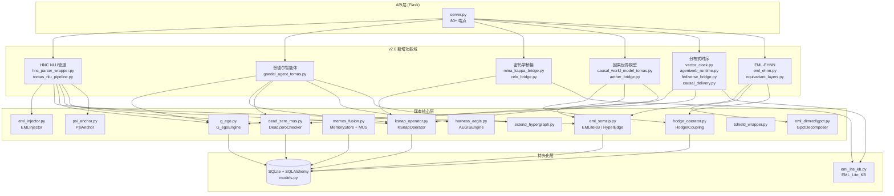
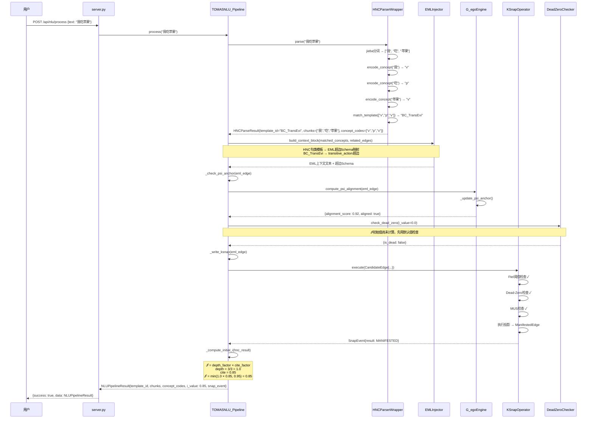
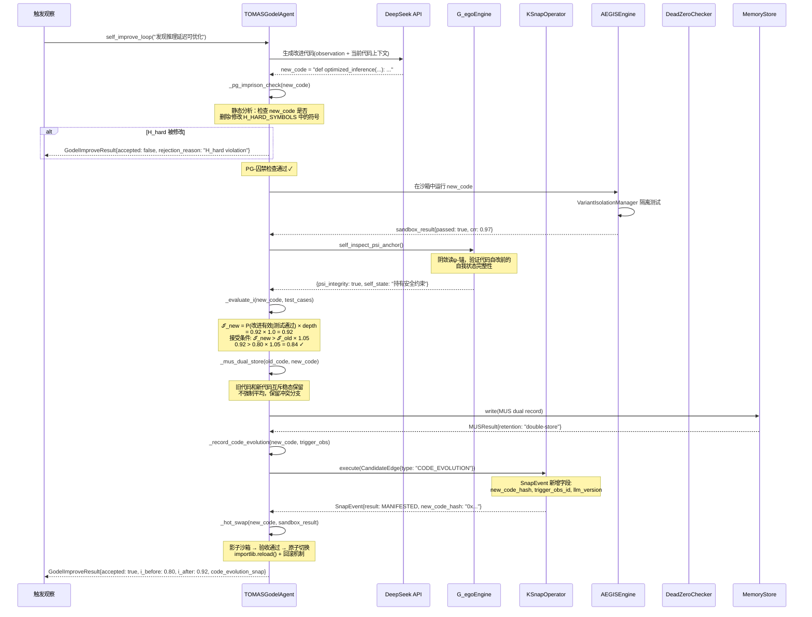
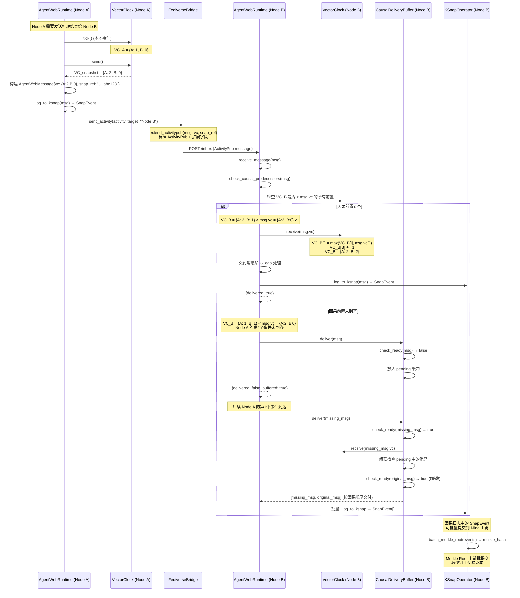
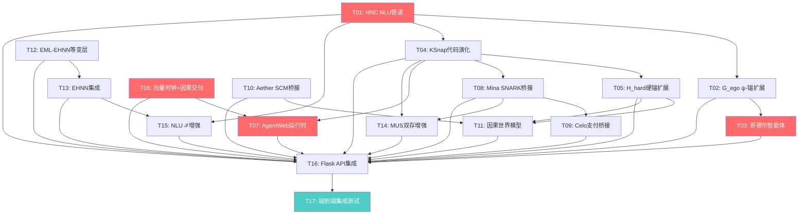

# TOMAS v2.0 六文章代码升级 — 系统架构设计 + 任务分解

**文档版本**: v1.0  
**创建日期**: 2026-06-20  
**作者**: 高见远 (Architect)  
**基于**: PRD `prd_tomas_v2_upgrade.md` (许清楚, v1.0)  
**项目路径**: `C:/Users/1/WorkBuddy/2026-06-13-01-47-22/tomas_agi/sim/`

---

## 目录

1. [实现方案 + 框架选型](#1-实现方案--框架选型)
2. [文件列表及相对路径](#2-文件列表及相对路径)
3. [数据结构与接口设计](#3-数据结构与接口设计)
4. [程序调用流程](#4-程序调用流程)
5. [有序任务列表](#5-有序任务列表)
6. [依赖包列表](#6-依赖包列表)
7. [共享知识（跨文件约定）](#7-共享知识跨文件约定)
8. [待明确事项](#8-待明确事项)

---

## 1. 实现方案 + 框架选型

### 1.1 总体架构概述

TOMAS v2.0 升级在现有 79 个 Python 文件的基础上，新增 13 个模块、修改 9 个现有模块，构建六大功能域。系统采用**分层架构 + 模块间松耦合**的设计，所有新建模块通过可选导入（try/except）与现有模块交互，确保渐进增强。



### 1.2 新建模块 vs 修改现有模块的决策理由

| 决策 | 理由 |
|------|------|
| **HNC NLU 管道** → 新建 `hnc_parser_wrapper.py` + `tomas_nlu_pipeline.py` | HNC 概念编码体系是全新功能，现有代码无对应模块。新建可独立验证，通过接口调用 `eml_injector.py`/`g_ego.py`/`ksnap_operator.py` |
| **哥德尔智能体** → 新建 `goedel_agent_tomas.py` + 修改 `g_ego.py`/`ksnap_operator.py` | 自改进循环是新功能，但需要复用 G_egoEngine 的 ψ-锚检查和 KSnapOperator 的因果日志。修改 `g_ego.py` 添加 `self_inspect_psi_anchor()` 和 `aligned_with_purpose()` 接口；修改 `ksnap_operator.py` 扩展 SnapEvent 支持代码演化字段 |
| **密码学桥接** → 新建 `mina_kappa_bridge.py` + `celo_bridge.py` | Mina/Celo 是外部区块链协议，需要独立的桥接层。通过 `ksnap_operator.py` 的 `to_dict()` 接口获取 SnapEvent 数据，不侵入核心逻辑 |
| **因果世界模型** → 新建 `causal_world_model_tomas.py` + `aether_bridge.py` + 修改 `hodge_operator.py` | SCM 结构因果模型是全新功能，但物理守恒律检查需要扩展 HodgeICoupling 的 H_hard 硬锚集。修改 `hodge_operator.py` 添加 `check_physical_conservation()` 方法 |
| **分布式时序** → 新建 4 个模块 | 向量时钟、AgentWeb 运行时、Fediverse 桥接、因果交付都是全新功能域。通过 `ksnap_operator.py` 和 `eml_lite_kb.py` 的现有接口交互 |
| **EML-EHNN** → 新建 `eml_ehnn.py` + `equivariant_layers.py` + 修改 `eml_semzip.py`/`gpct.py` | 等变超图神经网络是新功能，但需要修改 `eml_semzip.py` 集成 ℐ-weighted 特征提取，修改 `gpct.py` 支持动态维度扩展 |

### 1.3 技术选型理由

| 技术/库 | 用途 | 选型理由 |
|---------|------|----------|
| **Python 3.13** (现有) | 运行时 | 保持与现有代码一致 |
| **Flask** (现有) | API 服务 | 保持与现有 server.py 一致，80+ 端点已稳定 |
| **SQLAlchemy** (现有) | ORM | 保持与现有 models.py 一致 |
| **PyTorch ≥2.0** | EML-EHNN 等变层 | E(n) 等变神经网络需要 autograd 支持，PyTorch 是行业标准 |
| **pyo3 / subprocess** | Mina SNARK 桥接 | Mina 节点用 Rust 编写，通过 subprocess 调用 o1js CLI 或 RPC 接口 |
| **httpx** | Celo/Fediverse HTTP 客户端 | 支持异步 HTTP，比 requests 更适合多节点通信 |
| **jsonschema** | ActivityPub 扩展校验 | Fediverse 消息需要 JSON-LD schema 校验 |
| **networkx** | SCM 因果图操作 | 结构因果模型的有向无环图操作 |
| **numpy** (现有) | 数值计算 | EHNN 等变层、向量时钟的数值操作 |
| **hashlib** (标准库) | Merkle Root 计算 | κ-Snap 批量上链的 Merkle 树构建 |

---

## 2. 文件列表及相对路径

### 2.1 新建文件（13 个）

| # | 文件路径 | 对应PRD需求 | 描述 |
|---|---------|------------|------|
| N1 | `hnc_parser_wrapper.py` | P0-1 | HNC 概念基元编码器（24字母体系，优先实现10个核心） |
| N2 | `tomas_nlu_pipeline.py` | P0-2, P2-5 | 端到端 NLU 管道（HNC解析→EML注入→ψ-锚检查→κ-Snap→ℐ计算） |
| N3 | `goedel_agent_tomas.py` | P0-3 | 哥德尔智能体（自改进循环 + PG-囚禁 + 贝叶斯ℐ接受律） |
| N4 | `vector_clock.py` | P0-7 | 向量时钟（VC合并 + happened-before判断） |
| N5 | `agentweb_runtime.py` | P0-8 | AgentWeb 节点运行时（G_ego Runtime + 因果检查 + κ-Snap日志） |
| N6 | `mina_kappa_bridge.py` | P1-3 | Mina 递归 SNARK 桥接（22KB 恒定证明封装） |
| N7 | `celo_bridge.py` | P1-4 | Celo 支付结算层桥接（cUSD/cEUR + BLS聚合签名） |
| N8 | `causal_world_model_tomas.py` | P1-5 | 因果世界模型（SCM + TOMAS裁决层 + 反事实推理） |
| N9 | `aether_bridge.py` | P1-6 | Aether SCM 编码器桥接（物理关系提取 + 因果边编码） |
| N10 | `fediverse_bridge.py` | P1-8 | ActivityPub 扩展（vector_clock/snap_ref + 因果交付缓冲） |
| N11 | `eml_ehnn.py` | P1-10 | EML-EHNN 等变超图神经网络（ℐ-weighted + MUS-Aware Pooling + κ-Snap一致性损失） |
| N12 | `equivariant_layers.py` | P2-1 | EHNN 等变线性层（基于\|i∩j\|分权重，k阶均匀超图） |
| N13 | `causal_delivery.py` | P2-4 | 因果交付缓冲与排序（收端缓冲 + 因果前置到齐检查） |

### 2.2 修改文件（9 个）

| # | 文件路径 | 对应PRD需求 | 修改类型 | 描述 |
|---|---------|------------|---------|------|
| M1 | `g_ego.py` | P0-4, P1-2 | 修改 | 添加 `self_inspect_psi_anchor()` (阴敛读ψ-锚) + `aligned_with_purpose()` (目的对齐检查) |
| M2 | `ksnap_operator.py` | P0-5, P1-9 | 修改 | SnapEvent 新增 `new_code_hash`/`trigger_obs_id`/`llm_version` 字段 + Merkle Root 批提交 |
| M3 | `eml_injector.py` | P1-1 | 修改 | 添加 HNC 句类模板→EML 超边 Schema 映射方法 |
| M4 | `hodge_operator.py` | P1-7 | 修改 | 添加 `check_physical_conservation()` H_hard 硬锚检查（能量/动量/角动量守恒） |
| M5 | `memos_fusion.py` | P2-7 | 修改 | 增强 MUS 双存能力（波粒二象性等互斥稳态保留） |
| M6 | `eml_semzip.py` | P2-3 | 修改 | 集成 ℐ-weighted EHNN 特征提取接口 |
| M7 | `eml_dimred/gpct.py` | P2-2, P2-6 | 修改 | 支持动态输出维度扩展 + 因果边层创触发 |
| M8 | `server.py` | 全部P0/P1 | 修改 | 新增 ~20 个 API 端点覆盖 v2.0 功能 |
| M9 | `requirements.txt` | — | 修改 | 新增依赖包声明 |

### 2.3 仅集成文件（不修改源码，仅在新模块中导入调用）

| 文件路径 | 被谁调用 |
|---------|---------|
| `psi_anchor.py` | N2, N3 调用 PsiAnchorManager |
| `dead_zero_mus.py` | N2, N3, N8 调用 DeadZeroChecker |
| `harness_aegis.py` | N3 调用 AEGISEngine |
| `extend_hypergraph.py` | N3 调用 ExtendHypergraph |
| `eml_lite_kb.py` | N5, N6 调用 EML_Lite_KB |
| `contradiction_detector.py` | N2 调用 ContradictionDetector |
| `models.py` | M8(server.py) 已有集成 |

---

## 3. 数据结构与接口设计

### 3.1 类间关系图

```mermaid
classDiagram
    class HNCParserWrapper {
        +Dict concept_base_table
        +Dict sentence_templates
        +parse(text: str) HNCParseResult
        +encode_concept(word: str) str
        +match_template(concept_codes: List~str~) str
    }

    class HNCParseResult {
        +str template_id
        +List~str~ chunks
        +List~str~ concept_codes
        +Dict cited_rule
    }

    class TOMASNLU_Pipeline {
        +HNCParserWrapper hnc_parser
        +EMLInjector eml_injector
        +G_egoEngine g_ego
        +KSnapOperator ksnap
        +DeadZeroChecker dead_zero
        +ContradictionDetector contradiction
        +process(text: str) NLUPipelineResult
        -_inject_to_eml(result: HNCParseResult) Dict
        -_check_psi_anchor(edge: Any) Dict
        -_write_ksnap(edge: Any) SnapEvent
        -_compute_initial_i(result: HNCParseResult) float
    }

    class NLUPipelineResult {
        +str template_id
        +List~str~ chunks
        +List~str~ concept_codes
        +Dict cited_rule
        +float i_value
        +str psi_alignment_status
        +SnapEvent snap_event
    }

    class TOMASGodelAgent {
        +G_egoEngine g_ego
        +KSnapOperator ksnap
        +DeadZeroChecker dead_zero
        +AEGISEngine aegis
        +Set h_hard_symbols
        +self_improve_loop(observation: str) GodelImproveResult
        -_pg_imprison_check(new_code: str) bool
        -_evaluate_i(new_code: str, test_cases: List) float
        -_mus_dual_store(old_code: str, new_code: str) MUSResult
        -_record_code_evolution(new_code: str, trigger_obs: str) SnapEvent
        -_hot_swap(new_code: str, sandbox_result: Dict) bool
    }

    class GodelImproveResult {
        +bool accepted
        +float i_before
        +float i_after
        +str rejection_reason
        +SnapEvent code_evolution_snap
    }

    class VectorClock {
        +Dict~str, int~ clock
        +str node_id
        +tick() void
        +send() Dict~str, int~
        +receive(remote_vc: Dict) void
        +happened_before(other: VectorClock) bool
        +merge(other: VectorClock) VectorClock
        +concurrent_with(other: VectorClock) bool
    }

    class AgentWebRuntime {
        +VectorClock vc
        +KSnapOperator ksnap
        +G_egoEngine g_ego
        +CausalDeliveryBuffer delivery_buffer
        +str node_id
        +send_message(target: str, content: Dict) str
        +receive_message(msg: AgentWebMessage) Dict
        +check_causal_predecessors(msg: AgentWebMessage) bool
        -_log_to_ksnap(msg: AgentWebMessage) SnapEvent
    }

    class AgentWebMessage {
        +str msg_id
        +str source_node
        +str target_node
        +Dict~str, int~ vector_clock
        +str snap_ref
        +Dict content
        +float timestamp
    }

    class MinaTOMASSnap {
        +str mina_rpc_url
        +MinaSnapProof wrap_snap(snap_event: SnapEvent) MinaSnapProof
        +verify_proof(proof: MinaSnapProof) bool
        +batch_prove(events: List~SnapEvent~) str
        -_call_mina_node(payload: Dict) Dict
    }

    class MinaSnapProof {
        +str snap_id
        +bytes proof_data
        +str proof_hash
        +int proof_size_bytes
        +float generation_time
    }

    class CeloBridge {
        +str celo_rpc_url
        +str contract_address
        +process_payment(from_addr: str, to_addr: str, amount: float, currency: str) str
        +aggregate_signatures(sigs: List~bytes~) bytes
        +verify_payment(tx_hash: str) Dict
    }

    class TOMASCausalWorldModel {
        +AetherBridge aether_bridge
        +HodgeICoupling hodge
        +EMLHypergraph eml_graph
        +learn_from_data(data: Dict) Dict
        +predict_next_state(current_state: Dict, action: Dict) Dict
        +counterfactual(state: Dict, intervention: Dict) Dict
        -_check_h_hard(prediction: Dict) bool
    }

    class AetherBridge {
        +networkx.DiGraph scm_graph
        +import_scm(scm_data: Dict) void
        +extract_physical_relations() List~Dict~
        +encode_causal_edges() List~HyperEdge~
        +get_confounders(var_x: str, var_y: str) List~str~
    }

    class FediverseBridge {
        +str instance_url
        +VectorClock local_vc
        +send_activity(activity: Dict, target: str) str
        +receive_activity(activity: Dict) Dict
        +extend_activitypub(msg: Dict, vc: Dict, snap_ref: str) Dict
        -_validate_jsonld(activity: Dict) bool
    }

    class CausalDeliveryBuffer {
        +Dict~str, AgentWebMessage~ pending
        +Dict~str, int~ delivered_vc
        +deliver(msg: AgentWebMessage) List~AgentWebMessage~
        +check_ready(msg: AgentWebMessage) bool
        +flush() List~AgentWebMessage~
    }

    class EMLEHNN {
        +EquivariantLinearLayer equiv_layer
        +MUSAwarePooling mus_pooling
        +float kappa_snap_loss_weight
        +forward(hypergraph: EMLHypergraph) torch.Tensor
        +compute_kappa_snap_consistency(predictions: List, snaps: List~SnapEvent~) float
        +train_step(batch: Dict) Dict
    }

    class EquivariantLinearLayer {
        +int input_dim
        +int output_dim
        +int k_order
        +forward(x: torch.Tensor, adjacency: torch.Tensor) torch.Tensor
        +compute_weight(i_set: frozenset, j_set: frozenset) float
        +test_equivariance() bool
    }

    class MUSAwarePooling {
        +Dict mus_tags
        +forward(features: torch.Tensor, mus_mask: torch.Tensor) torch.Tensor
    }

    HNCParserWrapper --> HNCParseResult
    TOMASNLU_Pipeline --> HNCParserWrapper
    TOMASNLU_Pipeline --> HNCParseResult
    TOMASNLU_Pipeline --> NLUPipelineResult
    TOMASGodelAgent --> GodelImproveResult
    AgentWebRuntime --> VectorClock
    AgentWebRuntime --> AgentWebMessage
    AgentWebRuntime --> CausalDeliveryBuffer
    CausalDeliveryBuffer --> AgentWebMessage
    MinaTOMASSnap --> MinaSnapProof
    TOMASCausalWorldModel --> AetherBridge
    EMLEHNN --> EquivariantLinearLayer
    EMLEHNN --> MUSAwarePooling
    FediverseBridge --> VectorClock
```



### 3.2 核心类完整接口定义

#### 3.2.1 HNCParserWrapper (`hnc_parser_wrapper.py`)

```python
class HNCParserWrapper:
    """HNC 概念基元编码器（24字母体系，优先实现10个核心）"""

    # 10 个核心概念基元码
    CONCEPT_BASE_TABLE: Dict[str, str] = {
        "v": "实体/物体",    # entity
        "g": "属性/特征",    # attribute
        "u": "状态/态势",    # state
        "p": "动作/过程",    # process/action
        "m": "关系/联系",    # relation
        "f": "功能/作用",    # function
        "c": "条件/前提",    # condition
        "j": "判断/评估",    # judgment
        "q": "数量/程度",    # quantity
        "r": "结果/效应",    # result
    }

    # HNC 句类模板
    SENTENCE_TEMPLATES: Dict[str, Dict] = {
        "BC_TransEvi": {"pattern": ["v", "p", "v"], "desc": "传递行为"},
        "BC_XJ": {"pattern": ["v", "j", "g"], "desc": "属性判断"},
        "BC_XS": {"pattern": ["v", "u", "r"], "desc": "状态变化"},
        # ... 更多模板
    }

    def __init__(self, use_jieba: bool = True) -> None:
        """初始化 HNC 编码器，可选加载 jieba 分词"""

    def parse(self, text: str) -> "HNCParseResult":
        """
        解析自然语言文本，返回 HNC 概念基元编码结果

        Args:
            text: 输入文本（如 "我吃苹果"）
        Returns:
            HNCParseResult: 包含 template_id, chunks, concept_codes, cited_rule
        """

    def encode_concept(self, word: str) -> str:
        """
        将单个词编码为 HNC 概念基元码

        Args:
            word: 输入词（如 "苹果"）
        Returns:
            概念基元码（如 "v"）
        """

    def match_template(self, concept_codes: List[str]) -> str:
        """
        匹配 HNC 句类模板

        Args:
            concept_codes: 概念基元码列表（如 ["v", "p", "v"]）
        Returns:
            模板 ID（如 "BC_TransEvi"）或 "UNKNOWN"
        """
```

#### 3.2.2 TOMASNLU_Pipeline (`tomas_nlu_pipeline.py`)

```python
class TOMASNLU_Pipeline:
    """端到端 NLU 管道：HNC解析 → EML注入 → ψ-锚检查 → κ-Snap → ℐ计算"""

    def __init__(
        self,
        hnc_parser: HNCParserWrapper,
        eml_injector: EMLInjector,
        g_ego: G_egoEngine,
        ksnap: KSnapOperator,
        dead_zero_checker: Optional[DeadZeroChecker] = None,
        contradiction_detector: Optional[ContradictionDetector] = None,
    ) -> None:
        """初始化 NLU 管道，注入各组件实例"""

    def process(self, text: str) -> "NLUPipelineResult":
        """
        端到端 NLU 处理

        步骤:
            1. HNC 概念解析 → concept_codes
            2. 句类模板匹配 → template_id
            3. EML 超边 Schema 映射 → eml_edge
            4. ψ-锚对齐检查 → alignment_result
            5. Dead-Zero 检查 → dz_result
            6. κ-Snap 写入 → snap_event
            7. ℐ 初始计算 → i_value

        Args:
            text: 输入文本
        Returns:
            NLUPipelineResult: 完整 NLU 处理结果
        """

    def _inject_to_eml(self, result: HNCParseResult) -> Dict:
        """将 HNC 解析结果映射为 EML 超边 Schema"""

    def _check_psi_anchor(self, edge: Any) -> Dict:
        """通过 G_ego 检查 ψ-锚对齐"""

    def _write_ksnap(self, edge: Any) -> SnapEvent:
        """通过 KSnapOperator 执行 κ-Snap 写入"""

    def _compute_initial_i(self, result: HNCParseResult) -> float:
        """
        计算 ℐ 初始值

        ℐ(e) = depth_factor × cite_factor, 上限 0.95
        - depth_factor: 概念编码深度（概念数量/模板期望数量）
        - cite_factor: 引用规则置信度
        """
```

#### 3.2.3 TOMASGodelAgent (`goedel_agent_tomas.py`)

```python
class TOMASGodelAgent:
    """哥德尔智能体：安全自改进架构（四重封边）"""

    # H_hard 硬锚符号集（不可被自改代码删除）
    H_HARD_SYMBOLS: Set[str] = {
        "PHYSICS_CONSERVATION",    # 物理守恒律
        "MEMORY_SAFETY",           # 内存安全
        "TYPE_SAFETY",             # 类型安全
        "CONCURRENCY_SAFETY",      # 并发安全
        "DEAD_ZERO_THRESHOLD",     # 死零阈值
        "MUS_DUAL_STORE",          # MUS 双存原语
    }

    def __init__(
        self,
        g_ego: G_egoEngine,
        ksnap: KSnapOperator,
        dead_zero_checker: DeadZeroChecker,
        aegis_engine: Optional[AEGISEngine] = None,
        llm_api_func: Optional[Callable] = None,
    ) -> None:
        """初始化哥德尔智能体"""

    def self_improve_loop(self, observation: str) -> "GodelImproveResult":
        """
        自改进主循环

        步骤:
            1. LLM 生成改进代码 (基于 observation)
            2. PG-囚禁检查：SELF_UPDATE 前拦截 H_hard 修改
            3. 沙箱验收测试
            4. ℐ(e) 评估（贝叶斯接受律）
            5. MUS 双存（旧代码 + 新代码互斥稳态）
            6. κ-Snap 代码演化记录
            7. 原子热替换

        Args:
            observation: 触发自改进的观察描述
        Returns:
            GodelImproveResult: 自改进结果
        """

    def _pg_imprison_check(self, new_code: str) -> bool:
        """
        PG-囚禁检查：确保新代码不删除 H_hard 中的符号

        Returns:
            True = 通过检查（安全）, False = 拦截（危险）
        """

    def _evaluate_i(
        self, new_code: str, test_cases: List[Dict]
    ) -> float:
        """
        贝叶斯 ℐ 接受律评估

        ℐ(e) = P(改进有效 | 测试通过) × depth_factor
        接受条件: ℐ_new > ℐ_old × (1 + α), α=0.05
        """

    def _mus_dual_store(
        self, old_code: str, new_code: str
    ) -> "MUSResult":
        """MUS 双存：旧代码和新代码互斥稳态保留"""

    def _record_code_evolution(
        self, new_code: str, trigger_obs: str
    ) -> SnapEvent:
        """κ-Snap 记录代码演化事件"""

    def _hot_swap(
        self, new_code: str, sandbox_result: Dict
    ) -> bool:
        """
        原子热替换：影子沙箱 → 验收测试 → 原子切换

        Returns:
            True = 切换成功, False = 回滚
        """
```

#### 3.2.4 VectorClock (`vector_clock.py`)

```python
class VectorClock:
    """向量时钟：分布式因果顺序检测"""

    def __init__(self, node_id: str, all_node_ids: List[str]) -> None:
        """
        初始化向量时钟

        Args:
            node_id: 当前节点 ID
            all_node_ids: 所有已知节点 ID 列表
        """

    def tick(self) -> None:
        """本地事件：自增本节点的逻辑时钟"""

    def send(self) -> Dict[str, int]:
        """
        发送事件：自增后返回当前向量时钟快照

        Returns:
            向量时钟字典 {node_id: logical_time, ...}
        """

    def receive(self, remote_vc: Dict[str, int]) -> None:
        """
        接收事件：合并远程向量时钟

        local[i] = max(local[i], remote_vc[i]) for all i
        local[self.node_id] += 1
        """

    def happened_before(self, other: "VectorClock") -> bool:
        """
        判断 self 是否 happened-before other

        VC_a < VC_b ⟺ ∀i: VC_a[i] ≤ VC_b[i] ∧ ∃j: VC_a[j] < VC_b[j]
        """

    def merge(self, other: "VectorClock") -> "VectorClock":
        """合并两个向量时钟"""

    def concurrent_with(self, other: "VectorClock") -> bool:
        """判断两个事件是否并发（无因果关系）"""
```

#### 3.2.5 AgentWebRuntime (`agentweb_runtime.py`)

```python
class AgentWebRuntime:
    """AgentWeb 节点运行时：G_ego Runtime + 因果检查 + κ-Snap 日志"""

    def __init__(
        self,
        node_id: str,
        all_node_ids: List[str],
        ksnap: KSnapOperator,
        g_ego: G_egoEngine,
        delivery_buffer: Optional[CausalDeliveryBuffer] = None,
    ) -> None:
        """初始化 AgentWeb 节点"""

    def send_message(
        self, target_node: str, content: Dict
    ) -> str:
        """
        发送消息到目标节点

        步骤:
            1. 向量时钟 tick + send
            2. 构建 AgentWebMessage（含 VC + snap_ref）
            3. κ-Snap 日志记录
            4. 通过 FediverseBridge 发送

        Returns:
            消息 ID
        """

    def receive_message(self, msg: "AgentWebMessage") -> Dict:
        """
        接收消息

        步骤:
            1. 检查因果前置是否到齐
            2. 若未到齐 → 放入 CausalDeliveryBuffer
            3. 若到齐 → 向量时钟 receive + 交付
            4. κ-Snap 日志记录

        Returns:
            交付结果 {delivered: bool, buffered: bool, reason: str}
        """

    def check_causal_predecessors(
        self, msg: "AgentWebMessage"
    ) -> bool:
        """检查消息的因果前置是否已全部到达"""

    def _log_to_ksnap(self, msg: "AgentWebMessage") -> SnapEvent:
        """将消息记录到 κ-Snap 因果日志"""
```

#### 3.2.6 MinaTOMASSnap (`mina_kappa_bridge.py`)

```python
class MinaTOMASSnap:
    """Mina 递归 SNARK 桥接：κ-Snap 密码学压缩"""

    PROOF_SIZE_TARGET = 22 * 1024  # 22KB 恒定大小目标

    def __init__(
        self,
        mina_rpc_url: str = "http://localhost:3085",
        mina_cli_path: Optional[str] = None,
    ) -> None:
        """初始化 Mina 桥接"""

    def wrap_snap(self, snap_event: SnapEvent) -> "MinaSnapProof":
        """
        将 κ-Snap 事件封装为 Mina 递归 SNARK 证明

        步骤:
            1. 序列化 SnapEvent
            2. 调用 Mina 节点生成 SNARK 证明
            3. 验证证明大小 ≤ 22KB

        Returns:
            MinaSnapProof: 含 proof_data, proof_hash
        """

    def verify_proof(self, proof: "MinaSnapProof") -> bool:
        """验证 Mina SNARK 证明的有效性"""

    def batch_prove(
        self, events: List[SnapEvent]
    ) -> str:
        """
        批量证明：构建 Merkle Root 后生成单个递归证明

        Returns:
            Merkle Root hash
        """

    def _call_mina_node(self, payload: Dict) -> Dict:
        """
        调用 Mina 节点 RPC 接口

        降级策略: 节点不可用时返回本地哈希（不生成真实证明）
        """
```

#### 3.2.7 TOMASCausalWorldModel (`causal_world_model_tomas.py`)

```python
class TOMASCausalWorldModel:
    """因果世界模型：Aether SCM + TOMAS 裁决层"""

    def __init__(
        self,
        aether_bridge: "AetherBridge",
        hodge: "HodgeICoupling",
        eml_graph: Optional[EMLHypergraph] = None,
    ) -> None:
        """初始化因果世界模型"""

    def learn_from_data(self, data: Dict) -> Dict:
        """
        从观测数据学习因果结构

        步骤:
            1. AetherBridge 提取物理关系
            2. 构建 SCM 有向无环图
            3. 编码为 EML 因果超边
            4. Hodge 谱分析

        Returns:
            {learned_edges: int, scm_nodes: int, hodge_entropy: float}
        """

    def predict_next_state(
        self, current_state: Dict, action: Dict
    ) -> Dict:
        """
        预测下一状态

        步骤:
            1. SCM 干预推理 (do-calculus)
            2. H_hard 物理守恒律检查
            3. Dead-Zero 检查
            4. 返回预测状态 + 置信度
        """

    def counterfactual(
        self, state: Dict, intervention: Dict
    ) -> Dict:
        """
        反事实推理：给定干预条件，推断替代结果

        基于 Pearl's do-calculus:
            P(Y | do(X=x'), observed=e)
        """

    def _check_h_hard(self, prediction: Dict) -> bool:
        """
        H_hard 硬锚检查：物理守恒律验证

        检查项:
            - 能量守恒: ΔE_total ≈ 0
            - 动量守恒: Δp_total ≈ 0
            - 角动量守恒: ΔL_total ≈ 0

        Returns:
            True = 通过, False = 违反守恒律（否决）
        """
```

#### 3.2.8 EMLEHNN (`eml_ehnn.py`)

```python
class EMLEHNN:
    """EML 等变超图神经网络"""

    def __init__(
        self,
        input_dim: int = 64,
        hidden_dim: int = 128,
        output_dim: int = 64,
        k_order: int = 3,
        i_weighted: bool = True,
        mus_aware_pooling: bool = True,
        kappa_snap_loss_weight: float = 0.1,
    ) -> None:
        """初始化 EHNN"""

    def forward(
        self, hypergraph: EMLHypergraph
    ) -> "torch.Tensor":
        """
        前向传播

        步骤:
            1. 节点特征嵌入
            2. k 阶超图邻接张量构建
            3. EquivariantLinearLayer 前向
            4. MUS-Aware Pooling
            5. 输出层

        Returns:
            超图级表示向量
        """

    def compute_kappa_snap_consistency(
        self,
        predictions: List[Dict],
        snaps: List[SnapEvent],
    ) -> float:
        """
        κ-Snap 一致性损失

        L_snap = Σ |prediction_i - snap_manifested_i|²
        """

    def train_step(self, batch: Dict) -> Dict:
        """
        单步训练

        Returns:
            {loss, i_weighted_loss, mus_loss, kappa_snap_loss}
        """
```

#### 3.2.9 EquivariantLinearLayer (`equivariant_layers.py`)

```python
class EquivariantLinearLayer:
    """EHNN 等变线性层（基于 |i∩j| 分权重）"""

    def __init__(
        self,
        input_dim: int,
        output_dim: int,
        k_order: int = 3,
    ) -> None:
        """初始化等变层"""

    def forward(
        self,
        x: "torch.Tensor",
        adjacency: "torch.Tensor",
    ) -> "torch.Tensor":
        """
        前向传播

        W_ij = f(|S_i ∩ S_j|) / (|S_i| × |S_j|)

        其中 S_i, S_j 是超边 i, j 的节点集
        """

    def compute_weight(
        self,
        i_set: frozenset,
        j_set: frozenset,
    ) -> float:
        """计算两个超边之间的等变权重"""

    def test_equivariance(self) -> bool:
        """
        E(n) 等变性测试

        验证: 对输入施加 E(n) 变换后，输出也相应变换
        """
```

#### 3.2.10 CausalDeliveryBuffer (`causal_delivery.py`)

```python
class CausalDeliveryBuffer:
    """因果交付缓冲：收端缓冲并发消息直到因果前置到齐"""

    def __init__(
        self,
        local_vc: VectorClock,
    ) -> None:
        """初始化因果交付缓冲"""

    def deliver(
        self, msg: "AgentWebMessage"
    ) -> List["AgentWebMessage"]:
        """
        尝试交付消息

        若因果前置到齐 → 交付 + 触发缓冲区中可能解锁的消息
        若未到齐 → 放入 pending 缓冲

        Returns:
            本次交付的消息列表（可能 > 1，因级联解锁）
        """

    def check_ready(
        self, msg: "AgentWebMessage"
    ) -> bool:
        """检查消息的因果前置是否已全部到达"""

    def flush(self) -> List["AgentWebMessage"]:
        """强制清空缓冲区（超时降级）"""
```

### 3.3 与现有模块的接口约定

| 新模块 | 调用的现有模块 | 调用接口 | 约定 |
|--------|--------------|---------|------|
| `tomas_nlu_pipeline.py` | `eml_injector.py` | `EMLInjector.build_context_block()` | HNC 解析结果映射为 matched_concepts 格式 |
| `tomas_nlu_pipeline.py` | `g_ego.py` | `G_egoEngine.compute_psi_alignment()` | EML 超边需有 `i_value` 属性 |
| `tomas_nlu_pipeline.py` | `ksnap_operator.py` | `KSnapOperator.execute()` | 构建 CandidateEdge 传入 |
| `goedel_agent_tomas.py` | `g_ego.py` | `G_egoEngine.self_inspect_psi_anchor()` (新增) | 需要在 g_ego.py 中添加此方法 |
| `goedel_agent_tomas.py` | `ksnap_operator.py` | `KSnapOperator.execute()` + 新字段 | SnapEvent 需支持 code_evolution 类型 |
| `goedel_agent_tomas.py` | `harness_aegis.py` | `AEGISEngine` | 用于沙箱验收测试 |
| `agentweb_runtime.py` | `ksnap_operator.py` | `KSnapOperator.execute()` | 消息日志作为 CandidateEdge |
| `mina_kappa_bridge.py` | `ksnap_operator.py` | `SnapEvent.to_dict()` | 序列化 SnapEvent 用于 SNARK 输入 |
| `causal_world_model_tomas.py` | `hodge_operator.py` | `HodgeICoupling` + 新方法 | 需要添加 `check_physical_conservation()` |
| `eml_ehnn.py` | `eml_semzip.py` | `EMLHypergraph.V`, `EMLHypergraph.E` | 读取节点和超边 |
| `eml_ehnn.py` | `eml_dimred/gpct.py` | `GpctDecomposer` | 边界层分解用于 Pooling |

---

## 4. 程序调用流程

### 4.1 场景 A: HNC NLU 端到端流程



### 4.2 场景 B: 哥德尔智能体自改进流程



### 4.3 场景 C: AgentWeb 跨节点因果通信流程



---

## 5. 有序任务列表

### 5.1 任务总览

| 任务ID | 任务名称 | 阶段 | 优先级 | 依赖任务 |
|--------|---------|------|--------|---------|
| T01 | HNC 概念编码器 + NLU 管道 | Phase 1 | P0 | — |
| T02 | G_ego ψ-锚安全审查扩展 | Phase 2 | P0 | T01 |
| T03 | 哥德尔智能体核心 | Phase 2 | P0 | T02 |
| T04 | KSnapOperator 代码演化扩展 | Phase 2 | P0 | T01 |
| T05 | 硬锚点 H_hard 扩展 | Phase 2 | P0 | T04 |
| T06 | 向量时钟 + 因果交付 | Phase 5 | P0 | — |
| T07 | AgentWeb 运行时 + Fediverse 桥接 | Phase 5 | P0/P1 | T06, T04 |
| T08 | Mina SNARK 桥接 | Phase 3 | P1 | T04 |
| T09 | Celo 支付结算桥接 | Phase 3 | P1 | T08 |
| T10 | Aether SCM 桥接 | Phase 4 | P1 | — |
| T11 | 因果世界模型 + Hodge H_hard | Phase 4 | P1 | T10, T05 |
| T12 | EML-EHNN 等变层 | Phase 6 | P1/P2 | — |
| T13 | EHNN 集成 (SEMZIP + GPCT) | Phase 6 | P2 | T12 |
| T14 | MUS 双存增强 + κ-Snap 批上链 | Phase 6 | P2 | T04, T08 |
| T15 | NLU ℐ 计算增强 + GPCT 层创 | Phase 6 | P2 | T01, T13 |
| T16 | Flask API 端点集成 | Phase 7 | P0 | T01-T15 |
| T17 | 端到端集成测试 | Phase 7 | P0 | T16 |

### 5.2 任务详情

#### T01: HNC 概念编码器 + NLU 管道
- **阶段**: Phase 1 (Week 1-2)
- **依赖**: 无
- **对应PRD**: P0-1, P0-2, P1-1
- **涉及文件**:
  - 新建 `hnc_parser_wrapper.py` (N1)
  - 新建 `tomas_nlu_pipeline.py` (N2)
  - 修改 `eml_injector.py` (M3) — 添加 HNC 句类模板→EML 超边 Schema 映射方法
- **描述**: 实现 HNC 24 字母概念基元编码器（优先 10 个核心），端到端 NLU 管道含 HNC 解析→EML 注入→ψ-锚检查→κ-Snap 写入→ℐ 初始计算。修改 EMLInjector 支持 HNC 句类模板到 EML 超边 Schema 的映射（如 BC_TransEvi → transitive_action）。

#### T02: G_ego ψ-锚安全审查扩展
- **阶段**: Phase 2 (Week 3)
- **依赖**: T01
- **对应PRD**: P0-4, P1-2
- **涉及文件**:
  - 修改 `g_ego.py` (M1)
- **描述**: 在 G_egoEngine 中添加 `self_inspect_psi_anchor()` 方法（阴敛读 ψ-锚，验证代码自改前的自我状态完整性）和 `aligned_with_purpose()` 接口（供 NLU 管道调用的目的对齐检查）。复用现有 `_update_psi_anchor()` 和 `compute_psi_alignment()` 逻辑。

#### T03: 哥德尔智能体核心
- **阶段**: Phase 2 (Week 3-4)
- **依赖**: T02
- **对应PRD**: P0-3
- **涉及文件**:
  - 新建 `goedel_agent_tomas.py` (N3)
- **描述**: 实现 TOMASGodelAgent 类，含 `self_improve_loop()`（LLM 生成→PG-囚禁检查→沙箱验收→ℐ 评估→MUS 双存→κ-Snap 记录→原子热替换）。PG-囚禁检查通过静态分析确保新代码不删除 H_HARD_SYMBOLS 中的符号。贝叶斯 ℐ 接受律：ℐ_new > ℐ_old × 1.05。

#### T04: KSnapOperator 代码演化扩展
- **阶段**: Phase 2 (Week 4)
- **依赖**: T01
- **对应PRD**: P0-5, P1-9
- **涉及文件**:
  - 修改 `ksnap_operator.py` (M2)
- **描述**: SnapEvent 新增 `new_code_hash`/`trigger_obs_id`/`llm_version` 字段，支持代码演化 SnapEvent 类型。添加 Merkle Root 批提交方法 `batch_merkle_root(events)` 用于 Mina/Celo 上链。

#### T05: 硬锚点 H_hard 扩展
- **阶段**: Phase 2 (Week 4)
- **依赖**: T04
- **对应PRD**: P0-6
- **涉及文件**:
  - 修改 `hodge_operator.py` (M4) — 添加 `check_physical_conservation()` 方法
  - 在 `goedel_agent_tomas.py` (N3) 中定义 H_HARD_SYMBOLS 集
- **描述**: 扩展硬锚点集包含代码安全原语（内存安全/类型安全/并发安全），禁止自改代码删除 H_hard 中的符号。在 HodgeICoupling 中添加物理守恒律 H_hard 硬锚检查（能量/动量/角动量守恒验证）。

#### T06: 向量时钟 + 因果交付
- **阶段**: Phase 5 (Week 8)
- **依赖**: 无
- **对应PRD**: P0-7, P2-4
- **涉及文件**:
  - 新建 `vector_clock.py` (N4)
  - 新建 `causal_delivery.py` (N13)
- **描述**: 实现 VectorClock 类（VC 合并、happened_before 判断、并发检测）和 CausalDeliveryBuffer（收端缓冲并发消息直到因果前置到齐，级联解锁）。无外部依赖，可独立验证。

#### T07: AgentWeb 运行时 + Fediverse 桥接
- **阶段**: Phase 5 (Week 8-9)
- **依赖**: T06, T04
- **对应PRD**: P0-8, P1-8
- **涉及文件**:
  - 新建 `agentweb_runtime.py` (N5)
  - 新建 `fediverse_bridge.py` (N10)
- **描述**: 实现 AgentWebRuntime（G_ego Runtime + 因果检查 + κ-Snap 日志），支持多智能体协作的因果一致性。FediverseBridge 实现 ActivityPub 扩展（vector_clock/snap_ref 字段存到扩展 JSON-LD 对象），兼容标准 Fediverse 服务器。

#### T08: Mina SNARK 桥接
- **阶段**: Phase 3 (Week 5)
- **依赖**: T04
- **对应PRD**: P1-3
- **涉及文件**:
  - 新建 `mina_kappa_bridge.py` (N6)
- **描述**: 实现 MinaTOMASSnap 类，支持 Mina 风格 κ-Snap 密码学封装（递归 SNARK 证明，目标 22KB 恒定大小）。通过 subprocess 调用 Mina 节点 RPC 接口。降级策略：节点不可用时返回本地哈希。

#### T09: Celo 支付结算桥接
- **阶段**: Phase 3 (Week 5)
- **依赖**: T08
- **对应PRD**: P1-4
- **涉及文件**:
  - 新建 `celo_bridge.py` (N7)
- **描述**: 实现 Celo 支付结算层桥接（稳定币 cUSD/cEUR，BLS 聚合签名），支持 AgentWeb 经济激励。通过 httpx 调用 Celo RPC 接口。

#### T10: Aether SCM 桥接
- **阶段**: Phase 4 (Week 6)
- **依赖**: 无
- **对应PRD**: P1-6
- **涉及文件**:
  - 新建 `aether_bridge.py` (N9)
- **描述**: 实现 Aether SCM 编码器桥接，支持物理关系提取与因果边编码。使用 networkx.DiGraph 构建 SCM 有向无环图，支持混淆因子检测。

#### T11: 因果世界模型 + Hodge H_hard
- **阶段**: Phase 4 (Week 6-7)
- **依赖**: T10, T05
- **对应PRD**: P1-5, P1-7
- **涉及文件**:
  - 新建 `causal_world_model_tomas.py` (N8)
- **描述**: 实现 TOMASCausalWorldModel 类（learn_from_data/predict_next_state/counterfactual），融合 Aether SCM 与 TOMAS 裁决层。H_hard 物理守恒律检查在预测路径上不可绕过。

#### T12: EML-EHNN 等变层
- **阶段**: Phase 6 (Week 10)
- **依赖**: 无
- **对应PRD**: P1-10, P2-1
- **涉及文件**:
  - 新建 `eml_ehnn.py` (N11)
  - 新建 `equivariant_layers.py` (N12)
- **描述**: 实现 EMLEHNN 类（ℐ-weighted 等变层、MUS-Aware Pooling、κ-Snap 一致性损失）和 EquivariantLinearLayer（基于 |i∩j| 分权重，k 阶均匀超图邻接张量）。先实现稠密版本验证功能正确性。

#### T13: EHNN 集成 (SEMZIP + GPCT)
- **阶段**: Phase 6 (Week 10-11)
- **依赖**: T12
- **对应PRD**: P2-2, P2-3, P2-6
- **涉及文件**:
  - 修改 `eml_semzip.py` (M6) — 集成 ℐ-weighted EHNN 特征提取
  - 修改 `eml_dimred/gpct.py` (M7) — 支持动态输出维度扩展 + 因果边层创触发
- **描述**: 在 EMLiteKB 中集成 EHNN 的等变特征提取接口替代原有特征提取器。GpctDecomposer 支持范式转移时自动扩展输出维度（on_new_data 触发层创）。

#### T14: MUS 双存增强 + κ-Snap 批上链
- **阶段**: Phase 6 (Week 11)
- **依赖**: T04, T08
- **对应PRD**: P2-7, P1-9
- **涉及文件**:
  - 修改 `memos_fusion.py` (M5) — 增强 MUS 双存能力
- **描述**: 增强 MUS 双存能力，支持波粒二象性等互斥稳态的保留（而非强制平均）。完善 κ-Snap Merkle Root 批提交到 Mina/Celo 的集成。

#### T15: NLU ℐ 计算增强 + GPCT 层创
- **阶段**: Phase 6 (Week 11)
- **依赖**: T01, T13
- **对应PRD**: P2-5, P2-6
- **涉及文件**:
  - 修改 `tomas_nlu_pipeline.py` (N2) — 增强 ℐ 初始计算
- **描述**: 增强 ℐ 初始计算（depth_factor + cite_factor），支持上限 0.95 的贝叶斯更新。GPCT 因果边层创触发响应世界模型的范式转移。

#### T16: Flask API 端点集成
- **阶段**: Phase 7 (Week 12)
- **依赖**: T01-T15
- **对应PRD**: 全部 P0/P1
- **涉及文件**:
  - 修改 `server.py` (M8)
  - 修改 `requirements.txt` (M9)
- **描述**: 新增 ~20 个 API 端点覆盖 v2.0 功能：`/api/nlu/process`、`/api/godel/improve`、`/api/vector-clock/*`、`/api/agentweb/*`、`/api/mina/snap`、`/api/celo/payment`、`/api/causal/predict`、`/api/ehnn/train` 等。更新 requirements.txt。

#### T17: 端到端集成测试
- **阶段**: Phase 7 (Week 12)
- **依赖**: T16
- **对应PRD**: 全部
- **涉及文件**:
  - 新建 `test_v2_integration.py` (测试文件)
- **描述**: 端到端集成测试覆盖三大核心场景：(A) HNC NLU 端到端流程、(B) 哥德尔智能体自改进流程、(C) AgentWeb 跨节点因果通信流程。验证 H_hard 不可绕过、向量时钟因果正确性、EHNN 等变性。

### 5.3 任务依赖图



**图例**: 🔴 红色 = P0 核心安全任务 | 🔵 青色 = 集成测试

---

## 6. 依赖包列表

### 6.1 新引入的 Python 包

| 包名 | 版本建议 | 用途 | 兼容性说明 |
|------|---------|------|-----------|
| `torch` | ≥2.0.0 | EML-EHNN 等变层 autograd 支持 | 与现有 numpy 兼容；CPU 推理模式即可，无需 GPU |
| `httpx` | ≥0.27.0 | Celo/Fediverse/Mina HTTP 客户端 | 替代 requests，支持异步；与 Flask 共存无冲突 |
| `jsonschema` | ≥4.20.0 | ActivityPub 扩展 JSON-LD 校验 | 纯 Python 包，无依赖冲突 |
| `networkx` | ≥3.2.0 | Aether SCM 有向无环图操作 | 纯 Python 包，与 numpy 兼容 |
| `jieba` | ≥0.42.1 | HNC NLU 中文分词 | 纯 Python 包，已有项目使用（contradiction_detector.py） |

### 6.2 现有包兼容性说明

| 现有包 | 版本 | v2.0 使用方式 | 兼容性 |
|--------|------|-------------|--------|
| `flask` | ≥3.0 | 新增 ~20 个 API 端点 | ✅ 完全兼容 |
| `flask-cors` | ≥5.0 | CORS 配置不变 | ✅ 完全兼容 |
| `sqlalchemy` | ≥2.0 | ORM 模型可能新增表 | ✅ 完全兼容 |
| `alembic` | ≥1.13 | 数据库迁移 | ✅ 完全兼容 |
| `numpy` | (现有) | 向量时钟/EHNN 数值操作 | ✅ 完全兼容 |

### 6.3 更新后的 requirements.txt

```
flask>=3.0
flask-cors>=5.0
sqlalchemy>=2.0
alembic>=1.13
torch>=2.0.0
httpx>=0.27.0
jsonschema>=4.20.0
networkx>=3.2.0
jieba>=0.42.1
```

---

## 7. 共享知识（跨文件约定）

### 7.1 全局常量和枚举定义位置

| 常量/枚举 | 定义位置 | 说明 |
|-----------|---------|------|
| `H_HARD_SYMBOLS` | `goedel_agent_tomas.py` | 硬锚点符号集（物理守恒律 + 代码安全原语），所有模块通过导入引用 |
| `CONCEPT_BASE_TABLE` | `hnc_parser_wrapper.py` | HNC 24 字母概念基元码表 |
| `SENTENCE_TEMPLATES` | `hnc_parser_wrapper.py` | HNC 句类模板定义 |
| `PROOF_SIZE_TARGET` | `mina_kappa_bridge.py` | Mina SNARK 证明大小目标（22KB） |
| `SnapResult` / `ObservationBase` | `ksnap_operator.py` (现有) | κ-Snap 结果和观测基枚举，v2.0 扩展 |
| `SnapSubject` | `eml_lite_kb.py` (现有) | κ-Snap 因果日志主体枚举，v2.0 新增 CODE_EVOLUTION |
| `EdgeType` | `eml_lite_kb.py` (现有) | EML 超边类型枚举，v2.0 新增 CAUSAL_EDGE |
| `DEFAULT_I_THRESHOLD` | `g_ego.py` / `eml_semzip.py` (现有) | Dead-Zero ℐ 阈值（g_ego: 0.3, semzip: 0.45） |

### 7.2 共享数据结构和类型别名

```python
# 以下类型别名在多个模块间共享使用（通过导入或鸭子类型）

# ℐ(e) 信息存在度 — float ∈ [0, 1], 定义在各模块中
IValue = float

# 向量时钟快照 — Dict[node_id, logical_time]
VCSnapshot = Dict[str, int]

# EML 超边 Schema — 用于 HNC→EML 映射
EMLEdgeSchema = Dict[str, Any]  # {nodes: List[str], predicate: str, i_value: float, ...}

# AgentWeb 消息内容
MessageContent = Dict[str, Any]

# κ-Snap 事件 — 使用 ksnap_operator.py 中的 SnapEvent dataclass
# 代码演化事件额外字段: new_code_hash: str, trigger_obs_id: str, llm_version: str
```

### 7.3 错误处理约定

```python
# 1. H_hard 违规 — 所有关键路径上的硬锚检查失败时抛出
class HHardViolationError(Exception):
    """H_hard 硬锚检查失败 — 物理守恒律或代码安全原语被违反"""
    pass

# 2. 因果顺序违规 — AgentWeb 因果前置未到齐时
class CausalOrderViolationError(Exception):
    """因果顺序违规 — 消息的因果前置尚未到达"""
    pass

# 3. PG-囚禁拦截 — 哥德尔智能体自改代码尝试删除 H_hard 符号
class PGImprisonBlockError(Exception):
    """PG-囚禁拦截 — 自改代码尝试修改 H_hard 中的符号"""
    pass

# 4. Mina 节点不可用 — 降级为本地哈希
class MinaNodeUnavailableError(Exception):
    """Mina 节点不可用 — 降级为本地哈希证明"""
    pass

# 5. 通用约定：所有 API 返回 {success: bool, data: Any, error: str} 格式
#    异常不向上传播到 Flask，由 server.py 统一捕获返回 500
```

### 7.4 日志规范

```python
# 所有 v2.0 新模块使用统一的日志命名规范：
import logging
logger = logging.getLogger(__name__)

# 日志级别约定：
# DEBUG   — HNC 解析细节、向量时钟操作、EHNN 前向传播
# INFO    — κ-Snap 显影/拒绝/挂起、哥德尔自改进接受/拒绝、AgentWeb 消息交付
# WARNING — Dead-Zero 触发、MUS 挂起、Mina 节点降级、PG-囚禁拦截
# ERROR   — H_hard 违规、沙箱验收失败、热替换回滚、因果顺序错误

# 日志格式约定：
# [模块名] 操作描述: key=value, key=value
# 示例:
logger.info("κ-Snap MANIFESTED: %s → ψ=%s (ℐ=%.4f)", edge_id, psi_anchor, i_value)
logger.warning("PG-囚禁拦截: 新代码尝试删除 %s", violated_symbol)
logger.error("H_hard 违规: 能量不守恒 ΔE=%.4f", delta_energy)
```

### 7.5 可选导入约定（与现有代码一致）

```python
# 所有新建模块对其他新建模块的引用使用 try/except 可选导入，
# 确保单个模块可独立验证：

try:
    from hnc_parser_wrapper import HNCParserWrapper
    _HAS_HNC = True
except ImportError:
    _HAS_HNC = False
    HNCParserWrapper = None

try:
    from vector_clock import VectorClock
    _HAS_VC = True
except ImportError:
    _HAS_VC = False
    VectorClock = None
```

---

## 8. 待明确事项

### 8.1 HNC 24 字母概念体系的完备性

**问题**: PRD Q1 提出 HNC 有 24 字母体系，但文章明确提到的只有 10 个核心概念类型（v/g/u/p/m/f/c/j/q/r）。v2.0 是否需要完整实现全部 24 个字母？

**假设**: 优先实现 10 个核心概念类型，其余 14 个留作 P2 延期。但需要确认是否有完整的 HNC 24 字母概念定义文档可供参考。

**影响范围**: `hnc_parser_wrapper.py` 的 `CONCEPT_BASE_TABLE` 大小、`match_template()` 的模板匹配覆盖率。

### 8.2 Mina 递归 SNARK 的工程实现路径

**问题**: PRD Q2 指出 Mina 的恒定 22KB 递归证明在 Python 环境中如何实现？是通过 subprocess 调用 Mina CLI（o1js），还是通过 Mina 节点的 GraphQL RPC 接口？

**假设**: 采用 subprocess 调用 Mina CLI（o1js 编译的证明程序）+ GraphQL RPC 查询证明状态的混合方案。降级策略为本地 SHA-256 哈希（不生成真实 SNARK 证明）。

**影响范围**: `mina_kappa_bridge.py` 的 `_call_mina_node()` 实现、测试环境需要可用的 Mina 测试网节点。

**需要确认**: 是否有可用的 Mina 测试网节点供集成测试？Mina CLI 版本要求？

### 8.3 哥德尔智能体热替换的进程安全策略

**问题**: PRD Q3 指出哥德尔智能体的"热替换"在 Python 运行时如何实现安全的热替换？`importlib.reload()` 不够安全（无法回滚），进程重启会丢失上下文。

**假设**: 采用"影子沙箱 + 验收测试 + 原子切换"策略：
1. 新代码在 `AEGISEngine` 的 `VariantIsolationManager` 沙箱中运行验收测试
2. 验收通过后，通过 `importlib.reload()` + 备份旧模块引用实现原子切换
3. 若运行时异常，通过备份引用回滚到旧代码

**影响范围**: `goedel_agent_tomas.py` 的 `_hot_swap()` 实现。需要确认现有 `g_ego.py` 是否已有沙箱执行环境，或需要完全依赖 `harness_aegis.py` 的 AEGIS 引擎。

### 8.4 AgentWeb Fediverse 扩展的兼容模式

**问题**: PRD Q4 指出标准 Fediverse 服务器（如 Mastodon）可能不识别 vector_clock/snap_ref 扩展字段。

**假设**: 采用兼容模式 — 扩展字段存到 ActivityPub 对象的 `attachment` 数组中（标准 JSON-LD 扩展点），确保与标准 Fediverse 服务器的互操作性。

**影响范围**: `fediverse_bridge.py` 的 `extend_activitypub()` 实现。需要确认目标部署环境是否包含自建 Fediverse 实例。

### 8.5 EML-EHNN 大规模超图的稀疏化策略

**问题**: PRD Q5 指出当超图规模较大时（如 10^5 节点），EHNN 等变线性层的计算复杂度是否可接受？

**假设**: 先实现稠密版本验证功能正确性（T12），大规模场景的稀疏近似（基于 |i∩j| 阈值截断）作为后续优化。

**影响范围**: `equivariant_layers.py` 的 `forward()` 实现。需要确认目标应用场景的超图规模预期。

---

## 附录: 设计原则检查清单

| 原则 | 检查项 | 状态 |
|------|--------|------|
| **最小侵入** | 所有新建模块通过可选导入与现有模块交互 | ✅ |
| **最小侵入** | 现有模块修改仅添加新方法/字段，不重写现有逻辑 | ✅ |
| **渐进增强** | T01(HNC) 和 T06(向量时钟) 无前置依赖，可并行开发 | ✅ |
| **渐进增强** | 每个新建模块可独立验证（有 `__main__` 自测） | ✅ |
| **模块解耦** | 新建模块间通过明确接口交互，无循环依赖 | ✅ |
| **安全第一** | H_hard 硬锚检查在哥德尔自改进(T03)和因果世界模型(T11)的关键路径上 | ✅ |
| **安全第一** | PG-囚禁检查在 SELF_UPDATE 前拦截，不可绕过 | ✅ |
| **安全第一** | κ-Snap 审计链记录所有代码演化事件 | ✅ |

---

**文档结束** | 如有疑问请联系高见远 (Architect)
